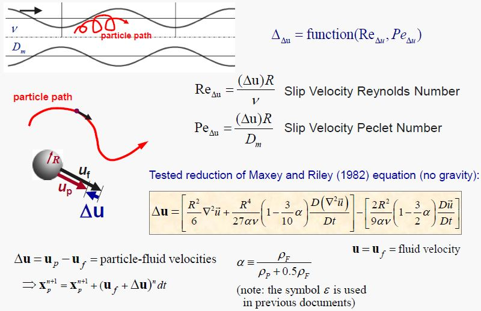

---
Hydrodynamic Convection Calculations for Use in Hierarchical Sherwood Correlations
author: Farhad Behafarid
date: 10 March 2017
---

## Correlations to compute slip velocity and Sherwood number enhancement

Figures [#fig:Slip_Equation_1] and  [#fig:Slip_Equation_2] show the Equations to compute the slip velocity and corresponding  Sherwood number enhancement:

#### Figure: {#fig:Slip_Equation_2}

{width=90%}

Caption: Hydrodynamic sip velocity calculations

#### Figure: {#fig:Slip_Equation_1}

{width=90%}

Caption: Hydrodynamic Convection Sherwood number enhancement.

## Velocity Gradients

For each node, 36 parameter should be calculated using velocity values at thos nodes and the nodes surounding them.

The calculations are done only before the Restart files are created.

## Material Derivatives of the Velocity (moving frame of reference, steady state)

~~~math

[\frac{D\vec{U}}{Dt}]_x = u \frac{\partial u}{\partial x}+ v  \frac{\partial u}{\partial y}+ (w+w_{frame}) \frac{\partial u}{\partial z} \\
[\frac{D\vec{U}}{Dt}]_y = u \frac{\partial v}{\partial x}+ v  \frac{\partial v}{\partial y}+ (w+w_{frame}) \frac{\partial v}{\partial z} \\
[\frac{D\vec{U}}{Dt}]_z = u \frac{\partial w}{\partial x}+ v  \frac{\partial w}{\partial y}+ (w+w_{frame}) \frac{\partial w}{\partial z} \\

~~~

## Laplacian

~~~math

[\nabla^2 \vec{U}]_x = \frac{\partial^2 u}{\partial x^2}+ \frac{\partial^2 u}{\partial y^2}+\frac{\partial^2 u}{\partial z^2} = A_1\\

[\nabla^2 \vec{U}]_y = \frac{\partial^2 v}{\partial x^2}+ \frac{\partial^2 v}{\partial y^2}+\frac{\partial^2 v}{\partial z^2} = A_2\\ 

[\nabla^2 \vec{U}]_z = \frac{\partial^2 w}{\partial x^2}+ \frac{\partial^2 w}{\partial y^2}+\frac{\partial^2 w}{\partial z^2} = A_3 
~~~

&nbsp;

&nbsp;

&nbsp;

## Material Derivatives of the Laplacian (moving frame of refence, steady state)

~~~math

\big[\frac{D}{Dt} (\nabla^2 \vec{U})\big]_x = u \frac{\partial A_1}{\partial x}+ v  \frac{\partial A_1}{\partial y}+ (w+w_{frame}) \frac{\partial A_1}{\partial z} \\
\big[\frac{D}{Dt} (\nabla^2 \vec{U})\big]_y = u \frac{\partial A_2}{\partial x}+ v  \frac{\partial A_2}{\partial y}+ (w+w_{frame}) \frac{\partial A_2}{\partial z} \\
\big[\frac{D}{Dt} (\nabla^2 \vec{U})\big]_z = u \frac{\partial A_3}{\partial x}+ v  \frac{\partial A_3}{\partial y}+ (w+w_{frame}) \frac{\partial A_3}{\partial z} \\

~~~

## Recorded parameters (used for interpolations)

Out of 36 parametrers calculated only 9 are recorded to be interpolated to the particles' locations as liste below:

~~~math

[\frac{D\vec{U}}{Dt}]_x  \\
[\frac{D\vec{U}}{Dt}]_y  \\
[\frac{D\vec{U}}{Dt}]_z  \\ 
[\nabla^2(\vec{U})]_x    \\
[\nabla^2(\vec{U})]_y    \\
[\nabla^2(\vec{U})]_z    \\
\big[\frac{D}{Dt} (\nabla^2 \vec{U})\big]_x \\
\big[\frac{D}{Dt} (\nabla^2 \vec{U})\big]_y \\
\big[\frac{D}{Dt} (\nabla^2 \vec{U})\big]_z \\

~~~

