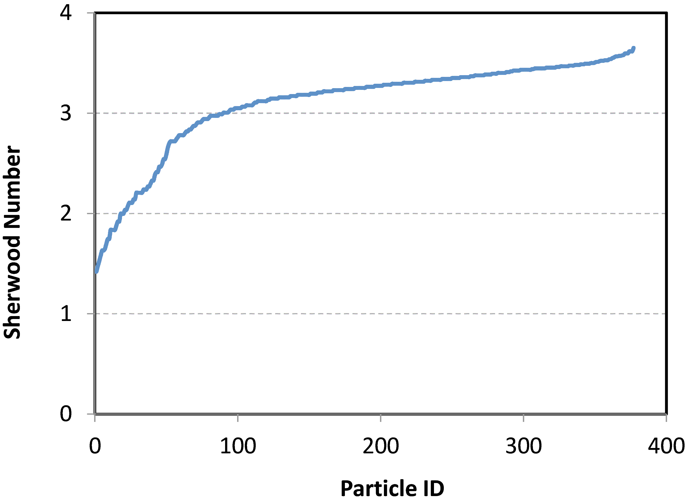

The Couette experiments were desined to investigate the influence of shear effects on drug release from a distribution of particles. 

<!----------------------------------------------------------------------------------------------------------------------------------------------------------->
<!----------------------------------------------------------------------------------------------------------------------------------------------------------->
# Geometry and Flow 

Table (#table:CouetteGeometry) describes the geometry and the flow for the in vitro experiment.

#### Table:  {#table:CouetteGeometry}

|Parameter             |Symbol   | value     |Unit  |  
|----------------------|---------|-----------|------|
|Outer diameter        |R_1      | 13.81     |$mm$  |
|Inner diameter        |R_2      | 12.575    |$mm$  |
|Gap                   |$\delta$ | 1.235     |$mm$  |
|Total volume (Fluid)  |$V_f$    | 12        |$cm^3$|
|Rotational speed      |$\omega$ |0.5,10,100 |RPM   |

Caption: In vitro Geometry and flow.

Table (#table:CouetteGeometryV) shows the wall velocities and strain rates for different in vivo experiment.

#### Table:  {#table:CouetteGeometryV}

|Rotational speed (RPM) | Rotational speed (RPS) |$V_{wall}$| Strain rate (1/s) |
|-----------------------|------------------------|----------|-------------------|
|0.5                    | 0.008333               |0.658     |0.53               |
|10                     | 0.166666               |13.17     |10.66              |
|100                    | 1.666666               |131.7     |106.6              |

Caption: In vitro wall velocities and strain rates.

<!----------------------------------------------------------------------------------------------------------------------------------------------------------->
<!----------------------------------------------------------------------------------------------------------------------------------------------------------->
# Drug and Fluid properties

Table (#table:study1DrugFluidParams) shows the drug and fluid properties for the first computational study.

#### Table:  {#table:study1DrugFluidParams}

| Name                         | Symbol |Choice                        |  Unit         |  
|------------------------------|--------|------------------------------|---------------|
| Drug                         |        |Benzoic Acid                  |               |
| Fluid                        |        |Density Matched Solution (DMS)|               |
| Fluid's temperature          |$T_w$   |20                            | $^{\circ}C$   |
| Fluid's PH                   |$PH_w$	|7                             |               |
| Fluid's density              |$\rho_f$|1.29         			           | $g/cm^3$      |
| Fluid's dynamic viscosity    |$\mu_f$ |6.72                          | $cp$          |
| Fluid's dynamic viscosity    |$\mu_f$ |0.00672                       | $kg/m.s$      |
| Fluid's kinematic viscosity  |$\nu_w$ |$5.21 \times 10^{-6}$         | $m^2/s$       |
| Drug's molecular mass        |        |122.12                        | $g/mol$       |  
| Drug's density               |$\rho_m$|1.29		                       | $g/cm^3$	     |	    	
| Drug's molar volume          |$\nu_m$ |92.73                         | $cm^3/mol$    |
| Drug's diffusivity           |$D_m$   |$8.47 \times 10^{-7}$         | $cm^2/s$  	   |
| Solubility in DMS            |$C_S$   |384.5                         | $\mu g/cm^3$  |
| Solubility in DMS            |$C_S$   |3.149                         | $\mu mol/cm^3$|

Caption: Drug and fluid properties in the vivo experiment.

<!----------------------------------------------------------------------------------------------------------------------------------------------------------->
<!----------------------------------------------------------------------------------------------------------------------------------------------------------->
# Dosage and numerical domain dimensions (Sieve cut of 45-75 micron)

Sieve cut of 45-75 micron was selected for verification/validation case.

Figurs below show the particle sizes for this sieve cut as measured by Greg and Deana:

#### Figure: {#fig:Particle_Sizes_Histogram}

{width=60%}

Caption: Histogram of particle sizes as measured by Greg and Deana

#### Figure: {#fig:Particle_Sizes}

{width=60%}

Caption: Particle sizes as measured by Greg and Deana

Total dose and domain volume for numerical simulation is presented in (#table:Dosage_DomainVolume): 

#### Table:  {#table:Dosage_DomainVolume}

|item                                                       | value   |unit      |
|-----------------------------------------------------------|---------|----------|
| Sieve cut                                                 | 45-75   |$\mu m$   |
| Total number of particles measured in this siev cut       | 376     |-         |
| Toal volume of particles measured in this siev cut        | 0.13025 |$mm^3$    |
| Drug density                                              | 1.29    |$mg/mm^3$ |
| Total weight of particles measured                        | 0.168   |$mg$      |
| Toal dose used in experiment                              | 5       |$mg$      |
| Total volume of container in experiment                   | 12      |$cm^3$    |
| Volume of container in simulation (matching $C_{tot}$)    | 403.3   |$mm^3$    |

Caption: Numerical simulation's dosage and domain volume 

Domain dimensions for numerical simulation is presented in (#table:Domain_Dimensions): 

#### Table:  {#table:Domain_Dimensions}

|item                                                       | value   |unit      |
|-----------------------------------------------------------|---------|----------|
| Volume of container in simulation (matching $C_{tot}$)    | 403.3   |$mm^3$    |
| Simulation domain width (identical to experiment)         | 1.235   |$mm$      |
| Simulation domain Length (identical to experiment)        | 82.89   |$mm$      |
| Simulation domain height (around 0.03 of the experiment)  | 3.93    |$mm$      |        
| Elemet size used for dicretizing                          | 0.137222|$mm$      | 
| Discretizing simulation domain's  width                   | 10      |nodes     | 
| Discretizing simulation domain's  width (including solids)| 13      |nodes     | 
| Discretizing simulation domain's  length                  | 30      |nodes     | 
| Discretizing simulation domain's  height                  | 605     |nodes     | 
| Simulation domain width (adjusted after discretization)   | 1.235   |$mm$      |
| Simulation domain width with solids (after discretization)| 1.647   |$mm$      |
| Simulation domain length (after discretization)           | 3.979   |$mm$      |
| Simulation domain height (after discretization)           | 82.88   |$mm$      |
| Simulation domain volume (after discretization)           | 407.3   |$mm$      |  

Caption: Numerical simulation's domain dimensions 

Figure beklow shows the schematics of the experimental container and the numerical domain used (resulting in the same $c_{tot}$.
#### Figure: {#fig:Geometry_schamtics}

{width=60%}

Caption:  schematics of the experimental container and the numerical domain 

<!----------------------------------------------------------------------------------------------------------------------------------------------------------->
<!----------------------------------------------------------------------------------------------------------------------------------------------------------->
<!----------------------------------------------------------------------------------------------------------------------------------------------------------->
# Boundary conditions
Table (#table:study1BC) shows the boundary condition choices: 

#### Table:  {#table:study1BC}

| Name      			| Symbol      | Choice                                |  Units      |
|-------------------------------|-----------------------|---------------------------------------|-------------|
| Momentum Boundary Condition	  | BounceBack2           | Second order Bounce Back		| -           |
| Scalar  Boundary Condition   	| zero flux           	| No absorption         			| -           |

Caption: Boundary Conditions

<!----------------------------------------------------------------------------------------------------------------------------------------------------------->
<!----------------------------------------------------------------------------------------------------------------------------------------------------------->
<!----------------------------------------------------------------------------------------------------------------------------------------------------------->
# Modeling Parameters
Table (#table:study1ModelingParameters) shows the modeling and computational parameters 

#### Table:  {#table:study1ModelingParameters}

| Name                   		|Symbol | Choice                															|
|---------------------------------------|-------|-----------------------------------------------------------------------------------------------------------------------------------------------|
| Partitioning modeling parameter       |$n_d$	|  3 															|
| Bulk concentration modeling parameter	|$n_b$  |  2 															|     
| Schmidt number                  	 		|$Sc$   |  20    													|             		           
| LBM Relaxation parameter	          	|$\tau$	|  1 															| 
| bulk concentration                    |$C_b$  | Local (using effective volume based on $n_b$, independant of Sh number)|     
| Mass conservation fix                 |       | Not needed (no node uncovering)							|  
| Directional drug release partitioning |     	|  $\Delta \phi_{(i,j,k)} = Overlap_{(i,j,k)} \Big[ \frac{C_s-C_{i,j,k}}{C_s} \Big] \frac{\Delta N_b}{ (\Delta x) ^3}$  |

Caption: Modeling and computational parameters for the first computational study.

<!----------------------------------------------------------------------------------------------------------------------------------------------------------->
<!----------------------------------------------------------------------------------------------------------------------------------------------------------->
<!----------------------------------------------------------------------------------------------------------------------------------------------------------->
#Computational Cost Estimation
#### Table:  {#table:ComputationalCost}

| Name                                         	| Symbol          | Choice      | Units |
|-----------------------------------------------|-----------------|-------------|-------|
| Mesh resolution		                          	| $\Delta x$      | 0.137	    	| mm    |
| Total number of nodes		                    	| $N_{nodes}$     | 230 000   	|       |
| Number of Particles                   	      | $N_{particles}$ | 377        |       |
| Time steps		               	                | $\Delta t$      | 6. e-4	| s     |
| Total physical time		                      	| $t_{tot}$       | 1800         | s     |
| Total number of iterations           		      | $N_{iter}$      | 3000 000      |       |
| Total computational time			                |		  | 25         	| hour  |

Caption: Computational cost estimation

<!----------------------------------------------------------------------------------------------------------------------------------------------------------->
<!----------------------------------------------------------------------------------------------------------------------------------------------------------->
<!----------------------------------------------------------------------------------------------------------------------------------------------------------->
# Results

#### Figure: {#fig:Results_Case1}

{width=70%}

Caption: Results of the case 1 experiment

<!----------------------------------------------------------------------------------------------------------------------------------------------------------->
<!----------------------------------------------------------------------------------------------------------------------------------------------------------->
<!----------------------------------------------------------------------------------------------------------------------------------------------------------->
# Simple Drug Release Estimation

Knowing hte particle sizes, shear rate (constant for all particles) and drug properties, the drug release rate can be estimated at the begining of the simulation (independent of the bulk concentration calculation method or drug release partitioning method)

Figure below shows the estimated Sherwood number for different particles:

#### Figure: {#fig:Sherwood_Number_Estimation}

{width=55%}

Caption: Sherwood number calculation for different particles (based on rotational speed of 10rpm corresponding to strain rate of 10.66 1/s)

#### Table:  {#table:Results}

| Data                               | Drug Release Rate |Units                  |
|------------------------------------|-------------------|-----------------------|
| Experimental data (estimated)      |  3.47	           |$10^{-8} \dfrac{g}{s}$ |
| Numerical simulation (LBM method)	 |  1.976          	 |$10^{-8} \dfrac{g}{s}$ |
| Simplified model estimation        |  1.977            |$10^{-8} \dfrac{g}{s}$ |

Caption: Drug release rate at initial time step
