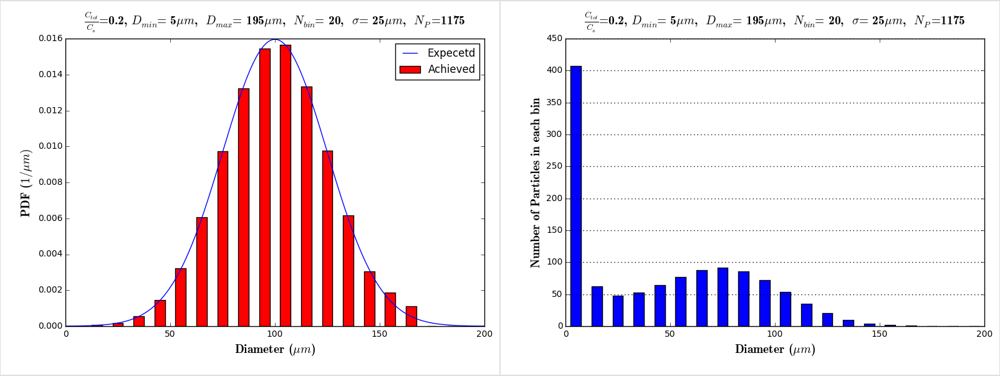

The Couette experiments were desined to investigate the influence of shear effects on drug release from a distribution of particles. 

<!----------------------------------------------------------------------------------------------------------------------------------------------------------->
<!----------------------------------------------------------------------------------------------------------------------------------------------------------->
# Geometry and Flow 

Table (#table:CouetteGeometry) describes the geometry and the flow for the in vitro experiment.

#### Table:  {#table:CouetteGeometry}

|Parameter             |Symbol   | value     |Unit  |  
|----------------------|---------|-----------|------|
|Outer diameter        |R_1      | 13.81     |$mm$  |
|Inner diameter        |R_2      | 12.575    |$mm$  |
|Gap                   |$\delta$ | 1.235     |$mm$  |
|Total volume (Fluid)  |$V_f$    | 12        |$cm^3$|
|Rotational speed      |$\omega$ |0.5,10,100 |RPM   |

Caption: In vitro Geometry and flow.

Table (#table:CouetteGeometryV) shows the wall velocities and strain rates for different in vivo experiment.

#### Table:  {#table:CouetteGeometryV}

|Rotational speed (RPM) | Rotational speed (RPM) |$V_{wall}$| S (1/s) |
|-----------------------|------------------------|----------|---------|
|0.5                    | 0.006666               |0.55285   |0.448    |
|10                     | 0.133333               |11.057    |8.95     |
|100                    | 1.333333               |110.57    |89.5     |

Caption: In vitro wall velocities and strain rates.

<!----------------------------------------------------------------------------------------------------------------------------------------------------------->
<!----------------------------------------------------------------------------------------------------------------------------------------------------------->
# Drug and Fluid properties

Table (#table:study1DrugFluidParams) shows the drug and fluid properties for the first computational study.

#### Table:  {#table:study1DrugFluidParams}

| Name                         | Symbol |Choice                        |  Unit         |  
|------------------------------|--------|------------------------------|---------------|
| Drug                         |        |Benzoic Acid                  |               |
| Fluid                        |        |Density Matched Solution (DMS)|               |
| Fluid's temperature          |$T_w$   |20                            | $^{\circ}C$   |
| Fluid's PH                   |$PH_w$	|7                             |               |
| Fluid's density              |$\rho_f$|1.29         			           | $g/cm^3$      |
| Fluid's dynamic viscosity    |$\mu_f$ |6.72                          | $cp$          |
| Fluid's dynamic viscosity    |$\mu_f$ |0.00672                       | $kg/m.s$      |
| Fluid's kinematic viscosity  |$\nu_w$ |$5.21 \times 10^{-6}$         | $m^2/s$       |
| Drug's molecular mass        |        |122.12                        | $g/mol$       |  
| Drug's density               |$\rho_m$|1.29		                       | $g/cm^3$	     |	    	
| Drug's molar volume          |$\nu_m$ |92.73                         | $cm^3/mol$    |
| Drug's diffusivity           |$D_m$   |$8.47 \times 10^{-7}$         | $cm^2/s$  	   |
| Solubility in DMS            |$C_S$   |0.368                         | $mg/cm^3$     |
| Solubility in DMS            |$C_S$   |3.149                         | $\mu mol/cm^3$|

Caption: Drug and fluid properties in the vivo experiment.

<!----------------------------------------------------------------------------------------------------------------------------------------------------------->
<!----------------------------------------------------------------------------------------------------------------------------------------------------------->
# Dosage and numerical domain dimensions (Sieve cut of 45-75 micron)

Total dose and domain volume for numerical simulation is presented in (#table:Dosage_DomainVolume): 

#### Table:  {#table:Dosage_DomainVolume}

|item                                                       | value   |unit      |
|-----------------------------------------------------------|---------|----------|
| Sieve cut                                                 | 45-75   |$\mu m$   |
| Total number of particles measured in this siev cut       | 376     |-         |
| Toal volume of particles measured in this siev cut        | 0.13025 |$mm^3$    |
| Drug density                                              | 1.29    |$mg/mm^3$ |
| Total weight of particles measured                        | 0.168   |$mg$      |
| Toal dose used in experiment                              | 5       |$mg$      |
| Total volume of container in experiment                   | 12      |$cm^3$    |
| Volume of container in simulation (matching $C_{tot}$)    | 403.3   |$mm^3$    |

Caption: Numerical simulation's dosage and domain volume 

Domain dimensions for numerical simulation is presented in (#table:Domain_Dimensions): 

#### Table:  {#table:Domain_Dimensions}

|item                                                       | value   |unit      |
|-----------------------------------------------------------|---------|----------|
| Volume of container in simulation (matching $C_{tot}$)    | 403.3   |$mm^3$    |
| Simulation domain width (identical to experiment)         | 1.235   |$mm$      |
| Simulation domain Length (identical to experiment)        | 82.89   |$mm$      |
| Simulation domain height (around 0.03 of the experiment)  | 3.93    |$mm$      |        
| Elemet size used for dicretizing                          | 0.137222|$mm$      | 
| Discretizing simulation domain's  width                   | 10      |nodes     | 
| Discretizing simulation domain's  width (including solids)| 13      |nodes     | 
| Discretizing simulation domain's  length                  | 30      |nodes     | 
| Discretizing simulation domain's  height                  | 605     |nodes     | 
| Simulation domain width (adjusted after discretization)   | 1.235   |$mm$      |
| Simulation domain width with solids (after discretization)| 1.647   |$mm$      |
| Simulation domain length (after discretization)           | 3.979   |$mm$      |
| Simulation domain height (after discretization)           | 82.88   |$mm$      |
| Simulation domain volume (after discretization)           | 407.3   |$mm$      |  

Caption: Numerical simulation's domain dimensions 

Table (#table:study1ParticleParameters) shows the particles parameters for the first computational study.

####Table:  {#table:study1ParticleParameters}

| Name                        	|    Symbol          	  | Choice                                       			                 			|  Units     |
|-------------------------------|-----------------------|-------------------------------------------------------------------------|------------|
|	-		                        	| $C_{tot}/C_s$        	| 1.08                                                                    | -          |
|Total volume of the particles  | $V_P$                 |  $2.11   \times 10^{-4}$                  	| $cm^3$     | 
|Toal drug in the domain      	|                       |  0.78734                                  	| $\mu mol$  |
|Toal drug in the domain      	|                       |  162.2                	                    | $\mu g$    |
|Maximum particle diameter    	| $D_P^{max}$          	|  195	 		 		                                | $\mu m$    |
|Average particle diameter      | $D_P^{ave}$           |  100                			                    | $\mu m$    |
|Minimum particle diameter      | $D_P^{min}$           |  5      	   	 			                          | $\mu m$    |
|Number of particles	         	| $N_P$			            |  1175 (Figure [#fig:Particle_Distribution_16])| -	         |
|Distribution function shape	  |	-	                   	|  Normal	        			                        | -	         |
|Standard deviation	 	          | $\sigma$		          |  25						                              | $\mu m$    |		
|Number of the bins		          | $N_{bins}$        		|  20				                                   	| -	         |
|Initial particle locations	    |	-		                  | randomly distributed in a sphere 						                            | -	         |	

Caption: Drug particle properties for the first computational study.

## Particle Distributions

For $\sigma$= 25$\mu m$:

#### Figure: {#fig:Particle_Distribution_16}

{width=99%}

Caption: $\frac{C_{tot}}{C_s}$=0.2 ,  $D_{min}$=5$\mu m$ ,   $D_{max}$=195$\mu m$ ,  $N_{bin}$=20  , $\sigma$=25$\mu m$ ,   $N_P$= 1175 

<!----------------------------------------------------------------------------------------------------------------------------------------------------------->
<!----------------------------------------------------------------------------------------------------------------------------------------------------------->
<!----------------------------------------------------------------------------------------------------------------------------------------------------------->
# Boundary conditions
Table (#table:study1BC) shows the boundary condition choices: 

#### Table:  {#table:study1BC}

| Name      			| Symbol                | Choice                                |  Units      |
|-------------------------------|-----------------------|---------------------------------------|-------------|
| Momentum Boundary Condition	| BounceBack2           | Second order Bounce Back		| -           |
| Scalar  Boundary Condition   	| $\phi_{BC} = 0.0$    	| Immidiate uptake 			| -           |

Caption: Boundary Conditions

<!----------------------------------------------------------------------------------------------------------------------------------------------------------->
<!----------------------------------------------------------------------------------------------------------------------------------------------------------->
<!----------------------------------------------------------------------------------------------------------------------------------------------------------->
# Modeling Parameters
Table (#table:study1ModelingParameters) shows the modeling and computational parameters 

#### Table:  {#table:study1ModelingParameters}

| Name                   		|Symbol | Choice                															|
|---------------------------------------|-------|-----------------------------------------------------------------------------------------------------------------------------------------------|
| Partitioning modeling parameter       |$n_d$	|  3 															|
| Bulk concentration modeling parameter	|$n_b$  |  2 															|     
| Schmidt number       	 		|$Sc$   |  20    														|             		           
| LBM Relaxation parameter		|$\tau$	|  1 															| 
| Mass conservation fix                 |       |  in BC:$\rho$=1, $\rho_{uncov}=\rho_{ave}$, Fix [$\rho, f, f^+$]  							|  
| Directional drug release partitioning |     	|  $\Delta \phi_{(i,j,k)} = Overlap_{(i,j,k)} \Big[ \frac{C_s-C_{i,j,k}}{C_s} \Big] \frac{\Delta N_b}{ (\Delta x) ^3}$  |

Caption: Modeling and computational parameters for the first computational study.

<!----------------------------------------------------------------------------------------------------------------------------------------------------------->
<!----------------------------------------------------------------------------------------------------------------------------------------------------------->
<!----------------------------------------------------------------------------------------------------------------------------------------------------------->
#Computational Cost Estimation
#### Table:  {#table:ComputationalCost}

| Name                                  	| Symbol          | Choice      | Units |
|-----------------------------------------------|-----------------|-------------|-------|
| Mesh resolution		        	| $\Delta x$      | 0.2		| mm    |
| Total number of nodes		        	| $N_{nodes}$     | 3 000 000	|       |
| Number of Particles                   	      | $N_{particles}$ | 1175        |       |
| Time steps		               	                | $\Delta t$      | 6.66 e-3	| s     |
| Total number of waves simulated             	| 	          | 20	        |       |
| Wave's charactristice time scale             	| $t_{wave}$      | 30		| s     |
| Total physical time		                      	| $t_{tot}$       | 600         | s     |
| Total number of iterations           		      | $N_{iter}$      | 90 000      |       |
| Computational time at each iteration (8 CPU)	|		  | 1		| s     |
| Total computational time			                |		  | 25         	| hour  |

Caption: Computational cost estimation

