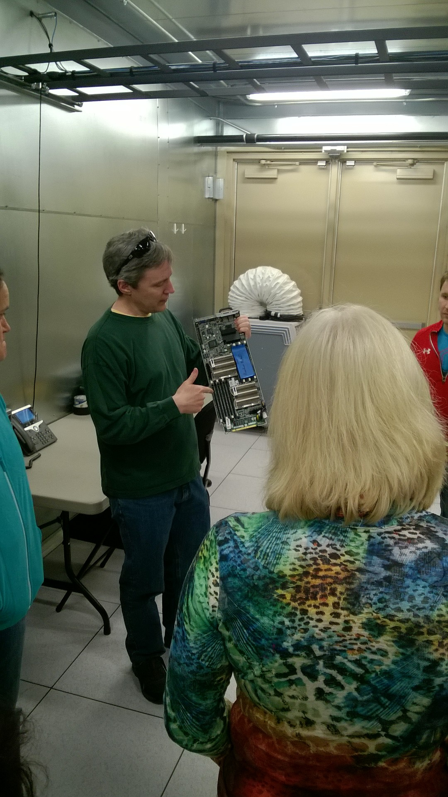
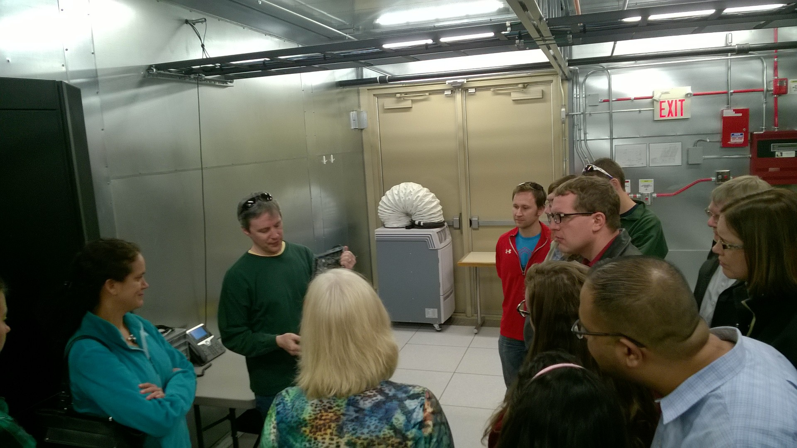
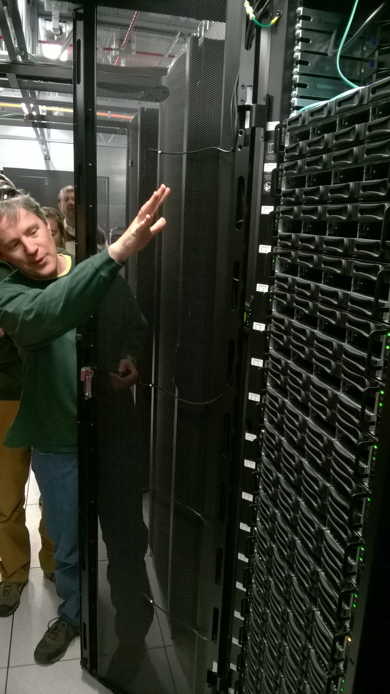
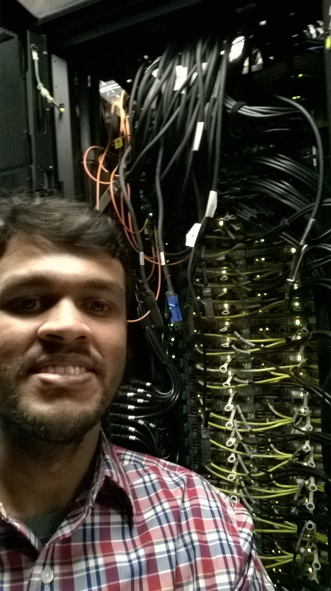

Janus supercomputer at CU Boulder was built about 5 years ago. It's warranty runs out in July 2016 and is being upgraded through an NSF grant. We got a tour of the existing super computer. The new machine will be named "SUMMIT". There is likely to be a reduced availability of the system over a period of approximately 2 months when upgrades are being performed. The new machine will be approximately twice as powerful as the existing machine and use about half the power. They are still currently in the process of vendor selection. Some details of the new machine are:

* 24 or more cores per node compared to 12 cores per node in Janus
* 9 racks with more than 320 total nodes
* $\sim 128GB$ RAM per node - Translates to $> 5GB$ per core
* Intel Omnipass interconnect compared to Infiniband currently in Janus
* GPFS scratch file system compared to lustre currently in Janus. Should support writing a lot of small files better than lustre.
* 10 GPU nodes for visualization with 2 K80 cards each
* 5 High memory nodes with 1 TB RAM per node
* The second phase of improvements will add 20 nodes of Knights landing processors with 60 cores per node
* Continue to retain similar software stack with upgrades from Redhat 7 to Redhat 8
* Continue to use SLURM for queue management
* Will need to apply for a separate allocation on the new machine even if we already have an allocation on Janus

Here are some photos from the tour.

#### Figure: {#janusTour}

{width=49%}
{width=49%} \
{width=49%}
{width=49%}

Caption: Photos from the tour of Janus supercomputer

The tour guide gave us some interesting facts about Janus. The cluster and the building were installed about 5 years ago at a total cost of $\sim $6M$. The building units were prefabricated in Canada and shipped here. The building is nothing but shipping containers on the outside. It consists of the mechanical parts in one section and the cluster units in the other section. The total capacity of the power unit is 0.5MW directly fed from Excel energy. It does not contain any backup system except for a 5 minute backup for the hard disks and the switches. It is protected from power surges but cannot sustain brownouts (low voltage). The cluster itself uses about 315kW, while the total power usage along with the cooling unit could go upto 460kW. The new cluster is expected to use significantly less power.

#Figure: {#janus}
{width=75%}

Caption: View of the Janus super computer in Boulder

The cooling unit is located on top of the building as shown above. Thanks to Colorado's weather, the air conditioning unit is required only for 6 months a year. The cluster relies on evaporative cooling for the rest of the year through circulation of water through the building and to the top, which in turn cools the filtered air circulating through the cluster. If the cooling unit were to be abruptly shut off, the cluster room would heat up to 100F in about 8 minutes. 

Janus contains 1400 nodes and has a peak capacity of 178 TFlops. It was the 31st fastest computer in the world at the time of installation and is currently $450+$. It contains 3 racks of infiniband switches for 17 racks of computational units. The cost of infiniband network is roughly 1/3rd of the total cost of the cluster alone. 

