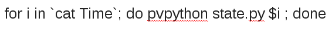

# Save state:

Save Paraview state as "state.py" 

# Add at top of the state.py :
	import sys, glob, commands 

# Flexible input files:

Change inoput file names (both output files and particle files) so they can be defined as an  argument:
	
	out0001000__dat = TecplotReader( guiName="out-0001000-..dat", DataArrayStatus=['u', 'v', 'w', 'P', 'phi', 'node'], FileNames=['/home/farhad/RUNS/Intestine/8-first-Experiment/2-1st-Experiment-for-Abstract/Case-2-B/out-{}-00001.dat'.format(sys.argv[1])] )
	pardat0001000__csv = CSVReader( guiName="pardat-0001000-..csv", FileName=['/home/farhad/RUNS/Intestine/8-first-Experiment/2-1st-Experiment-for-Abstract/Case-2-B/pardat-{}-00001.csv'.format(sys.argv[1])] )

Or using "Replace" option in vim (state.py saved at time step 500 for 2 processors):

	:%s/out\-0000500\-00001\.dat'\])/out\-{}\-00001\.dat'\.format(sys\.argv\[1\])\])/g
	:%s/out\-0000500\-00002\.dat'\])/out\-{}\-00002\.dat'\.format(sys\.argv\[1\])\])/g

	:%s/pardat\-0000600\-00001\.csv'\])/pardat\-{}\-00001\.csv'\.format(sys\.argv\[1\])\])/g

# Add at the Bottom of the state.py: 
	viewLayout = GetLayout()
	WriteImage('tmp1.png', view=RenderView1)
	WriteImage('tmp2.png', view=RenderView2)
	WriteImage('tmp3.png', view=RenderView3)
	WriteImage('tmp4.png', view=RenderView4)
	commands.getoutput("convert -border 1x1 +append tmp*.png T{}.jpg".format(sys.argv[1]))

Note: if one bolus is visualized and for example 4 consecutive sections are desired:

    viewLayout = GetLayout()
    WriteImage('tmp1.jpg', view=RenderView1)
    WriteImage('tmp2.jpg', view=RenderView3)
    commands.getoutput("convert -border 1x1 +append tmp1.jpg tmp1.jpg tmp1.jpg tmp1.jpg TEMP1.jpg".format(sys.argv[1]))
    commands.getoutput("convert -border 1x1 +append tmp2.jpg tmp2.jpg tmp2.jpg tmp2.jpg TEMP2.jpg".format(sys.argv[1]))
    commands.getoutput("convert -border 1x1 -append TEMP* T{}.jpg".format(sys.argv[1]))

# Define the desired time steps:

Create a file called TimeSteps with all desired  steps in one line, separated by "Tab" or "Space".

# Create snapshots:

#### Figure: {#fig:Bash_Loop_pvpython}

{width=40%}

# Make a movie out of the snapshots:
    ffmpeg -framerate 10 -pattern_type glob -i "*.jpg" -vf "fps=25,format=yuv420p" Movie.mp4

# Scaling the movie size:
    ffmpeg -i Movie.mp4 -s 524x440 -c:a copy Movie_mall.mp4

# ADVANCED: Creating Plot snapshots with a moving time indicator line
in creating the plots, "axvline" option should be used. 

An example file called Plot.py can be found below: 

	import numpy as np
    import matplotlib as mpl
    mpl.use('TkAgg')
    import matplotlib.pyplot as plt
    import commands
    from matplotlib.patches import Ellipse, Polygon
    from matplotlib import rc_file
    from pylab import loadtxt
    from pylab import rcParams
    import pickle, sys, os
    os.chdir('../Fasted')
    import Fasted as Case1
    os.chdir('../Plots')
    rcParams['figure.figsize'] = 12.86, 5
    axis_font  = {'fontname':'Arial', 'size':'16'}
  
    tcf = 2.6041666666666665E-003 
    Cs_mol =0.33000
    Cs_gram= 68
    alfa= Cs_gram/Cs_mol
    IC_solid_drug= alfa * 0.78734  
    IT = Case1.IterationNo
  
    for i in IT:
        fig = plt.figure()
        plt.axes([0.13,0.18,0.97-0.13,0.92-0.18])
        plt.plot(Case1.time, Case1.scalarAbsorbtionRate,'-', color= 'blue', label='') 
        plt.grid(b=True, which='major',  axis='y', linewidth=1)
        plt.ylim(0,6)
        plt.xlim(0,160)
        plt.xlabel('Time (s)',**axis_font)
        plt.ylabel('Drug Absorbtion Rate ($\mu g/s$)',**axis_font)
        plt.axvline(linewidth=2, color='red', x=i*tcf)
        plt.legend(loc=0)
        plt.savefig('DrugAbsRate-{:07d}.jpg'.format(int(i)),dpi=300)

To create the plot snapshots using plot.py:

    for i in `cat Times`; do echo "import Plot" | python ; done

After creating the plot snapshots, use the below command to atttach the plot snapshots to the paraview snapshots:

    for i in `cat Times`; do convert ../../"T$i.jpg" "DrugAbsRate-$i.jpg" -append "Viz-Plot-$i.jpg" ; done

# Make a movie out of the snapshots:
    ffmpeg -framerate 10 -pattern_type glob -i "*.jpg" -vf "fps=25,format=yuv420p" Movie.mp4
    ffmpeg -framerate 6  -pattern_type glob -i "*.jpg" -vf "fps=5, format=yuv420p" Movie.mp4

# Example of state.py (32 processors):     

    import sys, glob, commands 
    
    try: paraview.simple
    except: from paraview.simple import *
    paraview.simple._DisableFirstRenderCameraReset()
    
    a1_phi_Cs_PiecewiseFunction = CreatePiecewiseFunction( Points=[0.0, 0.0, 0.5, 0.0, 0.01, 1.0, 0.5, 0.0] )
    
    a1_rp_PiecewiseFunction = CreatePiecewiseFunction( Points=[2.5e-06, 0.0, 0.5, 0.0, 8.25e-05, 1.0, 0.5, 0.0] )
    
    a1_phi_Cs_PVLookupTable = GetLookupTableForArray( "phi_Cs", 1, RGBPoints=[0.0, 0.0, 0.0, 1.0, 0.01, 1.0, 0.0, 0.0], VectorMode='Magnitude', NanColor=[0.498039, 0.498039, 0.498039], ScalarOpacityFunction=a1_phi_Cs_PiecewiseFunction, ColorSpace='HSV', ScalarRangeInitialized=1.0, LockScalarRange=1 )
    
    a1_rp_PVLookupTable = GetLookupTableForArray( "rp", 1, RGBPoints=[2.5e-06, 0.23, 0.299, 0.754, 4.25e-05, 0.865, 0.865, 0.865, 8.25e-05, 0.706, 0.016, 0.15], VectorMode='Magnitude', NanColor=[0.25, 0.0, 0.0], ScalarOpacityFunction=a1_rp_PiecewiseFunction, ColorSpace='Diverging', ScalarRangeInitialized=1.0 )
    
    RenderView1 = CreateRenderView()
    RenderView1.CacheKey = 0.0
    RenderView1.StereoType = 0
    RenderView1.UseLight = 1
    RenderView1.StereoRender = 0
    RenderView1.CameraViewAngle = 0.01
    RenderView1.CameraPosition = [-1147545.70839559, 75.0, -6669.21599611965]
    RenderView1.LightSwitch = 0
    RenderView1.Background2 = [0.0, 0.0, 0.164705882352941]
    RenderView1.CameraClippingRange = [1136121.2695553494, 1164990.1546231438]
    RenderView1.StereoCapableWindow = 0
    RenderView1.Background = [1.0, 1.0, 1.0]
    RenderView1.CameraFocalPoint = [-51878.9105769693, 75.0, -87.609564558192]
    RenderView1.CenterAxesVisibility = 0
    RenderView1.CameraParallelScale = 245.258385740918
    RenderView1.CenterOfRotation = [79.2383527755737, 75.0, 224.5]
    RenderView1.ViewSize=[1046,438]
    ScalarBarWidgetRepresentation1 = CreateScalarBar( TitleFontSize=12, Title='rp', LookupTable=a1_rp_PVLookupTable, Visibility=0, LabelFontSize=12 )
    GetRenderView().Representations.append(ScalarBarWidgetRepresentation1)
    
    ScalarBarWidgetRepresentation2 = CreateScalarBar( TitleFontSize=12, Title='phi_Cs', LookupTable=a1_phi_Cs_PVLookupTable, Visibility=0, LabelFontSize=12 )
    GetRenderView().Representations.append(ScalarBarWidgetRepresentation2)
    
    out0100500_2_dat  = TecplotReader( guiName="out-0100500-2..dat" , DataArrayStatus=['u[mm_s]', 'v[mm_s]', 'w[mm_s]', 'P', 'phi_Cs', 'node'], FileNames=['out-{}-00002.dat'.format(sys.argv[1])])
    out0100500_4_dat  = TecplotReader( guiName="out-0100500-4..dat" , DataArrayStatus=['u[mm_s]', 'v[mm_s]', 'w[mm_s]', 'P', 'phi_Cs', 'node'], FileNames=['out-{}-00004.dat'.format(sys.argv[1])])
    out0100500_6_dat  = TecplotReader( guiName="out-0100500-6..dat" , DataArrayStatus=['u[mm_s]', 'v[mm_s]', 'w[mm_s]', 'P', 'phi_Cs', 'node'], FileNames=['out-{}-00006.dat'.format(sys.argv[1])])
    out0100500_8_dat  = TecplotReader( guiName="out-0100500-8..dat" , DataArrayStatus=['u[mm_s]', 'v[mm_s]', 'w[mm_s]', 'P', 'phi_Cs', 'node'], FileNames=['out-{}-00008.dat'.format(sys.argv[1])])
    out0100500_10_dat = TecplotReader( guiName="out-0100500-10..dat", DataArrayStatus=['u[mm_s]', 'v[mm_s]', 'w[mm_s]', 'P', 'phi_Cs', 'node'], FileNames=['out-{}-00010.dat'.format(sys.argv[1])])
    out0100500_12_dat = TecplotReader( guiName="out-0100500-12..dat", DataArrayStatus=['u[mm_s]', 'v[mm_s]', 'w[mm_s]', 'P', 'phi_Cs', 'node'], FileNames=['out-{}-00012.dat'.format(sys.argv[1])])
    out0100500_14_dat = TecplotReader( guiName="out-0100500-14..dat", DataArrayStatus=['u[mm_s]', 'v[mm_s]', 'w[mm_s]', 'P', 'phi_Cs', 'node'], FileNames=['out-{}-00014.dat'.format(sys.argv[1])])
    out0100500_16_dat = TecplotReader( guiName="out-0100500-16..dat", DataArrayStatus=['u[mm_s]', 'v[mm_s]', 'w[mm_s]', 'P', 'phi_Cs', 'node'], FileNames=['out-{}-00016.dat'.format(sys.argv[1])])
    out0100500_18_dat = TecplotReader( guiName="out-0100500-18..dat", DataArrayStatus=['u[mm_s]', 'v[mm_s]', 'w[mm_s]', 'P', 'phi_Cs', 'node'], FileNames=['out-{}-00018.dat'.format(sys.argv[1])])
    out0100500_20_dat = TecplotReader( guiName="out-0100500-20..dat", DataArrayStatus=['u[mm_s]', 'v[mm_s]', 'w[mm_s]', 'P', 'phi_Cs', 'node'], FileNames=['out-{}-00020.dat'.format(sys.argv[1])])
    out0100500_22_dat = TecplotReader( guiName="out-0100500-22..dat", DataArrayStatus=['u[mm_s]', 'v[mm_s]', 'w[mm_s]', 'P', 'phi_Cs', 'node'], FileNames=['out-{}-00022.dat'.format(sys.argv[1])])
    out0100500_24_dat = TecplotReader( guiName="out-0100500-24..dat", DataArrayStatus=['u[mm_s]', 'v[mm_s]', 'w[mm_s]', 'P', 'phi_Cs', 'node'], FileNames=['out-{}-00024.dat'.format(sys.argv[1])])
    out0100500_26_dat = TecplotReader( guiName="out-0100500-26..dat", DataArrayStatus=['u[mm_s]', 'v[mm_s]', 'w[mm_s]', 'P', 'phi_Cs', 'node'], FileNames=['out-{}-00026.dat'.format(sys.argv[1])])
    out0100500_28_dat = TecplotReader( guiName="out-0100500-28..dat", DataArrayStatus=['u[mm_s]', 'v[mm_s]', 'w[mm_s]', 'P', 'phi_Cs', 'node'], FileNames=['out-{}-00028.dat'.format(sys.argv[1])])
    out0100500_30_dat = TecplotReader( guiName="out-0100500-30..dat", DataArrayStatus=['u[mm_s]', 'v[mm_s]', 'w[mm_s]', 'P', 'phi_Cs', 'node'], FileNames=['out-{}-00030.dat'.format(sys.argv[1])])
    out0100500_32_dat = TecplotReader( guiName="out-0100500-32..dat", DataArrayStatus=['u[mm_s]', 'v[mm_s]', 'w[mm_s]', 'P', 'phi_Cs', 'node'], FileNames=['out-{}-00032.dat'.format(sys.argv[1])])
    
    Dom = GroupDatasets( guiName="Dom", Input=[ out0100500_2_dat, out0100500_4_dat, out0100500_6_dat, out0100500_8_dat, out0100500_10_dat, out0100500_12_dat, out0100500_14_dat, out0100500_16_dat, out0100500_18_dat, out0100500_20_dat, out0100500_22_dat, out0100500_24_dat, out0100500_26_dat, out0100500_28_dat, out0100500_30_dat, out0100500_32_dat ] )
    
    Top_Threshold = Threshold( guiName="Top_Threshold", Scalars=['POINTS', 'node'], ThresholdRange=[0.0, 0.5] )
    
    SetActiveSource(Dom)
    Bot_Contour = Contour( guiName="Bot_Contour", Isosurfaces=[0.5], ContourBy=['POINTS', 'node'], PointMergeMethod="Uniform Binning" )
    
    pardat0100500__csv = CSVReader( guiName="pardat-0100500-..csv", FileName=['pardat-{}-00001.csv'.format(sys.argv[1])])
    
    TableToPoints = TableToPoints( guiName="TableToPoints", ZColumn='z', YColumn='y', XColumn='x' )
    
    Top_Par_Clip1 = Clip( guiName="Top_Par_Clip1", Scalars=['POINTS', 'Cb/Cs'], ClipType="Plane" )
    Top_Par_Clip1.ClipType.Origin = [73.0, 76.80455, 112.02325]
    
    Top_Par_Clip2 = Clip( guiName="Top_Par_Clip2", Scalars=['POINTS', 'Cb/Cs'], ClipType="Plane", InsideOut=1 )
    Top_Par_Clip2.ClipType.Origin = [79.0, 0.25, 32.29460906982422]
    
    Top_Par_Glyph = Glyph( guiName="Top_Par_Glyph", Scalars=['POINTS', 'rp'], Vectors=[None, ''], GlyphTransform="Transform2", GlyphType="Sphere", MaximumNumberofPoints=1210, SetScaleFactor=70000.0, ScaleMode='scalar' )
    
    SetActiveSource(TableToPoints)
    Bot_Par_Glyph = Glyph( guiName="Bot_Par_Glyph", Scalars=['POINTS', 'rp'], Vectors=[None, ''], GlyphTransform="Transform2", GlyphType="Sphere", MaximumNumberofPoints=1200, SetScaleFactor=70000.0, ScaleMode='scalar' )
    
    SetActiveSource(Top_Par_Glyph)
    Top_Par_Gylph_Transform = Transform( guiName="Top_Par_Gylph_Transform", Transform="Transform" )
    Top_Par_Gylph_Transform.Transform.Translate = [0.0, 0.0, 224.0]
    
    SetActiveSource(Top_Threshold)
    Top_Threshhold_Transform = Transform( guiName="Top_Threshhold_Transform", Transform="Transform" )
    Top_Threshhold_Transform.Transform.Translate = [0.0, 0.0, 224.0]
    
    SetActiveSource(Bot_Contour)
    Bot_Contour_Transform = Transform( guiName="Bot_Contour_Transform", Transform="Transform" )
    Bot_Contour_Transform.Transform.Translate = [0.0, 0.0, 224.0]
    
    SetActiveSource(Bot_Par_Glyph)
    Transform4 = Transform( guiName="Transform4", Transform="Transform" )
    Transform4.Transform.Translate = [0.0, 0.0, 224.0]
    
    SetActiveSource(out0100500_2_dat)
    DataRepresentation1 = Show()
    DataRepresentation1.EdgeColor = [0.0, 0.0, 0.5000076295109483]
    DataRepresentation1.SelectionPointFieldDataArrayName = 'node'
    DataRepresentation1.ScalarOpacityUnitDistance = 2.04025221898017
    DataRepresentation1.Visibility = 0
    DataRepresentation1.ExtractedBlockIndex = 1
    DataRepresentation1.Representation = 'Outline'
    DataRepresentation1.ScaleFactor = 7.4
    
    DataRepresentation2 = Show()
    DataRepresentation2.EdgeColor = [0.0, 0.0, 0.5000076295109483]
    DataRepresentation2.SelectionPointFieldDataArrayName = 'node'
    DataRepresentation2.ScalarOpacityUnitDistance = 2.04025221898017
    DataRepresentation2.Visibility = 0
    DataRepresentation2.ExtractedBlockIndex = 1
    DataRepresentation2.Representation = 'Outline'
    DataRepresentation2.ScaleFactor = 7.4
    
    DataRepresentation3 = Show()
    DataRepresentation3.EdgeColor = [0.0, 0.0, 0.5000076295109483]
    DataRepresentation3.SelectionPointFieldDataArrayName = 'node'
    DataRepresentation3.ScalarOpacityUnitDistance = 2.03642380686116
    DataRepresentation3.Visibility = 0
    DataRepresentation3.ExtractedBlockIndex = 1
    DataRepresentation3.Representation = 'Outline'
    DataRepresentation3.ScaleFactor = 7.3
    
    DataRepresentation4 = Show()
    DataRepresentation4.EdgeColor = [0.0, 0.0, 0.5000076295109483]
    DataRepresentation4.SelectionPointFieldDataArrayName = 'node'
    DataRepresentation4.ScalarOpacityUnitDistance = 2.04025221898017
    DataRepresentation4.Visibility = 0
    DataRepresentation4.ExtractedBlockIndex = 1
    DataRepresentation4.Representation = 'Outline'
    DataRepresentation4.ScaleFactor = 7.4
    
    DataRepresentation5 = Show()
    DataRepresentation5.EdgeColor = [0.0, 0.0, 0.5000076295109483]
    DataRepresentation5.SelectionPointFieldDataArrayName = 'node'
    DataRepresentation5.ScalarOpacityUnitDistance = 2.03642380686116
    DataRepresentation5.Visibility = 0
    DataRepresentation5.ExtractedBlockIndex = 1
    DataRepresentation5.Representation = 'Outline'
    DataRepresentation5.ScaleFactor = 7.3
    
    DataRepresentation6 = Show()
    DataRepresentation6.EdgeColor = [0.0, 0.0, 0.5000076295109483]
    DataRepresentation6.SelectionPointFieldDataArrayName = 'node'
    DataRepresentation6.ScalarOpacityUnitDistance = 2.03642380686116
    DataRepresentation6.Visibility = 0
    DataRepresentation6.ExtractedBlockIndex = 1
    DataRepresentation6.Representation = 'Outline'
    DataRepresentation6.ScaleFactor = 7.3
    
    DataRepresentation7 = Show()
    DataRepresentation7.EdgeColor = [0.0, 0.0, 0.5000076295109483]
    DataRepresentation7.SelectionPointFieldDataArrayName = 'node'
    DataRepresentation7.ScalarOpacityUnitDistance = 2.04025221898017
    DataRepresentation7.Visibility = 0
    DataRepresentation7.ExtractedBlockIndex = 1
    DataRepresentation7.Representation = 'Outline'
    DataRepresentation7.ScaleFactor = 7.4
    
    DataRepresentation8 = Show()
    DataRepresentation8.EdgeColor = [0.0, 0.0, 0.5000076295109483]
    DataRepresentation8.SelectionPointFieldDataArrayName = 'node'
    DataRepresentation8.ScalarOpacityUnitDistance = 2.03642380686116
    DataRepresentation8.Visibility = 0
    DataRepresentation8.ExtractedBlockIndex = 1
    DataRepresentation8.Representation = 'Outline'
    DataRepresentation8.ScaleFactor = 7.3
    
    DataRepresentation9 = Show()
    DataRepresentation9.EdgeColor = [0.0, 0.0, 0.5000076295109483]
    DataRepresentation9.SelectionPointFieldDataArrayName = 'node'
    DataRepresentation9.ScalarOpacityUnitDistance = 2.03642380686116
    DataRepresentation9.Visibility = 0
    DataRepresentation9.ExtractedBlockIndex = 1
    DataRepresentation9.Representation = 'Outline'
    DataRepresentation9.ScaleFactor = 7.3
    
    DataRepresentation10 = Show()
    DataRepresentation10.EdgeColor = [0.0, 0.0, 0.5000076295109483]
    DataRepresentation10.SelectionPointFieldDataArrayName = 'node'
    DataRepresentation10.ScalarOpacityUnitDistance = 2.04025221898017
    DataRepresentation10.Visibility = 0
    DataRepresentation10.ExtractedBlockIndex = 1
    DataRepresentation10.Representation = 'Outline'
    DataRepresentation10.ScaleFactor = 7.4
    
    DataRepresentation11 = Show()
    DataRepresentation11.EdgeColor = [0.0, 0.0, 0.5000076295109483]
    DataRepresentation11.SelectionPointFieldDataArrayName = 'node'
    DataRepresentation11.ScalarOpacityUnitDistance = 2.03642380686116
    DataRepresentation11.Visibility = 0
    DataRepresentation11.ExtractedBlockIndex = 1
    DataRepresentation11.Representation = 'Outline'
    DataRepresentation11.ScaleFactor = 7.3
    
    DataRepresentation12 = Show()
    DataRepresentation12.EdgeColor = [0.0, 0.0, 0.5000076295109483]
    DataRepresentation12.SelectionPointFieldDataArrayName = 'node'
    DataRepresentation12.ScalarOpacityUnitDistance = 2.04025221898017
    DataRepresentation12.Visibility = 0
    DataRepresentation12.ExtractedBlockIndex = 1
    DataRepresentation12.Representation = 'Outline'
    DataRepresentation12.ScaleFactor = 7.4
    
    DataRepresentation13 = Show()
    DataRepresentation13.EdgeColor = [0.0, 0.0, 0.5000076295109483]
    DataRepresentation13.SelectionPointFieldDataArrayName = 'node'
    DataRepresentation13.ScalarOpacityUnitDistance = 2.04025221898017
    DataRepresentation13.Visibility = 0
    DataRepresentation13.ExtractedBlockIndex = 1
    DataRepresentation13.Representation = 'Outline'
    DataRepresentation13.ScaleFactor = 7.4
    
    DataRepresentation14 = Show()
    DataRepresentation14.EdgeColor = [0.0, 0.0, 0.5000076295109483]
    DataRepresentation14.SelectionPointFieldDataArrayName = 'node'
    DataRepresentation14.ScalarOpacityUnitDistance = 2.03642380686116
    DataRepresentation14.Visibility = 0
    DataRepresentation14.ExtractedBlockIndex = 1
    DataRepresentation14.Representation = 'Outline'
    DataRepresentation14.ScaleFactor = 7.3
    
    DataRepresentation15 = Show()
    DataRepresentation15.EdgeColor = [0.0, 0.0, 0.5000076295109483]
    DataRepresentation15.SelectionPointFieldDataArrayName = 'node'
    DataRepresentation15.ScalarOpacityUnitDistance = 2.03642380686116
    DataRepresentation15.Visibility = 0
    DataRepresentation15.ExtractedBlockIndex = 1
    DataRepresentation15.Representation = 'Outline'
    DataRepresentation15.ScaleFactor = 7.3
    
    DataRepresentation16 = Show()
    DataRepresentation16.EdgeColor = [0.0, 0.0, 0.5000076295109483]
    DataRepresentation16.SelectionPointFieldDataArrayName = 'node'
    DataRepresentation16.ScalarOpacityUnitDistance = 2.04025221898017
    DataRepresentation16.Visibility = 0
    DataRepresentation16.ExtractedBlockIndex = 1
    DataRepresentation16.Representation = 'Outline'
    DataRepresentation16.ScaleFactor = 7.4
    
    SetActiveSource(Dom)
    DataRepresentation17 = Show()
    DataRepresentation17.EdgeColor = [0.0, 0.0, 0.5000076295109483]
    DataRepresentation17.SelectionPointFieldDataArrayName = 'node'
    DataRepresentation17.ScalarOpacityUnitDistance = 2.09623607445817
    DataRepresentation17.Visibility = 0
    DataRepresentation17.ExtractedBlockIndex = 2
    DataRepresentation17.ScaleFactor = 22.3
    
    SetActiveSource(Top_Threshold)
    DataRepresentation18 = Show()
    DataRepresentation18.EdgeColor = [0.0, 0.0, 0.5000076295109483]
    DataRepresentation18.SelectionPointFieldDataArrayName = 'node'
    DataRepresentation18.ScalarOpacityFunction = a1_phi_Cs_PiecewiseFunction
    DataRepresentation18.ColorArrayName = ('POINT_DATA', 'phi_Cs')
    DataRepresentation18.ScalarOpacityUnitDistance = 3.10158200280271
    DataRepresentation18.LookupTable = a1_phi_Cs_PVLookupTable
    DataRepresentation18.ExtractedBlockIndex = 2
    DataRepresentation18.ScaleFactor = 22.3
    
    SetActiveSource(Top_Par_Clip1)
    DataRepresentation23 = Show()
    DataRepresentation23.EdgeColor = [0.0, 0.0, 0.5000076295109483]
    DataRepresentation23.SelectionPointFieldDataArrayName = 'Cb/Cs'
    DataRepresentation23.ScalarOpacityUnitDistance = 21.6295599246815
    DataRepresentation23.Visibility = 0
    DataRepresentation23.ScaleFactor = 13.09497
    
    SetActiveSource(Top_Par_Clip2)
    DataRepresentation24 = Show()
    DataRepresentation24.EdgeColor = [0.0, 0.0, 0.5000076295109483]
    DataRepresentation24.SelectionPointFieldDataArrayName = 'Cb/Cs'
    DataRepresentation24.ScalarOpacityUnitDistance = 38.4748975393633
    DataRepresentation24.Visibility = 0
    DataRepresentation24.ScaleFactor = 12.99088
    
    SetActiveSource(Top_Par_Glyph)
    DataRepresentation25 = Show()
    DataRepresentation25.EdgeColor = [0.0, 0.0, 0.5000076295109483]
    DataRepresentation25.SelectionPointFieldDataArrayName = 'rp'
    DataRepresentation25.DiffuseColor = [0.0, 0.0, 0.0]
    DataRepresentation25.LookupTable = a1_rp_PVLookupTable
    DataRepresentation25.ScaleFactor = 13.1874099731445
    
    SetActiveSource(Top_Par_Gylph_Transform)
    DataRepresentation27 = Show()
    DataRepresentation27.EdgeColor = [0.0, 0.0, 0.5000076295109483]
    DataRepresentation27.SelectionPointFieldDataArrayName = 'rp'
    DataRepresentation27.DiffuseColor = [0.0, 0.0, 0.0]
    DataRepresentation27.LookupTable = a1_rp_PVLookupTable
    DataRepresentation27.ScaleFactor = 13.0598205566406
    
    SetActiveSource(Top_Threshhold_Transform)
    DataRepresentation28 = Show()
    DataRepresentation28.EdgeColor = [0.0, 0.0, 0.5000076295109483]
    DataRepresentation28.SelectionPointFieldDataArrayName = 'node'
    DataRepresentation28.ScalarOpacityFunction = a1_phi_Cs_PiecewiseFunction
    DataRepresentation28.ColorArrayName = ('POINT_DATA', 'phi_Cs')
    DataRepresentation28.ScalarOpacityUnitDistance = 3.10158200280271
    DataRepresentation28.LookupTable = a1_phi_Cs_PVLookupTable
    DataRepresentation28.ExtractedBlockIndex = 2
    DataRepresentation28.ScaleFactor = 22.3
    
    SetActiveSource(Bot_Contour)
    RenderView2 = CreateRenderView()
    RenderView2.CacheKey = 0.0
    RenderView2.StereoType = 0
    RenderView2.UseLight = 1
    RenderView2.StereoRender = 0
    RenderView2.CameraViewAngle = 0.01
    RenderView2.CameraPosition = [-1147545.70839559, 75.0, -6669.21599611965]
    RenderView2.LightSwitch = 0
    RenderView2.Background2 = [0.0, 0.0, 0.164705882352941]
    RenderView2.CameraClippingRange = [1136019.8406670913, 1165041.6240536517]
    RenderView2.StereoCapableWindow = 0
    RenderView2.Background = [1.0, 1.0, 1.0]
    RenderView2.CameraFocalPoint = [-51878.9105769693, 75.0, -87.609564558192]
    RenderView2.CenterAxesVisibility = 0
    RenderView2.CameraParallelScale = 245.258385740918
    RenderView2.CenterOfRotation = [79.2383527755737, 75.0, 224.5]
    RenderView2.ViewSize=[1046,438]
    
    DataRepresentation19 = Show()
    DataRepresentation19.ScaleFactor = 22.3
    DataRepresentation19.EdgeColor = [0.0, 0.0, 0.5000076295109483]
    DataRepresentation19.SelectionPointFieldDataArrayName = 'Normals'
    DataRepresentation19.DiffuseColor = [0.235294117647059, 0.235294117647059, 0.235294117647059]
    
    SetActiveSource(TableToPoints)
    DataRepresentation22 = Show()
    DataRepresentation22.ScaleFactor = 13.09497
    DataRepresentation22.Visibility = 0
    DataRepresentation22.SelectionPointFieldDataArrayName = 'Cb/Cs'
    DataRepresentation22.EdgeColor = [0.0, 0.0, 0.5000076295109483]
    
    SetActiveSource(Bot_Par_Glyph)
    DataRepresentation26 = Show()
    DataRepresentation26.ScaleFactor = 13.2574691772461
    DataRepresentation26.LookupTable = a1_rp_PVLookupTable
    DataRepresentation26.SelectionPointFieldDataArrayName = 'rp'
    DataRepresentation26.EdgeColor = [0.0, 0.0, 0.5000076295109483]
    
    SetActiveSource(Bot_Contour_Transform)
    DataRepresentation29 = Show()
    DataRepresentation29.ScaleFactor = 22.3
    DataRepresentation29.EdgeColor = [0.0, 0.0, 0.5000076295109483]
    DataRepresentation29.SelectionPointFieldDataArrayName = 'Normals'
    DataRepresentation29.DiffuseColor = [0.196078431372549, 0.196078431372549, 0.196078431372549]
    
    SetActiveSource(Top_Par_Gylph_Transform)
    DataRepresentation30 = Show()
    DataRepresentation30.EdgeColor = [0.0, 0.0, 0.5000076295109483]
    DataRepresentation30.SelectionPointFieldDataArrayName = 'rp'
    DataRepresentation30.Visibility = 0
    DataRepresentation30.LookupTable = a1_rp_PVLookupTable
    DataRepresentation30.ScaleFactor = 13.0598205566406
    
    SetActiveSource(Transform4)
    DataRepresentation31 = Show()
    DataRepresentation31.ScaleFactor = 13.257470703125
    DataRepresentation31.LookupTable = a1_rp_PVLookupTable
    DataRepresentation31.SelectionPointFieldDataArrayName = 'rp'
    DataRepresentation31.EdgeColor = [0.0, 0.0, 0.5000076295109483]
    
    Render()
    
    viewLayout = GetLayout()
    WriteImage('tmp1.png', view=RenderView1)
    WriteImage('tmp2.png', view=RenderView2)
    commands.getoutput("convert -border 1x1 -append tmp*.png T{}.jpg".format(sys.argv[1]))
