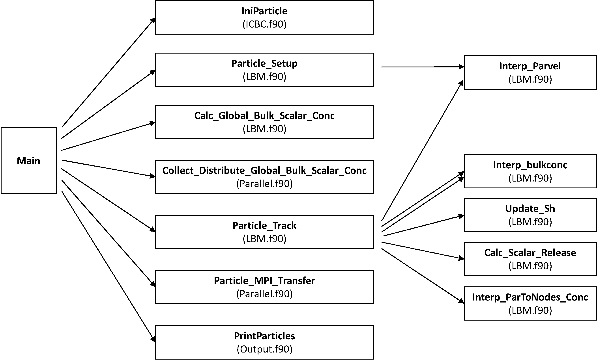

## ICBC.f90

* **SUBROUTINE IniParticles** 
	* 	Reads parid,xp,yp,zp,par_radius from particle.dat file
	*	Finds which partition each particle belongs
	*	Create a particle element in the linked list for each partition
	* 	<span style="color: red"> Is called only by Main.f90 </span>	


* **SUBROUTINE IniParticles_Old** 
	*	<span style="color: red"> Is never called </span>


## LBM.f90

* **SUBROUTINE Particle_Setup** 
	*	Only calls Interp_Parvel
	* 	<span style="color: red"> Is called by Main.f90 </span>


* **SUBROUTINE Interp_ParToNodes_Conc**
	*	Interpolate Particle concentration release to node locations
	*	<span style="color: red"> Is called by Particle_Track(LBM.f90)</span> 


* **SUBROUTINE Particle_Track** 
	*	Cpmputes the new locations of the particles
	*	Interpolates the particle velocities and bulk concentrations
	*	Updates Sherwood number, particle radius, delNBbuCV
	*	Distributes released drug concentration to neightbouring nodes
	*	Updates tausgs only for those cells that have non-zero values of tausgs
	*	Wrapping periodic BC in Y and Z directiosn 
	*	Decides if particle should be transferred to another partition
	*	Writes out particle_history.dat fiels (only 10 files?)
	*	<span style="color: red"> Is called only by Main.f90 </span>


* **SUBROUTINE Interp_Parvel_1** 
	*	Computing particle velocity using a crude interpolation approach
	*	<span style="color: red"> Is never called </span>


* **SUBROUTINE Interp_Parvel** 
	*	Computing the velocity at particle location using trilinear interpolation for u, v and w.
	*	<span style="color: red"> Is called by Particle_Setup(LBM.f90) </span>
	*	<span style="color: red"> IS called twice by Particle_Track(LBM.f90) </span>


* **SUBROUTINE Interp_Parvel_Crude** 
	*	Computing particle velocity using a crde interpolation approach
	*	<span style="color: red"> Is never called </span>


* **SUBROUTINE Interp_bulkconc** 
	*	Computing Bulk Concentration using Trilinear interpolation
	*	<span style="color: red"> Is called only by Particle_Track(LBM.f90) </span>


* **SUBROUTINE Calc_Global_Bulk_Scalar_Conc** 
	*	Calculates "Global Bulk SCalar Concentration" for use in the scalar drug relese model
	*	Loops over all Fluid nodes and computes total number of moles/total domain size (average concentration)
	* 	<span style="color: red"> Is called only by Main.f90 </span>


* **SUBROUTINE Calc_Scalar_Release**
	*	Updates particle radius, calculates new drug conc release rate delNBbyCV
 	*	<span style="color: red"> Is called only by Particle_Trak(LBM.f90) </span>


* **SUBROUTINE Update_Sh**
	*	Incporate hierarchical mdoel to Sh(t) to include effect of shear/hydrodynamics and container effect 	
	*	Called by Particle_Track (LBM.f90) to get Calc_SCalar_Release, delNBbyCV, update particle radius
	*	Calculates delNBbyCV for each particle in the domain
	*	<span style="color: red"> Is called only by Particle_Track(LBM.f90) </span>


* **SUBROUTINE Find_Root** 
	*


## Output.f90

* **SUBROUTINE PrintParticle** 
	*	Print particle position, velocity, radius, and concentrationto output files


* **SUBROUTINE MergeParticleOutput** 
	* 	Combines the subdomain particle output into an output file for the entire computational domain


## Parallel.f90

* **Collect_Distribute_Global_Bulk_Scalar_Conc**
	*	parallel communication to collect all the bulk concentration in each of the processes and computeѕ an average, which is then distributed to the various processors for computing the drug concentration.  
	* 	<span style="color: red"> Is only called by Miain.f90 </spain>
	
* **SUBROUTINE Particle_MPI_Transfer**
	*	Transfer the particles to neighbouring partitions
	*	<span style="color: red"> Is only called by Miain.f90 </spain>


## Code Diagram for Particle Tracking and Drug Dissolution (Couette Code)


Figure [#ParticlTrackingCodeSchematic] presents a simple diagram of the subroutines involved in trakcking the particles in parallel and estimating the bulk concentration and drug dissolution rates from each particle.

#### Figure: {#ParticlTrackingCodeSchematic}


 
Caption: Schematic of particl tracking and drug dissolution subroutines 


# Issues

## Drug Release

* 	In Calc_Scalar_Release: Why not computing "dR" and "delNBbyCV" directly? 
	
~~~ math
#Equation1
tmp= R^2 -4 \nu_m D_m Sh (C_s-C_b) dt
~~~

~~~ math
#Equation2
R_{new}= \dfrac{1}{2} \big[ R+ \sqrt{tmp} \big]   
~~~

Notice that tmp can be negative, therfore an extra step is taken into account to chcek if "tmp" is negative, and if it is, change it to zero. Having the $R_{new}$: 

~~~ math
#Equation3
dR= R_{new}-R_{old} 
~~~

While dR could be calculated directly as:

~~~ math
#Equation4
dR= - \nu_m D_m Sh (C_s-C_b) dt
~~~


## Bulk Concentration:
*	Why $C_b$ is computed as the average concentration in the whole domain?
*	SUBROUTINE **Interp_bulkconc**: Computes bulk concentration, $C_b$, by interpolating the concentration at the location of the particle (trilinear, only using the 9 lattice nodes around particle)
*	SUBROUTINE Calc_Scalar_Release: does not use $C_b$ from **Interp_bulkconc**. Instead it uses the average concentration (in the whole domain) computed by **Calc_Global_Bulk_Scalar_Conc** and **Collect_Distribute_Global_Bulk_Scalar_Conc**.

## Distributing the drug released from the particles to the lattice  nodes:

*	SUBROUTINE **Interp_ParToNodes_Conc**: Computes the contribution to each lattice node around the particle based on the drug released from that particle.
*	If the particle's volume-of-influence is much alrger than the lattice cell (lets say equal to 10 lattice cells), still only the 8 lattice nodes arund the particle get contributions and nodes farther away get no contribution..
*	In **Interp_ParToNodes_Conc**, when  assigining the share of the drug released from particle to nodes around it, if a lattice node is in another processor, the node is just moved back to the current processor, practically assining its contribution equal to that of its counterpart in the current processor.


# Some Code Samples

All the particle tracking action is controlled from `Main.f90` as follows

```fortran
    !Before start of time iteration

	IF(ParticleTrack.EQ.ParticleOn) THEN    ! If particle tracking is 'on' then do the following
		CALL IniParticles
		CALL Particle_Setup
	ENDIF

	DO iter = iter0-0_lng,nt

    All other stuff

    !After collision before streaming

	IF(ParticleTrack.EQ.ParticleOn .AND. iter .GE. phiStart) THEN ! If particle tracking is 'on' then do the following
		CALL Calc_Global_Bulk_Scalar_Conc		! Estimate bluk	scalar concentration in each partition
		CALL Collect_Distribute_Global_Bulk_Scalar_Conc	! Collect Cb_Global from different processors, average it and distribute it to all the processors.  
		CALL Particle_Track
		CALL Particle_MPI_Transfer
	ENDIF

    !Call stream

    !Call scalar

    !Printing stuff

     IF(ParticleTrack.EQ.ParticleOn .AND. iter .GE. phiStart) THEN 										! If particle tracking is 'on' then do the following
     		CALL PrintParticles											! output the particle velocity, radius, position and con. [MODULE: Output]
     ENDIF
```

The particles in each processor domain are controlled through a doubly linked list. This allows for the particles that are in the middle of the list to be chucked out and transferred to another processor. Some elaborate data type is defined to contain the information for each particle along with a whole host of other variables in [Setup.f90](#particleDataStructure).

The subroutine [IniParticles](#IniParticles) is in `LBM.f90`. Doesn't seem to have a restart capability yet. If the code is starting from scratch, then it reads the particle.dat for all particles, determines if each particle is in the current processor domain and assigns it's properties. 

The subroutine [Particle_Setup](#ParticleSetup) is in `LBM.f90`. It seems to interpolate the velocities to the particles using trilinear interpolation.

[Calc_Global_Scalar_Conc and Collect_Distribute_Global_Bulk_Scalar_Conc](#calcGlobalScalarConc) together calculate the average bulk concentration over all the processors.

[Particle_Track](#particleTrack) seems to be doing most of the heavy lifting.

* Do the following only when the iteration number is $> 0$, i.e. not the starting time step.

  * Use second order interpolation to move the particle in time
    - First project particle based on current velocity at particle
	- Interpolate velocity field to the new location by calling `Interp_parvel`
	- Use a 50-50 mix of the new and old velocities to advect the particle from the old location.
  * Call `Interp_parvel` again to get the velocities at the new particle location.
  * Call `Interp_bulkconc` to interpolate the bulk concentration to the new particle location.
  * Call `Update_sh` to update the Sherwood number for the particle
  * Call `Calc_Scalar_Release` to update the particle radius and calculate the new drug concentration release rate
  * Call `Interp_ParToNodes_Conc` to distribute the released drug concentration to the neighboring nodes
* Do the following at all time steps.
  * Update $\tau_{sgs}$ for cells that have non-zero values for $\tau_{sgs}$.
  * Wrap the new position around in periodic directions if they have crossed the domain.
  * Estimate the new partition of the particles and flag it for `ParticleTransfer` if necessary  
  * Write the updated particle position to the correct `.dat` file.
 
  
[Particle_MPI_Transfer](#particleMPItransfer) does the transfer of particles from one processor to another in `Parallel.f90`. 

The subroutine [Scalar](#scalar) just adds the drug release and the SGS terms to the scalar advection/diffusion equation.

# Particle Data Structure {#particleDataStructure}

```fortran
!~~~~~~~~~~~~~~~~~~~~~~~~~~~~~~~~~~~ Particle Tracking Variables ~~~~~~~~~~~~~~~~~~~~~~~~~~~~~~~~~~~~~~~~~~~

INTEGER(lng)	:: ParticleTrack			! a flag to denote if particle track is on (1) or off (0) 
INTEGER(lng), PARAMETER :: ParticleOn=1			! flag to signify Particle Tracking is on
INTEGER(lng), PARAMETER :: ParticleOff=0		! flag for signify if particle tracking is off
INTEGER(lng)    :: np					! number of particles

REAL(dbl), PARAMETER :: molarvol=92.73_dbl,diffm=8.47e-7_dbl,R0=0.0026_dbl,Cs_mol=3.14854e-6!1.2e-6		! drug properties
REAL(dbl):: Cb_global		! Global bulk scalar Concentration
INTEGER(lng):: Cb_numFluids	! Number of fluid nodes in the process for Global bulk scalar Concentration
INTEGER(lng):: num_particles	! Total number of particles in domain

INTEGER(lng), ALLOCATABLE :: iMaxDomain(:),iMinDomain(:) ! List of starting/enning i indices for each subdomain
INTEGER(lng), ALLOCATABLE :: jMaxDomain(:),jMinDomain(:) ! List of starting/enning j indices for each subdomain
INTEGER(lng), ALLOCATABLE :: kMaxDomain(:),kMinDomain(:) ! List of starting/enning k indices for each subdomain
REAL(dbl), ALLOCATABLE  :: partransfersend(:,:),partransferrecv(:,:)
INTEGER(lng),ALLOCATABLE :: parreqid(:),parwtstat(:,:)		! number of send/recv requests
INTEGER(lng),ALLOCATABLE :: probestat(:)	! MPI status object
INTEGER(lng),ALLOCATABLE :: numpartransfer(:)	! Particles to be transferred in each direction
INTEGER(lng) :: NumCommDirsPar = 26_lng
INTEGER(lng) :: NumParVar = 16_lng

TYPE ParRecordTransfer
	SEQUENCE
	INTEGER(lng)	:: parid ! particle id in the overall list - a tag that can be used to track the particle
	INTEGER(lng)	:: cur_part	! current sub-domain id / partition number
	INTEGER(lng)	:: new_part	! current sub-domain id / partition number
	REAL(dbl)	:: xp	! particle x-position
	REAL(dbl)	:: yp ! particle y-position
	REAL(dbl)	:: zp	! particle z-position
	REAL(dbl)	:: up	! particle u-velocity
	REAL(dbl)	:: vp   ! particle v-velocity
	REAL(dbl)	:: wp	! particle w-velocity
	REAL(dbl)	:: rp	! particle radius
	REAL(dbl)	:: delNBbyCV ! particle drug release concentration 
	REAL(dbl)	:: par_conc ! particle concentration
	REAL(dbl)	:: bulk_conc ! bulk concentration at particle location
	REAL(dbl)	:: xpold	! particle x-position
	REAL(dbl)	:: ypold 	! particle y-position
	REAL(dbl)	:: zpold	! particle z-position
	REAL(dbl)	:: upold	! particle u-velocity
	REAL(dbl)	:: vpold   	! particle v-velocity
	REAL(dbl)	:: wpold	! particle w-velocity
	REAL(dbl)	:: rpold	! old particle radius
	REAL(dbl)	:: sh 	! Sherwood number
	REAL(dbl)	:: gamma_cont	! gamma - container effect
	REAL(dbl)	:: S 	! Shear rate at particle location
	REAL(dbl)	:: Sst 	! Shear peclet number
	REAL(dbl)	:: Veff ! effective particle container volume
	REAL(dbl)	:: Nbj  ! number of moles associated with the particlnumber of moles associated with the particle
END TYPE ParRecordTransfer

TYPE ParRecord
	TYPE(ParRecord), POINTER :: prev => NULL()! pointer to prev record
	TYPE(ParRecord), POINTER :: next => NULL()	! pointer to next record
	INTEGER(lng)	:: parid ! particle id in the overall list - a tag that can be used to track the particle
	TYPE(ParRecordTransfer) :: pardata
END TYPE ParRecord

TYPE(ParRecordTransfer),ALLOCATABLE	:: ParSendArray(:,:),ParRecvArray(:,:)
TYPE(ParRecord), POINTER	:: ParListHead,ParListEnd
TYPE(ParRecordTransfer) :: ParInit
LOGICAL :: ParticleTransfer
INTEGER :: mpipartransfertype
INTEGER :: numparticlesSub
INTEGER(lng), PARAMETER :: der_type_count = 26_lng,numparticlesDomain = 1000_lng
INTEGER :: mpidblextent,mpiintextent
INTEGER(lng), DIMENSION(der_type_count) :: der_block_len,der_block_types,der_block_offsets
REAL(dbl) :: fmovingsum,fmovingrhosum
INTEGER(lng), ALLOCATABLE 	:: parfilenum(:),numparticleSubfile(:) ! array of particle output file numbers and number of particles in each of these files
INTEGER(lng)	:: parfileCount				! current output file number (out of total number of output files)


!************************************************
```

While the above is where most of the major action happens for the particles, 4 other arrays are defined earlier in `Setup.f90` as

```fortran
REAL(dbl), ALLOCATABLE :: delphi_particle(:,:,:)	! passive scalar contribution from particles
REAL(dbl), ALLOCATABLE :: tausgs_particle_x(:,:,:)	! passive scalar contribution from particles
REAL(dbl), ALLOCATABLE :: tausgs_particle_y(:,:,:)	! passive scalar contribution from particles
REAL(dbl), ALLOCATABLE :: tausgs_particle_z(:,:,:)	! passive scalar contribution from particles
```

# IniParticles {#IniParticles}

```fortran
SUBROUTINE IniParticles
!-----------------------------------------------
IMPLICIT NONE
INTEGER(lng)   :: i, parid,particle_partition,ipartition
REAL(dbl) :: xp,yp,zp,par_radius
TYPE(ParRecord), POINTER	:: CurPar
IF (restart) THEN
	! Read particle number and position along with it's radius,concentration.
	! Interpolate to calculate particle velocities.
	! Interpolate particle concentration to nodes into delphi_particle.

ELSE
	! Linked list approach
	OPEN(60,FILE='particle.dat')
	READ(60,*) np
	num_particles = np

	! Initialize Header Pointer
	
	CALL list_init(ParListHead)
	CurPar => ParListHead

	! Recursively allocate all the particle records and build the linked list
	DO i = 1, np
		READ(60,*) parid,xp,yp,zp,par_radius ! read particle.dat file

		! Search the partition this particle belongs to
		DO ipartition = 1_lng,NumSubsTotal 

			IF ((xp.GE.REAL(iMinDomain(ipartition),dbl)-1.0_dbl).AND.&
			(xp.LT.(REAL(iMaxDomain(ipartition),dbl)+0.0_dbl)).AND. &
			(yp.GE.REAL(jMinDomain(ipartition),dbl)-1.0_dbl).AND. &
			(yp.LT.(REAL(jMaxDomain(ipartition),dbl)+0.0_dbl)).AND. &
			(zp.GE.REAL(kMinDomain(ipartition),dbl)-1.0_dbl).AND. &
			(zp.LT.(REAL(kMaxDomain(ipartition),dbl)+0.0_dbl))) THEN

				particle_partition = ipartition
			END IF
		END DO
		! Create a particle element in the linked list only if the particles belongs to this partition
		IF (particle_partition.EQ.mySub) THEN
			CALL list_init(CurPar%next)		
			CurPar%next%prev => CurPar
			CurPar%next%next => null()
			CurPar%next%pardata%parid = parid
			CurPar%next%pardata%xp = xp
			CurPar%next%pardata%yp = yp
			CurPar%next%pardata%zp = zp
			CurPar%next%pardata%up = 0.0_dbl
			CurPar%next%pardata%vp = 0.0_dbl
			CurPar%next%pardata%wp = 0.0_dbl
			CurPar%next%pardata%rp = par_radius!R0!0.005_dbl
			CurPar%next%pardata%xpold = CurPar%next%pardata%xp
			CurPar%next%pardata%ypold = CurPar%next%pardata%yp
			CurPar%next%pardata%zpold = CurPar%next%pardata%zp
			CurPar%next%pardata%upold = CurPar%next%pardata%up
			CurPar%next%pardata%vpold = CurPar%next%pardata%vp
			CurPar%next%pardata%wpold = CurPar%next%pardata%wp
			CurPar%next%pardata%rpold = CurPar%next%pardata%rp
			CurPar%next%pardata%par_conc = Cs_mol!3.14854e-6
			CurPar%next%pardata%gamma_cont = 0.0000_dbl
			CurPar%next%pardata%sh = 1.0000_dbl/(1.0_dbl-CurPar%next%pardata%gamma_cont)
			CurPar%next%pardata%S = 0.0_dbl
			CurPar%next%pardata%Sst = 0.0_dbl
			CurPar%next%pardata%Veff = 0.0_dbl
			CurPar%next%pardata%Nbj = 0.0_dbl
			CurPar%next%pardata%bulk_conc = 0.0000_dbl
			CurPar%next%pardata%delNBbyCV= 0.00000_dbl
			CurPar%next%pardata%cur_part= mySub
			CurPar%next%pardata%new_part= mySub
			! point to next node in the list
			CurPar => CurPar%next
		END IF
	END DO
	
	CLOSE(60)
ENDIF
!------------------------------------------------
END SUBROUTINE IniParticles
```

# Particle Setup {#ParticleSetup}

```fortran
SUBROUTINE Particle_Setup
!------------------------------------------------
IMPLICIT NONE
IF (restart) THEN
ELSE
	CALL Interp_Parvel
ENDIF

SUBROUTINE Interp_Parvel ! Using Trilinear interpolation
!------------------------------------------------
IMPLICIT NONE
INTEGER(lng)  :: i,ix0,ix1,iy0,iy1,iz0,iz1
REAL(dbl)     :: xp,yp,zp,c00,c01,c10,c11,c0,c1,c,xd,yd,zd
TYPE(ParRecord), POINTER :: current
TYPE(ParRecord), POINTER :: next

current => ParListHead%next
DO WHILE (ASSOCIATED(current))
	next => current%next ! copy pointer of next node

	xp = current%pardata%xp - REAL(iMin-1_lng,dbl)
	yp = current%pardata%yp - REAL(jMin-1_lng,dbl)
	zp = current%pardata%zp - REAL(kMin-1_lng,dbl)

	ix0=FLOOR(xp)
	ix1=CEILING(xp)
	iy0=FLOOR(yp)
	iy1=CEILING(yp)
	iz0=FLOOR(zp)
	iz1=CEILING(zp)
	!!!!!! MAKE SURE THE ABOVE NODES ARE FLUID NODES

	IF (ix1 /= ix0) THEN 
		xd=(xp-REAL(ix0,dbl))/(REAL(ix1,dbl)-REAL(ix0,dbl))	
	ELSE
		xd = 0.0_dbl
	END IF
	IF (iy1 /= iy0) THEN 
		yd=(yp-REAL(iy0,dbl))/(REAL(iy1,dbl)-REAL(iy0,dbl))	
	ELSE
		yd = 0.0_dbl
	END IF

	IF (iz1 /= iz0) THEN 
		zd=(zp-REAL(iz0,dbl))/(REAL(iz1,dbl)-REAL(iz0,dbl))
	ELSE
		zd = 0.0_dbl
	END IF

	! u-interpolation
	! Do first level linear interpolation in x-direction
	c00 = u(ix0,iy0,iz0)*(1.0_dbl-xd)+u(ix1,iy0,iz0)*xd	
	c01 = u(ix0,iy0,iz1)*(1.0_dbl-xd)+u(ix1,iy0,iz1)*xd	
	c10 = u(ix0,iy1,iz0)*(1.0_dbl-xd)+u(ix1,iy1,iz0)*xd	
	c11 = u(ix0,iy1,iz1)*(1.0_dbl-xd)+u(ix1,iy1,iz1)*xd	
	! Do second level linear interpolation in y-direction
	c0  = c00*(1.0_dbl-yd)+c10*yd
	c1  = c01*(1.0_dbl-yd)+c11*yd
	! Do third level linear interpolation in z-direction
	c   = c0*(1.0_dbl-zd)+c1*zd
        current%pardata%up=c


	! v-interpolation
	! Do first level linear interpolation in x-direction
	c00 = v(ix0,iy0,iz0)*(1.0_dbl-xd)+v(ix1,iy0,iz0)*xd
	c01 = v(ix0,iy0,iz1)*(1.0_dbl-xd)+v(ix1,iy0,iz1)*xd
	c10 = v(ix0,iy1,iz0)*(1.0_dbl-xd)+v(ix1,iy1,iz0)*xd
	c11 = v(ix0,iy1,iz1)*(1.0_dbl-xd)+v(ix1,iy1,iz1)*xd	
	! Do second level linear interpolation in y-direction
	c0  = c00*(1.0_dbl-yd)+c10*yd
	c1  = c01*(1.0_dbl-yd)+c11*yd
	! Do third level linear interpolation in z-direction
	c   = c0*(1.0_dbl-zd)+c1*zd
        current%pardata%vp=c

	! w-interpolation
	! Do first level linear interpolation in x-direction
	c00 = w(ix0,iy0,iz0)*(1.0_dbl-xd)+w(ix1,iy0,iz0)*xd	
	c01 = w(ix0,iy0,iz1)*(1.0_dbl-xd)+w(ix1,iy0,iz1)*xd	
	c10 = w(ix0,iy1,iz0)*(1.0_dbl-xd)+w(ix1,iy1,iz0)*xd	
	c11 = w(ix0,iy1,iz1)*(1.0_dbl-xd)+w(ix1,iy1,iz1)*xd	
	! Do second level linear interpolation in y-direction
	c0  = c00*(1.0_dbl-yd)+c10*yd
	c1  = c01*(1.0_dbl-yd)+c11*yd
	! Do third level linear interpolation in z-direction
	c   = c0*(1.0_dbl-zd)+c1*zd
        current%pardata%wp=c

	! point to next node in the list
	current => next
	!write(*,*) i

ENDDO

```

# Calc Global Scalar Conc {#calcGlobalScalarConc}

```fortran
SUBROUTINE Calc_Global_Bulk_Scalar_Conc! Calculate Global Bulk SCalar COnc for use in the scalar drug relese model 
!------------------------------------------------
IMPLICIT NONE
INTEGER(lng)  :: i,j,k
! Calculate the bulk Conc = total number of moles/total domain size or it is the average conc in the domain
Cb_global = 0.0_dbl
Cb_numFluids = 0_lng
DO k=1,nzSub
  DO j=1,nySub
    DO i=1,nxSub
      IF(node(i,j,k) .EQ. FLUID) THEN
        Cb_global = Cb_global + phi(i,j,k)
        Cb_numFluids = Cb_numFluids + 1_lng
      END IF
    END DO
  END DO
END DO
END SUBROUTINE Calc_Global_Bulk_Scalar_Conc
```

`Collect_Distribute_Global_Bulk_Scalar_Conc` from `Parallel.f90` then averages it over all the processors.

```fortran
SUBROUTINE  Collect_Distribute_Global_Bulk_Scalar_Conc
! This subroutine does the
!parallel communication needed to collect all the bulk concentration in each of
!the processes and computeѕ an average, which is the distributed to the various
!process for computing the drug concentration. 
!--------------------------------------------------------------------------------------------------
IMPLICIT NONE
REAL(dbl) :: Cb_global_temp
INTEGER(lng):: Cb_numFluids_temp,mpierr
!CALL MPI_BARRIER(MPI_COMM_WORLD,mpierr)					! synchronize all processing units before next loop [Intrinsic]
!CALL MPI_GATHER......
!write(*,*)  'In Collect and Distribute before reduce', iter,mySub,Cb_global,Cb_numFluids
Cb_global_temp = 0.0_dbl
Cb_numFluids_temp = 0_lng
CALL MPI_REDUCE(Cb_global,Cb_global_temp,1,MPI_DOUBLE_PRECISION,MPI_SUM,master,MPI_COMM_WORLD,mpierr)
CALL MPI_REDUCE(Cb_numFluids,Cb_numFluids_temp,1,MPI_INTEGER,MPI_SUM,master,MPI_COMM_WORLD,mpierr)
Cb_global = Cb_global_temp/Cb_numFluids_temp
Cb_numFLuids = Cb_numFluids_temp
!write(*,*) 'In Collect and Distribute before bcas',iter,mySub,Cb_global,Cb_global_temp,Cb_numFluids,Cb_numFluids_temp
CALL MPI_BCast(Cb_global,1,MPI_DOUBLE_PRECISION,master,MPI_COMM_WORLD,mpierr)
CALL MPI_BCast(Cb_numFluids,1,MPI_INTEGER,master,MPI_COMM_WORLD,mpierr)
!CALL MPI_BARRIER(MPI_COMM_WORLD,mpierr)					! synchronize all processing units before next loop [Intrinsic]
!write(*,*) 'In Collect and Distribute after Bcast',iter,mySub,Cb_global,Cb_numFluids,Cb_numFluids*xcf*ycf*zcf,Cb_numFluids_temp

!--------------------------------------------------------------------------------------------------
END SUBROUTINE  Collect_Distribute_Global_Bulk_Scalar_Conc
```

# Particle Track {#particleTrack}

```fortran
SUBROUTINE Particle_Track
!------------------------------------------------
IMPLICIT NONE
INTEGER(lng)   :: i,ipartition,ii,jj,kk
REAL(dbl)      :: xpold(1:np),ypold(1:np),zpold(1:np) ! old particle coordinates (working coordinates are stored in xp,yp,zp)
!REAL(dbl)      :: xp(1:np),yp(1:np),zp(1:np) 	      ! working particle coordinates (working coordinates are stored in xp,yp,zp)
!REAL(dbl)      :: xpnew(1:np),ypnew(1:np),zpnew(1:np) ! new particle coordinates (working coordinates are stored in xp,yp,zp)
REAL(dbl)      :: upold(1:np),vpold(1:np),wpold(1:np) ! old particle velocity components (new vales are stored in up, vp, wp)
!REAL(dbl)      :: up(1:np),vp(1:np),wp(1:np) 	      ! working particle velocity (working coordinates are stored in xp,yp,zp)
TYPE(ParRecord), POINTER :: current
TYPE(ParRecord), POINTER :: next

ParticleTransfer = .FALSE. ! AT this time we do not know if any particles need to be transferred.
delphi_particle = 0.0_dbl ! set delphi_particle to 0.0 before every time step, when the particle drug release happens. 
tausgs_particle_x = 0.0_dbl
tausgs_particle_y = 0.0_dbl
tausgs_particle_z = 0.0_dbl
	
IF (iter.GT.iter0+0_lng) THEN ! IF condition ensures that at the first step, the only part of this subroutine that operates is computing the partitions the particles belong to without releasing any drug.  
! Second order interpolation in time
!Backup particle data from previous time step
! Using a linked list of particle records
current => ParListHead%next
DO WHILE (ASSOCIATED(current))
	next => current%next ! copy pointer of next node

	current%pardata%xpold = current%pardata%xp
	current%pardata%ypold = current%pardata%yp
	current%pardata%zpold = current%pardata%zp
	
	current%pardata%upold = current%pardata%up
	current%pardata%vpold = current%pardata%vp
	current%pardata%wpold = current%pardata%wp
	
	current%pardata%xp=current%pardata%xpold+current%pardata%up
	current%pardata%yp=current%pardata%ypold+current%pardata%vp
	current%pardata%zp=current%pardata%zpold+current%pardata%wp
	
	! point to next node in the list
	current => next
ENDDO

CALL Interp_Parvel
! Using a linked list of particle records
current => ParListHead%next
DO WHILE (ASSOCIATED(current))
	next => current%next ! copy pointer of next node

	current%pardata%xp=current%pardata%xpold+0.5*(current%pardata%up+current%pardata%upold)
	current%pardata%yp=current%pardata%ypold+0.5*(current%pardata%vp+current%pardata%vpold)
	current%pardata%zp=current%pardata%zpold+0.5*(current%pardata%wp+current%pardata%wpold)

	! point to next node in the list
	current => next
ENDDO

CALL Interp_Parvel ! interpolate final particle velocities after the final position is ascertained. 
CALL Interp_bulkconc ! interpolate final bulk_concentration after the final position is ascertained.
CALL Update_Sh ! Update the Sherwood number for each particle depending on the shear rate at the particle location. 
CALL Calc_Scalar_Release ! Updates particle radius, calculates new drug conc release rate delNBbyCV. 
CALL Interp_ParToNodes_Conc ! distributes released drug concentration to neightbouring nodes 
!drug molecules released by the particle at this new position
ENDIF

! Now update tausgs only for those cells that have non-zero values of tausgs
DO kk=0,nzSub+1
        DO jj=0,nySub+1
                DO ii=0,nxSub+1
			if (tausgs_particle_x(ii,jj,kk).ne.0.0_dbl) then
                        	tausgs_particle_x(ii,jj,kk) = u(ii,jj,kk)*phi(ii,jj,kk)
			endif
			if (tausgs_particle_y(ii,jj,kk).ne.0.0_dbl) then
                        	tausgs_particle_y(ii,jj,kk) = v(ii,jj,kk)*phi(ii,jj,kk)
			endif
			if (tausgs_particle_z(ii,jj,kk).ne.0.0_dbl) then
                        	tausgs_particle_z(ii,jj,kk) = w(ii,jj,kk)*phi(ii,jj,kk)
			endif
                ENDDO
        ENDDO
ENDDO

current => ParListHead%next
DO WHILE (ASSOCIATED(current))
	next => current%next ! copy pointer of next node
	
	! Wrappign around in z-direction for periodic BC in z
	IF(current%pardata%zp.GE.REAL(nz,dbl)) THEN
		current%pardata%zp = MOD(current%pardata%zp,REAL(nz,dbl))
	ENDIF
	IF(current%pardata%zp.LE.0.0_dbl) THEN
		current%pardata%zp = current%pardata%zp+REAL(nz,dbl)
	ENDIF

	! Wrappign around in y-direction for periodic BC in y
	IF(current%pardata%yp.GE.REAL(ny,dbl)) THEN
		current%pardata%yp = MOD(current%pardata%yp,REAL(ny,dbl))
	ENDIF
	IF(current%pardata%yp.LT.1.0_dbl) THEN
		current%pardata%yp = current%pardata%yp+REAL(ny,dbl)
	ENDIF


	! Estimate to which partition the updated position belongs to.
	DO ipartition = 1_lng,NumSubsTotal 

		IF ((current%pardata%xp.GE.REAL(iMinDomain(ipartition),dbl)-1.0_dbl).AND.&
		(current%pardata%xp.LT.(REAL(iMaxDomain(ipartition),dbl)+0.0_dbl)).AND. &
		(current%pardata%yp.GE.REAL(jMinDomain(ipartition),dbl)-1.0_dbl).AND. &
		(current%pardata%yp.LT.(REAL(jMaxDomain(ipartition),dbl)+0.0_dbl)).AND. &
		(current%pardata%zp.GE.REAL(kMinDomain(ipartition),dbl)-1.0_dbl).AND. &
		(current%pardata%zp.LT.(REAL(kMaxDomain(ipartition),dbl)+0.0_dbl))) THEN

			current%pardata%new_part = ipartition
		END IF
	END DO
	
	IF ((.NOT.ParticleTransfer).AND.(current%pardata%new_part .NE. current%pardata%cur_part)) THEN
		ParticleTransfer = .TRUE.
	END IF
	
	SELECT CASE(current%pardata%parid)
	CASE(1_lng)
      open(72,file='particle1-history.dat',position='append')
      write(72,*) iter,iter*tcf,current%pardata%xp,current%pardata%yp,current%pardata%zp,current%pardata%up*vcf,current%pardata%vp*vcf,current%pardata%wp*vcf,current%pardata%sh,current%pardata%rp,current%pardata%bulk_conc,current%pardata%delNBbyCV,current%pardata%cur_part,current%pardata%new_part
      close(72)
	CASE(3_lng)
      open(73,file='particle3-history.dat',position='append')
      write(73,*) iter,iter*tcf,current%pardata%xp,current%pardata%yp,current%pardata%zp,current%pardata%up,current%pardata%vp,current%pardata%wp,current%pardata%sh,current%pardata%rp,current%pardata%bulk_conc,current%pardata%delNBbyCV,current%pardata%cur_part,current%pardata%new_part
      close(73) 
	CASE(5_lng)
      open(74,file='particle5-history.dat',position='append')
      write(74,*) iter,iter*tcf,current%pardata%xp,current%pardata%yp,current%pardata%zp,current%pardata%up,current%pardata%vp,current%pardata%wp,current%pardata%sh,current%pardata%rp,current%pardata%bulk_conc,current%pardata%delNBbyCV,current%pardata%cur_part,current%pardata%new_part
      close(74)
	CASE(7_lng)
      open(75,file='particle7-history.dat',position='append')
      write(75,*) iter,iter*tcf,current%pardata%xp,current%pardata%yp,current%pardata%zp,current%pardata%up,current%pardata%vp,current%pardata%wp,current%pardata%sh,current%pardata%rp,current%pardata%bulk_conc,current%pardata%delNBbyCV,current%pardata%cur_part,current%pardata%new_part
      close(75)
	CASE(9_lng)
      open(76,file='particle9-history.dat',position='append')
      write(76,*) iter,iter*tcf,current%pardata%xp,current%pardata%yp,current%pardata%zp,current%pardata%up,current%pardata%vp,current%pardata%wp,current%pardata%sh,current%pardata%rp,current%pardata%bulk_conc,current%pardata%delNBbyCV,current%pardata%cur_part,current%pardata%new_part
      close(76) 
	CASE(10_lng)
      open(77,file='particle10-history.dat',position='append')
      write(77,*) iter,iter*tcf,current%pardata%xp,current%pardata%yp,current%pardata%zp,current%pardata%up,current%pardata%vp,current%pardata%wp,current%pardata%sh,current%pardata%rp,current%pardata%bulk_conc,current%pardata%delNBbyCV,current%pardata%cur_part,current%pardata%new_part
      close(77)
	CASE(8_lng)
      open(78,file='particle8-history.dat',position='append')
      write(78,*) iter,iter*tcf,current%pardata%xp,current%pardata%yp,current%pardata%zp,current%pardata%up,current%pardata%vp,current%pardata%wp,current%pardata%sh,current%pardata%rp,current%pardata%bulk_conc,current%pardata%delNBbyCV,current%pardata%cur_part,current%pardata%new_part
      close(78)
	CASE(6_lng)
      open(79,file='particle6-history.dat',position='append')
      write(79,*) iter,iter*tcf,current%pardata%xp,current%pardata%yp,current%pardata%zp,current%pardata%up,current%pardata%vp,current%pardata%wp,current%pardata%sh,current%pardata%rp,current%pardata%bulk_conc,current%pardata%delNBbyCV,current%pardata%cur_part,current%pardata%new_part
      close(79)
	CASE(4_lng)
      open(80,file='particle4-history.dat',position='append')
      write(80,*) iter,iter*tcf,current%pardata%xp,current%pardata%yp,current%pardata%zp,current%pardata%up,current%pardata%vp,current%pardata%wp,current%pardata%sh,current%pardata%rp,current%pardata%bulk_conc,current%pardata%delNBbyCV,current%pardata%cur_part,current%pardata%new_part
      close(80)
	CASE(2_lng)
      open(81,file='particle2-history.dat',position='append')
      write(81,*) iter,iter*tcf,current%pardata%xp,current%pardata%yp,current%pardata%zp,current%pardata%up,current%pardata%vp,current%pardata%wp,current%pardata%sh,current%pardata%rp,current%pardata%bulk_conc,current%pardata%delNBbyCV,current%pardata%cur_part,current%pardata%new_part
      close(81)
	END SELECT
	! point to next node in the list
	current => next
ENDDO

END SUBROUTINE Particle_Track

```


# Particle MPI Transfer {#particleMPItransfer}

```fortran
SUBROUTINE Particle_MPI_Transfer		! transfer the particles to neighbouring partitions
!--------------------------------------------------------------------------------------------------
IMPLICIT NONE
TYPE(ParRecord), POINTER :: current  => NULL()
TYPE(ParRecord), POINTER :: next => NULL()
INTEGER(lng) :: nreqs,source,sendtag,dest,recvtag		! number of send/recv requests
INTEGER(lng) :: mpierr,commdir,iComm,par_num!,numparticlesDomain			! MPI standard error object
LOGICAL :: probeflag
INTEGER(lng) :: parsendindex(NumCommDirsPar), parrecvindex(NumCommDirsPar)

!write(*,*) 'In Particle_MPI	','FLAG=',ParticleTransfer,'SUBID = ',mySub,'iter = ',iter

! IMPORTANT NOTE: It is important for the partransfersend and partransferrecv arrays to store the particle data in columns, i.e. of 
! dimenions NumParVar x NumCommDirsPar as against NumCommDirsPar x  NumParVar as we are planning to send packets of data 
! corresponding to an entire particle across processors. In fortran and MPI, this requires that the entire particle data 
!(all NumParVar  variables given by partransfersend(:,iComm)) need to be in column format so that they can be passed as a single array.
! For some yet-to-be understood reason, MPI dopes not accept passing an entire row of data, say, partransfersend(iComm,:) 
!as a contiguous array into MPI_SEND or MPI_RECV. Hence the convetion used below. 

nreqs = 0_lng
partransfersend = 0.0_dbl
partransferrecv = 0.0_dbl
sendtag = 0_lng


!Identify how many particles need to be transfererd in each direction
numpartransfer = 0_lng
current => ParListHead%next
DO WHILE (ASSOCIATED(current))
	next => current%next ! copy pointer of next node
	IF (current%pardata%cur_part /= current%pardata%new_part) THEN ! Transfer only if the particle has moved to another partition
		DO iComm = 1,NumCommDirsPar
			IF (SubID(iComm).EQ.current%pardata%new_part) THEN
				numpartransfer(iComm) = numpartransfer(iComm)+1_lng
			END IF
		END DO
	END IF
	! point to next node in the list
	current => next
	!write(*,*) current%parid
ENDDO
! Now 'numpartransfer' contains the number of particles in each direction


!numparticlesDomain = 1_lng!MAXVAL(numpartransfer)
ALLOCATE(ParSendArray(numparticlesDomain,NumCommDirsPar))
ALLOCATE(ParRecvArray(numparticlesDomain,NumCommDirsPar))
!ALLOCATE(ParSendArray(1,NumCommDirsPar))
!ALLOCATE(ParRecvArray(1,NumCommDirsPar))
DO iComm = 1,NumCommDirsPar
	DO par_num = 1,numparticlesDomain
		ParSendArray(par_num,iComm) = ParInit
		ParRecvArray(par_num,iComm) = ParInit
	END DO
END DO

!write(*,*) 'In MPI_Particle_transfer - allocated particle send and recv arrays',mySub,iter
!CALL MPI_BARRIER(MPI_COMM_WORLD,mpierr)					! synchronize all processing units before next loop [Intrinsic]

! Pack data
parsendindex = 0_lng
current => ParListHead%next
DO WHILE (ASSOCIATED(current))
	next => current%next ! copy pointer of next node
	IF (current%pardata%cur_part /= current%pardata%new_part) THEN ! Transfer only if the particle has moved to another partition
		DO iComm = 1,NumCommDirsPar
			IF (SubID(iComm).EQ.current%pardata%new_part) THEN
				commdir = iComm
				parsendindex(commdir) = parsendindex(commdir) + 1_lng
				!write(*,*) 'data being packed in ',mySub,'for direction ',commdir
			END IF
		END DO
		! PACK DATA INTO AN ARRAY
		ParSendArray(parsendindex(commdir),commdir)		= current%pardata

	END IF
	! point to next node in the list
	current => next
	!write(*,*) current%parid
ENDDO

! Post send
DO iComm = 1,NumCommDirsPar
	!write(*,*) 'In post send ',mySub,iComm,SubID(iComm)
	IF(SubID(iComm) .NE. 0) THEN
		nreqs 	= nreqs + 1_lng
		dest	= SubID(iComm) - 1_lng ! rank of processing unit sending message TO this processing unit
		sendtag = iComm + 20_lng
		CALL MPI_ISEND(ParSendArray(1:max(parsendindex(iComm),1),iComm),max(parsendindex(iComm),1),mpipartransfertype,dest,sendtag,MPI_COMM_WORLD,parreqid(nreqs),mpierr)	! send data
	END IF
END DO


! Post receives
parrecvindex = 0_lng
DO iComm = 1,NumCommDirsPar
	!write(*,*) 'In post receive ', mySub,iComm,SubID(OppCommDir(iComm))
	IF(SubID(OppCommDir(iComm)) .NE. 0) THEN
		nreqs 	= nreqs + 1_lng
		source	= SubID(OppCommDir(iComm)) - 1_lng ! rank of processing unit sending message TO this processing unit
		recvtag = iComm + 20_lng
		!recvtag = source*1000_lng + iComm*1000_lng + 20_lng
!10		CALL MPI_IPROBE(source,recvtag,MPI_COMM_WORLD,probeflag,probestat,mpierr)
10		CALL MPI_PROBE(source,recvtag,MPI_COMM_WORLD,probestat,mpierr)
		CALL MPI_GET_COUNT(probestat,mpipartransfertype,parrecvindex(iComm),mpierr)	
		IF (parrecvindex(iComm).LT.1_lng) THEN
			GOTO 10
		END IF

	END IF
END DO

!write(*,*) 'In MPI_Particle_transfer - post receives',mySub,iter
!CALL MPI_BARRIER(MPI_COMM_WORLD,mpierr)					! synchronize all processing units before next loop [Intrinsic]

! Wait for all communication to complete
CALL MPI_WAITALL(nreqs,parreqid(1:nreqs),parwtstat,mpierr)


! Unpack data if recd.
DO iComm = 1,NumCommDirsPar
	DO par_num = 1,parrecvindex(iComm)
		!IF (partransferrecv(1,iComm).GT.0_lng) THEN
		IF (ParRecvArray(par_num,iComm)%parid.GT.0_lng) THEN
			CALL list_insert(ParListHead)
			current => ParListHead%next
	
			! UNPACK DATA
 
			current%pardata 		=ParRecvArray(par_num,iComm)

			current%pardata%cur_part 	= mySub!current%pardata%new_part
		END IF
	END DO
END DO

! If data was sent then remove sent particle from list
current => ParListHead%next
DO WHILE (ASSOCIATED(current))
	next => current%next ! copy pointer of next node
	!write(*,*) 'traverse node',mySub,current%pardata%parid,current%pardata%cur_part,current%pardata%new_part,iter
	!write(*,*) current%prev%next%pardata%parid,current%pardata%parid,iter
	IF (current%pardata%cur_part .NE. current%pardata%new_part) THEN ! Transfer only if the particle has moved to another partition
		!write(*,*) 'In delete node',mySub,current%pardata%parid,current%pardata%cur_part,current%pardata%new_part,iter
		!PAUSE
		CALL list_delete(current)
		NULLIFY(current)
	END IF
ENDDO
!write(*,*) mySub,ParListHead%next%pardata%parid
numparticlesSub = 0_lng
current => ParListHead%next
DO WHILE (ASSOCIATED(current))
	numparticlesSub = numparticlesSub + 1_lng
	next => current%next ! copy pointer of next node
	!write(*,*) 'leftover node',mySub,current%pardata%parid,current%pardata%cur_part,current%pardata%new_part
	! point to next node in the list
	current => next
	!write(*,*) current%pardata%parid
ENDDO
!write(*,*) 'In MPIParticleTransfer  ',iter,mySub,numparticlesSub

DEALLOCATE(ParSendArray)
DEALLOCATE(ParRecvArray)

! Rough outline of the algorithm
! PACK DATA INTO OPTIMAL NUMBER OF PACKETS
! POST RECEIVE
! SEND DATA
! MPI_WAITALL - make sure all the data transfer is completed
! UNPACK DATA AND ADD DATA TO THE PARTICLE LINKED LIST

!------------------------------------------------
END SUBROUTINE Particle_MPI_Transfer
```


# Scalar {#scalar}

```fortran
	phi(i,j,k) = phi(i,j,k)+ delphi_particle(i,j,k) ! Balaji added to introduce drug concentration release
	tausgs = ((tausgs_particle_x(i+1,j,k)-tausgs_particle_x(i-1,j,k)) + &
		 (tausgs_particle_y(i,j+1,k)-tausgs_particle_y(i,j-1,k)) + &
		 (tausgs_particle_z(i,j,k+1)-tausgs_particle_z(i,j,k-1)))*0.5_dbl
	phi(i,j,k) = phi(i,j,k)+ tausgs ! Balaji added - to handle SGS particle effects.
```
	
