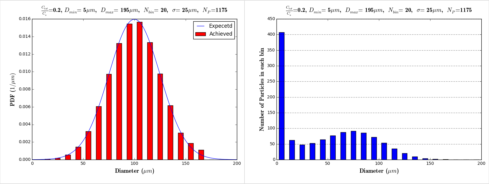

Four experiments are summerized in Table (#table:FedExperiments):

#### Table:  {#table:FedExperiments}

|Exp. No.|State/Motility      |Shear Effects |Buffer |
|--------|--------------------|--------------|-------|
|1       |Peristalsis, Large  |Yes           |0 mM   |
|2       |Peristalsis, Small  |Yes           |0 mM   |

Caption: Experiments

The input parameters that need to be specified for the different experiments fall into different categories, viz., geometry and motility, drug and fluid properties, particle information, boundary conditions and the correlations for shear and hydrodynamic effects. 

&nbsp;

&nbsp;

&nbsp;

&nbsp;

&nbsp;

&nbsp;

&nbsp;

&nbsp;

<!----------------------------------------------------------------------------------------------------------------------------------------------------------->
<!----------------------------------------------------------------------------------------------------------------------------------------------------------->

# Geometry, Motility and discretization

Table (#table:study1GeomMotilityParams) describes the geometry, motility and discretization parameters for first computational experiments.

#### Table:  {#table:study1GeomMotilityParams}

|Name              |Symbol                    | Large                        |Small                        | Unit |  
|------------------|--------------------------|------------------------------|-----------------------------|------|
|Motility type     |-                         |Peristalsis                   |Peristalsis                  |      |
|Max diameter      |$D_{max}$                 |30                            |16.8                         |$mm$  |
|Wavelength        |$\lambda$                 |50	                           |28	                         |$mm$  |
|Dimension Ratio   |$\frac{\lambda}{D_{max}}$ |1.66                          | 1.66                        | --   |
|Wave speed        |$w$                       |5                             |5                            |$mm/s$| 
|Number of waves   |-                         |1                             |1                            |-     |
|Volume of bolus   |$V_C$		                  |15.22                         |2.67                         |$cm^3$|
|Occlusion ratio   |$\epsilon/R_{ave}$        |0.3                           |0.3                          |-     |
|Mesh dimensions   |                          |($216 \times 216 \times 360$) |($151 \times 151 \times 250$)|-     |
|Totoal meshnumbers|                          |14 million                    |5.7 million                  |      |
|Mesh size         | $\Delta x$               |0.138                         |0.112                        |$mm$  |   
|Time step         | $\Delta t$               |3.215                         |2.091                        |$m s$ |  
|Period Time       | $T_{period}$             |10                            |5.6                          |$s$   |
|Period iterations | $iter_{period}$          |3110                          |2678                         |--    |

Caption: Geometry and motility properties for the first computational study.

&nbsp;

&nbsp;

&nbsp;

&nbsp;

&nbsp;

<!----------------------------------------------------------------------------------------------------------------------------------------------------------->
<!----------------------------------------------------------------------------------------------------------------------------------------------------------->
# Drug and Fluid properties

Table (#table:study1DrugFluidParams) shows the drug and fluid properties for the first computational study.

#### Table:  {#table:study1DrugFluidParams}

| Name                 	                                     |Symbol   |Choice           	           |Unit    	     |  
|------------------------------------------------------------|---------|-----------------------------|---------------|
| Fluid                		                                   |         |Water                        |               |
| Fluid's temperature                                        |$T_w$    |20                           |$^{\circ}C$    |
| Fluid's density                                            |$\rho_w$ |1000	                       |$kg/m^3$       |
| Fluid's dynamic viscosity                                  |$\mu_w$  |$1$                          |$cp$   	       |
| Fluid's kinematic viscosity                                |$\nu_w$  |$1.0e-6$                     |$m^2/s$   	   |
| Drug                 		                                   |	       |Ibuprofen	   			           | 	     	       |
| Drug's molar volume                                        |$\nu_d$  |268                          |$cm^3/mol$     |
| Drug's molecular wight                                     |$M_d$    |206.285                      |$g/mol$        |  
| Drug's diffusivity                                         |$D_d$    |$7.5 \times 10^{-6}$         |$cm^2/s$       |
| Drug's  density                                            |$\rho_d$ |1.03 |$g/cm^3$       |
| pH: Bulk                                                   |$pH_{,b}$|6.5					                 |-              |
| pH: Particle surface                                       |$pH_s$   |4.5                          |-              |  
| Interinsic solubility                                      |$S_o$    |$0.33$                       |$\mu mol/cm^3$ |
| Interinsic Solubility                                      |$S_o$    |$68$                         |$\mu g/cm^3$   |
| Particle's surface solubility                              |$S_s$    |$0.759649$                   |$\mu mol/cm^3$ |
| Particle's surface solubility                              |$S_s$    |$156.5338$                   |$\mu g/cm^3$   |
| Bulk solubility over interinsic solubility ($pH_{,b}$=6.5) |$S_b/S_o$|126.893                      | -             |
| Bulk solubility ($pH_{,b}$=6.5)                            |$S_b$    |41.87                        |$\mu mol/cm^3$ |
| Bulk solubility ($pH_{,b}$=6.5)                            |$S_b$    |8628.7                       |$\mu g/cm^3$   |

Caption: Drug and fluid properties for the first computational experiments.

<!----------------------------------------------------------------------------------------------------------------------------------------------------------->
<!----------------------------------------------------------------------------------------------------------------------------------------------------------->
# Particles

"BOLUS DOSE": mass or moles of drug in a bolus segment. To estimate we will collect data from the literature and from UM on concentration of extracted fluids -- statistics. From MRI (Nottingham) we will estimate bolus volume. These two will give us dose in moles from which bolus $C_{tot}$ can be estimated. To this end, we need to estimate solid content along with fluid concentration in the extracted segments. 

Table (#table:study1ParticleParameters) shows the particles parameters for the first computational study.

####Table:  {#table:study1ParticleParameters}

| Name                        	|    Symbol     | Choice                                       | Units        |
|-------------------------------|---------------|----------------------------------------------|--------------|
|Bolus dosage desired          	|               |1000                     	                   |$\mu g$       |
|Bolus dosage entered           |               |1006.76                                       |$\mu g$       |                  
|Total volume of the particles  |$V^{tot}_d$    |$----- \times 10^{-4}$                        |$cm^3$        | 
|Max particle diameter cut-off  |               |500                                           |$\mu m$       |
|Max particle diameter        	|$D_P^{max}$  	|236	 		  	                                 |$\mu m$       |
|Average particle diameter      |$D_P^{ave}$    |124.184            			                     |$\mu m$       |
|Min particle diameter          |$D_P^{min}$    |5      	   	 			                           |$\mu m$       |
|Number of particles	         	|$N_P$			    |6326 (Figure [#fig:Particle_Distribution_16]) |-	            |
|Distribution function shape	  |-	           	|Normal	        			                         |-	            |
|Standard deviation	 	          |$\sigma$	      |43.9157	                                 |$\mu m$       |		
|Number of the bins		          |$N_{bins}$   	|20				                                     |-	            |
|Initial particle locations	    |-		          |Randomly distributed in a whole domain 	     |-	            |	
|Total concentration            |$C_{tot}$      |Large: ----, Small ----                   |$\mu g/cm^3$  | 

Caption: Drug particle properties for the first computational study.

&nbsp;

&nbsp;

&nbsp;

&nbsp;

&nbsp;

## Particle Distributions
For $\sigma$= 43.9157$\mu m$:

#### Figure: {#fig:Particle_Distribution_16}

{width=99%}

Caption: $\frac{C_{tot}}{C_s}$=--- ,  $D_{min}$=5$\mu m$ ,   $D_{max}$=236$\mu m$ , $\sigma$=43.9157$\mu m$ ,   $N_P$= 6326 

&nbsp;

<!----------------------------------------------------------------------------------------------------------------------------------------------------------->
<!----------------------------------------------------------------------------------------------------------------------------------------------------------->
<!----------------------------------------------------------------------------------------------------------------------------------------------------------->
# Boundary conditions
Table (#table:study1BC) shows the boundary condition choices: 

#### Table:  {#table:study1BC}

| Name                     			| Symbol                | Choice                   |  Units      |
|-------------------------------|-----------------------|--------------------------|-------------|
| Momentum Boundary Condition	  | BounceBack2           | Second order Bounce Back | -           |
| Scalar  Boundary Condition   	| $\phi_{BC} = 0.0$    	| Immidiate uptake 			   | -           |

Caption: Boundary Conditions

&nbsp;

&nbsp;

&nbsp;

&nbsp;

<!----------------------------------------------------------------------------------------------------------------------------------------------------------->
<!----------------------------------------------------------------------------------------------------------------------------------------------------------->
<!----------------------------------------------------------------------------------------------------------------------------------------------------------->
# Modeling Parameters
Table (#table:study1ModelingParameters) shows the modeling and computational parameters 

#### Table:  {#table:study1ModelingParameters}

| Name                              		|Symbol | Choice                												               			|
|---------------------------------------|-------|-----------------------------------------------------------------------------------------------------------------------------------------------|
| Partitioning modeling parameter       |$n_d$	|  3 															|
| Bulk concentration modeling parameter	|$n_b$  |  3 															|     
| Schmidt number       	            		|$Sc$   |  20  														|             		           
| LBM Relaxation parameter	           	|$\tau$	|  1 															| 
| Mass conservation fix                 |       |  in BC:$\rho$=1, $\rho_{uncov}=\rho_{ave}$, Fix [$\rho, f, f^+$]  							|  
| Directional drug release partitioning |     	|  $\Delta \phi_{(i,j,k)} = Overlap_{(i,j,k)} \Big[ \frac{C_s-C_{i,j,k}}{C_s} \Big] \frac{\Delta N_b}{ (\Delta x) ^3}$  |

Caption: Modeling and computational parameters for the first computational study.

<!---
#Computational Cost Estimation
#### Table:  {#table:ComputationalCost}

| Name                                  	   |Symbol          |Choice          | Units |
|--------------------------------------------|----------------|----------------|-------|
| Mesh resolution		        	               |$\Delta x$      |0.2		         | mm    |
| Total number of nodes		        	         |$N_{nodes}$     |3 000 000	     |       |
| Number of Particles                   	   |$N_{particles}$ |?               |       |
| Time steps		               	           	 |$\Delta t$      |6.66 e-3	       | s     |
| Total number of waves simulated       	   |	              |Fed:20/Fasted:40|       |
| Wave's charactristice time scale      	   |$t_{wave}$      |Fed:30/Fasted:15| s     |
| Total physical time		                     |$t_{tot}$       |600             | s     |
| Total number of iterations           		   |$N_{iter}$      |?               |       |
| Computational time for 1 iteration (8 CPU) |		            |?		           | s     |
| Total computational time		               |		            |?               | hour  |

Caption: Computational cost estimation

# Results: Case 1

Using 8 processors on Janus.

#### Figure: {#fig:Results_Case1}

{width=70%}

Caption: Results of the case 1 experiment

--->

