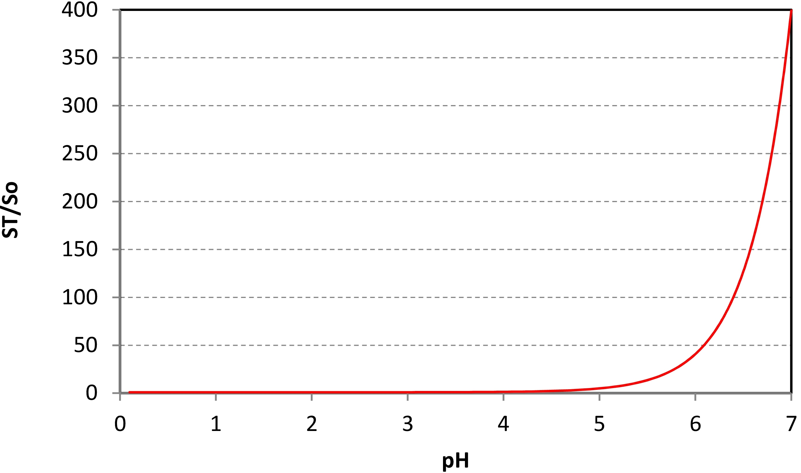
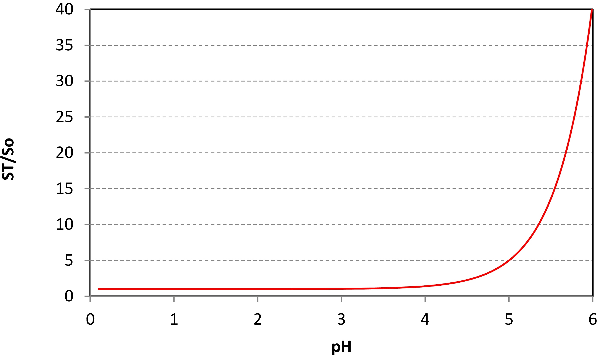

---
Solubility as a function of pH
Farhad Behafarid
date: 1 Aug 2016
---

## Solutbility as a function of pH and pKa

~~~math
S_T = S_o \bigg( 1+ \frac{10^{-pKa}}{10^{-pH}} \bigg)
~~~

For ibuprofen:
~~~math
S_o = 68 \frac{\mu g}{cm^3} \\

pKa \approx 3.4
~~~

For ibuprofen:

#### Figure: {#fig:Particle_Distribution_16}

{width=60%}

Caption: Solubility as a function of pH for ibuprofen ( $pKa= 4.4$ and $S_o = 68 \frac{\mu g}{cm^3}$) 

and for pH always lower than 6:

#### Figure: {#fig:Particle_Distribution_16}

{width=60%}

Caption: Solubility as a function of pH for ibuprofen ( $pKa= 4.4$ and $S_o = 68 \frac{\mu g}{cm^3}$)

## Solubility for in-vivo simulations:

For in-vivo simulations, assuming $ph \approx 5.5$,  we get:

~~~math
\frac{S_T}{S_o} = \bigg( 1+ \frac{10^{-pKa}}{10^{-pH}} \bigg)= \bigg( 1+ \frac{10^{-4.4}}{10^{-5.5}} \bigg)= 13.589 \\

S_T = 13.589 \times 68 \frac{\mu g}{cm^3}  = 924.1 \frac{\mu g}{cm^3}  \\

S_T= 4.485  \frac{\mu m}{cm^3}  
~~~

