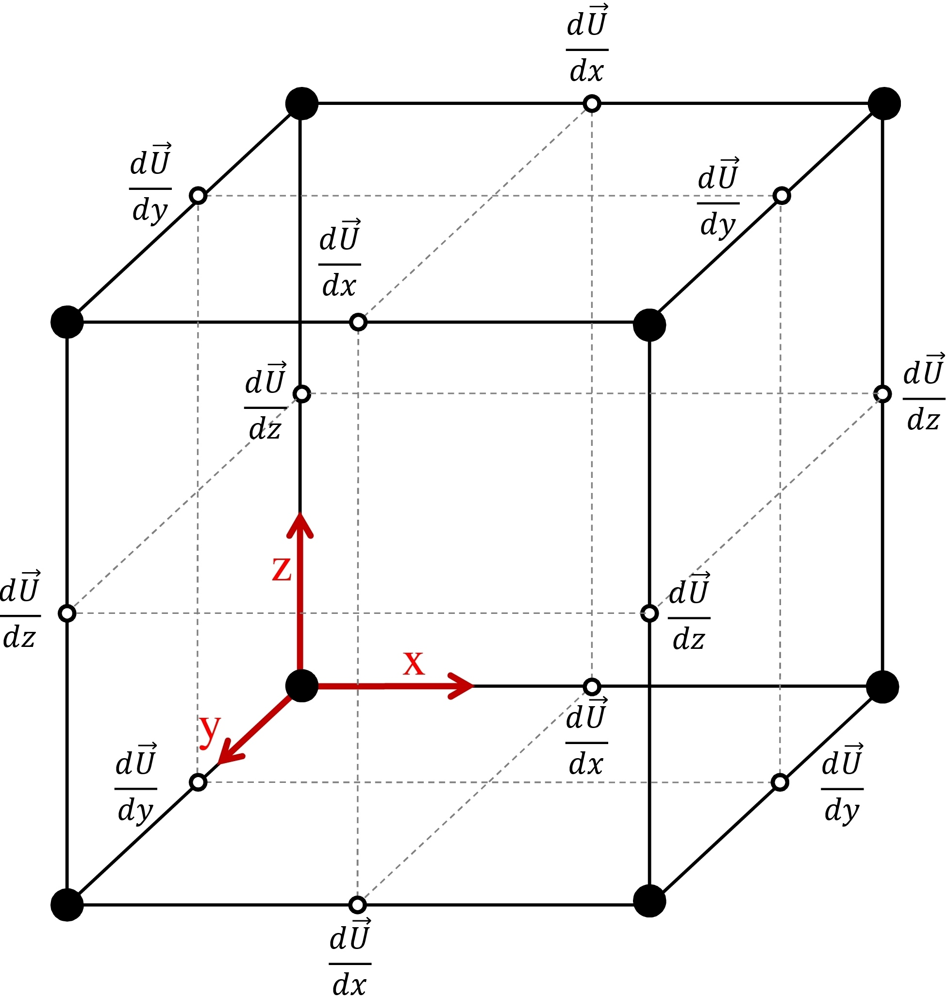

---
Strain Rate Calculations for Use in Hierarchical Sherwood Correlations
author: Farhad Behafarid
date: 24 June 2016
---

## Velocity Gradients

All 36 velocity gradinet components are computed usingvelocity values at 8 nodes around the particle as shown in fi
gure [#fig:U_Gradient]:

#### Figure: {#fig:U_Gradient}

{width=40%}

Caption: Velocity gradient (36 components) computed using velocity values at 8 nodes around each particle.

Then, velocity gradients are bilinearly interpolated to the location of the particle to get the 9 components of the velocity gradients in 3D.

## Strain Rate Tensor

Defined as half the sum of the velocity gradient tensor and its transpose:

E = $\begin{bmatrix}
\frac{\partial u}{\partial x}  							& \frac{1}{2}(\frac{\partial u}{\partial y} +  \frac{\partial v}{\partial x})   & \frac{1}{2}(\frac{\partial u}{\partial z} +  \frac{\partial w}{\partial x}) \\
\frac{1}{2}(\frac{\partial v}{\partial x} +  \frac{\partial u}{\partial y})     & \frac{\partial v}{\partial y} 						& \frac{1}{2}(\frac{\partial v}{\partial z} +  \frac{\partial w}{\partial y}) \\
\frac{1}{2}(\frac{\partial w}{\partial x} +  \frac{\partial u}{\partial z})   	& \frac{1}{2}(\frac{\partial w}{\partial y} +  \frac{\partial v}{\partial z})   & \frac{\partial w}{\partial z} 
\end{bmatrix}$

## Computing the Strain Rate Magnitude (scalar) for Use in Corelations:
~~~math
S =  \sqrt{2 \bigg[ E_{11}^2 + E_{22}^2 + E_{33}^2  + 2 \big( E_{12}^2 + E_{13}^2 + E_{23}^2 \big) \bigg] }
~~~

~~~math
S= \sqrt{2 \bigg[ \big(\frac{\partial u}{\partial x}\big)^2 
                + \big(\frac{\partial v}{\partial y}\big)^2
                + \big(\frac{\partial w}{\partial z}\big)^2   \bigg]
                + \big( \frac{\partial u}{\partial y}+ \frac{\partial v}{\partial x} \big)^2                 
                + \big( \frac{\partial u}{\partial z}+ \frac{\partial w}{\partial x} \big)^2 
                + \big( \frac{\partial w}{\partial y}+ \frac{\partial v}{\partial z} \big)^2 
                 }
~~~

Look at this: [Link](http://www.cfd-online.com/Forums/fluent-udf/90818-strain-rate-magnitude.html)

