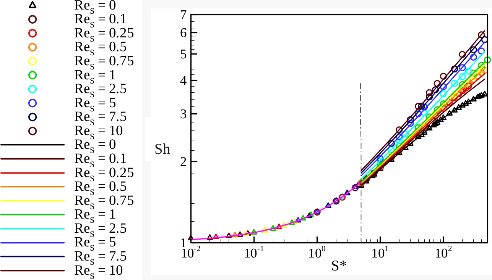

# Chosen case from Yanxing's data files
One of the Yanxing's simulations was chosen as defined by the parameters below (re01s-b/sca-f-01.dat and re01s-b/sca-c-01.dat):

~~~math
U_o = 0.1 m/s \\
\nu= 0.125 m^2/s \\
S^* = 1 \\
Re_s= 0.1 \\
~~~

All units for dimensional parameters and for all parameters in the data files were assumed to be SI.  (Yanxing please confirm the units) 

<!---
The output plots are presented in Figures below

#### Figure: {#Chhosen-Case-Scalar}
{width=50%}
Caption: Total scalar released form Yanxing data 

#### Figure: {#Chhosen-Case-Flux}
{width=50%}
Caption: $q^"A$  from Yanxing data

#### Figure: {#Chhosen-Case-Cb}
{width=50%}
Caption: $C_b/C_s$ based on Yanxing data 
--->

#Parameters

Using below equations we can get the dimensional parameters needed for our simulations:

~~~math
\left.\begin{aligned}
S    = \frac{U_o}{H} \\
Re_s = \frac{S \; R^2}{ \nu} \\
S^*  = Re_s \; Sc \\
H/R = 20\\
L/R = 50 \\
W/R = 20 \\
\end{aligned}
\right\}
\qquad \text{Non-dimensional parameters}
~~~

The required parameters then can be calculated as:

~~~math
\left.\begin{aligned}
R   = \frac{20 \; Re_s \; \nu }{U_o} =2.5 m\\
H = W = 20 R = 50 m  \\
L = 50 R = 125 m \\
Sc  = \frac{S*}{Re_s} = 10\\
D_m = \frac{\nu}{Sc} = 0.0125 m^2/s\\
C_s =1 mol/m^3\\
\end{aligned}
\right\}
\qquad \text{Parameters needed}
~~~
( Yanxing pleas confirm values and units specially for $C_s$ )

# Sherwood number calculation based on the data files

We got $N^"_s A_P$ from the last time step of the data file (sca-f-01.dat, last column, last row):

 (Yanxing please confirm that the last column in the data files represnets $N^"_s A_P$ or molecule release rate with unit of mol/s )  

~~~math
N^"_s A_P =  4.058773 \frac{mol} {s} \\
A_P= 4 \pi R^2= 4 \pi (2.5)^2 =78.54 m^2 \\
N^"_s= \frac{4.058733} {78.54} = 0.051677 \frac{mol} {m^2.s} 
~~~

Global bulk concentration was calculated by getting the total moles in the whole domain (in last time step, which is 105.054 mols) divided by total volume of the domain (100m x 100m x 125m):

~~~math
C_b= 0.000092 mol/m^3  
~~~

Therefore:

~~~math
Sh= \frac{N^"_s} {D_m  (\frac{C_s-C_b}{R}) } = \frac{0.051677} {0.0125 (\frac{1-0.000092}{2.5})} = 10.336   \\
~~~

The computed Sherwood number of 10.336 is not what we  expected (Sh= 1.296 from Sherwood plots and correlations)

# Sherwood number plots and correlations

#### Figure: {#Chhosen-Case-Cb}
{width=70%}
Caption: Sherwood Plots

The correlation we use in the code (in case of $S^* < 5$) to compute the Sherwood number is:
~~~math
Sh= 1+0.296 \sqrt{s^*}
~~~

Which for our case of  $S^* =1$, we get:

~~~math
Sh= 1.296 
~~~

