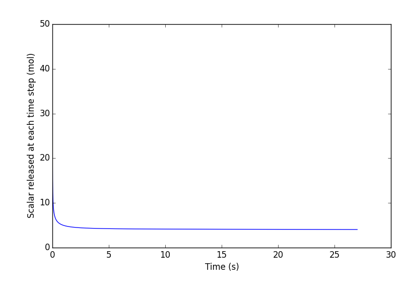
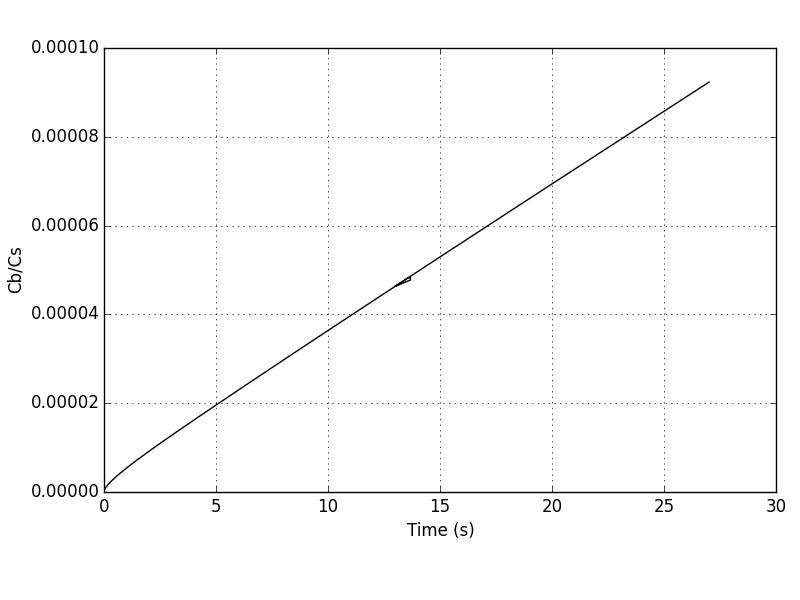

# Chosen case from Yanxing's data files
One of the Yanxing's simulations was chosen as defined by the parameters below:

~~~math
\left.\begin{aligned}
U_o = 0.1 m/s \\
S^* = 1 \\
Re_s= 0.1 \\
\nu= 0.125 m^2/s \\
\end{aligned}
\right\}
\qquad \text{corresponding to [re01s-b/sca-*-01.dat]}
~~~

The output plots are presented in Figures below

#### Figure: {#Chhosen-Case-Scalar}
{width=50%}
Caption: Total scalar released form Yanxing data 

#### Figure: {#Chhosen-Case-Flux}
{width=50%}
Caption: $q^"A$  from Yanxing data

#### Figure: {#Chhosen-Case-Cb}
{width=50%}
Caption: $C_b/C_s$ based on Yanxing data 

#Parameters

Using below equations we can get the dimensional parameters needed for our simulations:

~~~math
\left.\begin{aligned}
S    = \frac{U_o}{H} \\
Re_s = \frac{S \; R^2}{ \nu} \\
S^*  = Re_s \; Sc \\
H/R = 20\\
L/R = 50 \\
W/R = 20 \\
\end{aligned}
\right\}
\qquad \text{Non-dimensional parameters}
~~~

~~~math
\left.\begin{aligned}
R   = \frac{20 \; Re_s \; \nu }{U_o} =2.5 m\\
H = W = 20 R = 50 m  \\
L = 50 R = 125 m \\
Sc  = \frac{S*}{Re_s} = 10\\
D_m = \frac{\nu}{Sc} = 0.0125 m^2/s\\
C_s =1\\
\end{aligned}
\right\}
\qquad \text{Dimensional parameters}
~~~

# Sherwood number based on Figure (#Chhosen-Case-Flux) 

We have $N^"_s A_P$ from Figure (#Chhosen-Case-Flux):

~~~math
N^"_s A_P \approx 4 \\
A_P= 4 \pi R^2= 4 \pi (2.5)^2 =78.54 m^2 \\
N^"_s= \frac{4} {78.54} \approx  0.05 \frac{mols} {m^2.s} 
~~~

based on Figure (#Chhosen-Case-Cb), we can assume $C_b = 0$, therefore:

~~~math
Sh= \frac{N^"_s} {D_m  (\frac{C_s-C_b}{R}) } = \frac{0.05} {0.0125 (\frac{1-0}{2.5})} = 10   \\
~~~

The estimated Sherwood number of 10 is much larger than the value we expected (Sh=1.3 from Sherwood plots and correlations)

