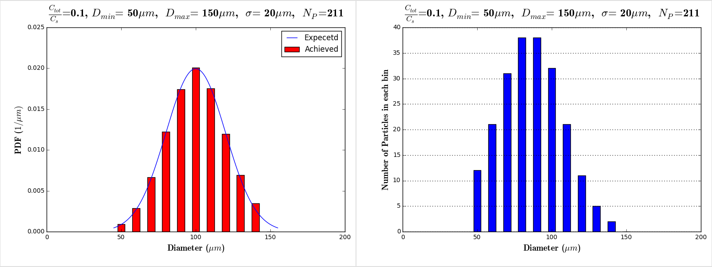
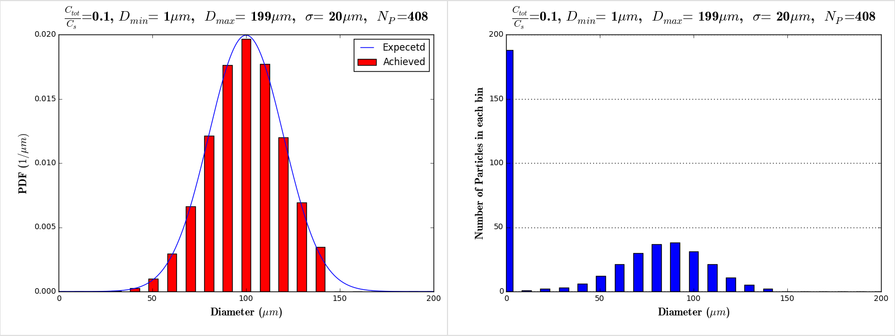
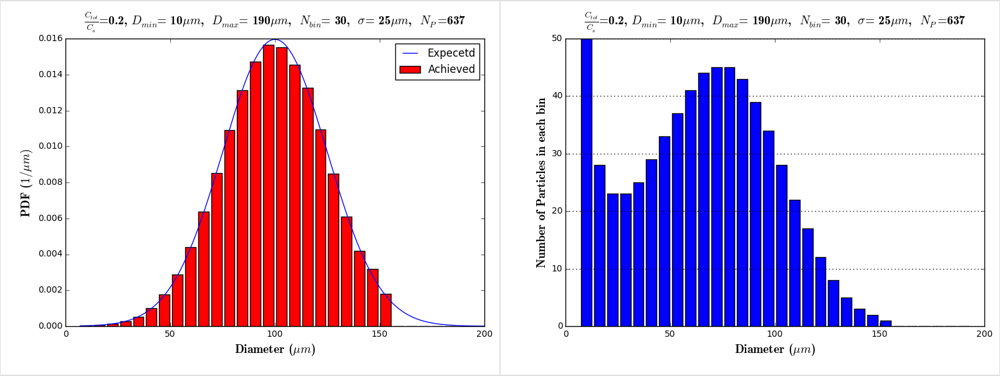
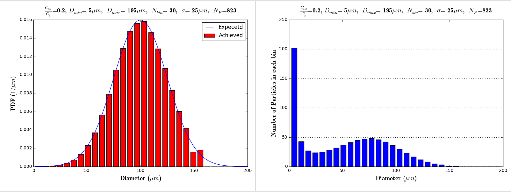

The first study is to test the influence of hydrodynamic and shear effects on the dissolution and absorption of drug releasing from a distribution of particles in the fed state of a human intestine. The four experiments that will be run are

1. Intestine without shear or hydrodynamic effects.
2. Intestine with shear but no hydrodynamic effects.
3. Intestine with hydrodynamic but no shear effects.
4. Intestine with hydrodynamic and shear effects.

The input parameters that need to be specified for the different experiments fall into different categories, viz., geometry and motility, drug and fluid properties, particle information, boundary conditions and the correlations for shear and hydrodynamic effects. 

<!----------------------------------------------------------------------------------------------------------------------------------------------------------->
<!----------------------------------------------------------------------------------------------------------------------------------------------------------->
<!----------------------------------------------------------------------------------------------------------------------------------------------------------->
# Geometry and Motility

Review Gino's thesis for in vivo human data - we need ranges of physiologically realistic parameters in the middle of which will be "typical". We need peristaltic and segmental motility geometry models:

* Need to estimate "bolus" volume as well as $R_{max}$, $\lambda$ (wavelength)  and $\epsilon/R_{max}$ (occlusion ratio - use 0.4).
* Need to estimate wave speed (peristalsis) and collapse speed (segmental)

Table (#table:study1GeomMotilityParams) describes the geometry and motility parameters of the first computational study.

#### Table:  {#table:study1GeomMotilityParams}

| Name             |       Symbol        | Choice     				|Unit	|  
|------------------|---------------------|--------------------------------------|-------|
| Max diameter     | $D_{max}$           | 22.6|$mm$  	|
| Wavelength       | $\lambda$           | 60	|$mm$  	|
| Wave speed       | $s_1$               | 2	|$mm/s$ |
| Number of waves  | -                   | 1           				|-      |
| Occlusion ratio  | $\epsilon/R_{max}$  | 0.5         				|-      |
| Motility mode    | -                   | peristalsis 				|-  	|
| Volume of bolus  | $V_C$		 | 12.03	    			|$cm^3$ |

Caption: Geometry and motility properties for the first computational study.

<!----------------------------------------------------------------------------------------------------------------------------------------------------------->
<!----------------------------------------------------------------------------------------------------------------------------------------------------------->
<!----------------------------------------------------------------------------------------------------------------------------------------------------------->

# Drug and Fluid properties

Table (#table:study1DrugFluidParams) shows the drug and fluid properties for the first computational study.

#### Table:  {#table:study1DrugFluidParams}

| Name                 		|    Symbol           	| Choice                				|  Unit      	|  
|-------------------------------|-----------------------|-------------------------------------------------------|---------------|
| Drug                 		| 		     	| Ibuprofen	   					| 	     	|
| Fluid                		|              		| Water                					|            	|
| Fluid's temperature  		| $T_w$		     	| 20                   					| $^{\circ}C$	|
| Fluid's PH			| $PH_w$		| 7							|            	|
| Fluid's density              	| $\rho_w$      	| 1000			| $kg/m^3$   	|
| Fluid's dynamic viscosity  	| $\mu_w$       	| $1$ 			| $cp$   	|
| Fluid's kinematic viscosity  	| $\nu_w$       	| $1.0e-6$ 		| $m^2/s$   	|
| Drug's density		| $\rho_m$ 		| ?			| $kg/m^3$	|	    	
| Drug's molar volume  		| $\nu_m$             	| 268                  					| $cm^3/mol$ 	|
| Drug's diffusivity   		| $D_m$               	| $7.5 \times 10^{-6}$ 					| $cm^2/s$    	|
| Saturation concentration	| $C_S$               	| $3.3 \times 10^{-7}$ 					| $mol/cm^3$ 	|

Caption: Drug and fluid properties for the first computational study.

<!----------------------------------------------------------------------------------------------------------------------------------------------------------->
<!----------------------------------------------------------------------------------------------------------------------------------------------------------->
<!----------------------------------------------------------------------------------------------------------------------------------------------------------->
# Particles

Total dose and particle size distribution: Choice of shape (log normal), average size and width, number of bins, bin size.

Total dose: Choose $C_{tot}/C_S \sim 0.1$ to be such that we are in sink conditions and far from the singularity near $C_{tot}/C_s = 1$. We choose this even though that singularity is only for the case without absorption and we do have absorption in the intestine case.

"BOLUS DOSE": mass or moles of drug in a bolus segment. To estimate we will collect data from the literature and from UM on concentration of extracted fluids -- statistics. From MRI (Nottingham) we will estimate bolus volume. These two will give us dose in moles from which bolus $C_{tot}$ can be estimated. To this end, we need to estimate solid content along with fluid concentration in the extracted segments. Once we have ranges of $C_{tot}$ we can estimate ranges of  $C_{tot}/C_s$ -- our critical parameter.

We need to estimate for time = 0 the ranges of average particle sizes ($R_P$ ~ 50 - 100 $\mu m$ seem reasonable), mathematical distribution function  shape (log normal seems reasonable), width of the distribution, number of particles, and the number of the bins discretizing the distribution. I must put together information from previous attempts to address this issue. There will have to be a strong balance with practicality -- computational load, grid resolution, etc.

Choice of where to locate the particles at the initial condition.

Table (#table:study1ParticleParameters) shows the particles parameters for the first computational study.

####Table:  {#table:study1ParticleParameters}

| Name                  	|    Symbol          	| Choice                				|  Units     |
|-------------------------------|-----------------------|-------------------------------------------------------|------------|
|	-			| $C_{tot}/C_s$        	|  0.2		       	 | -          |
|Total concentration   		| $C_{tot}$           	|  $6.6 \times 10^{-8}$	 | $mol/cm^3$ |
|Maximum particle diameter	| $D_P^{max}$          	|  195	 		 | $\mu m$    |
|Average particle diameter      | $D_P^{ave}$           |  100                   | $\mu m$    |
|Minimum particle diameter      | $D_P^{min}$           |  5      	   	 | $\mu m$    |
|Number of particles		| $N_P$			|  				| -	     |
|Distribution function shape	|	-		|  Normal	        	| -	     |
|Standard deviation	 	| $\sigma$		|  25				| $\mu m$    |		
|Number of the bins		| $N_{bins}$		|  20				| -	     |
|Initial particle locations	|	-		| randomly distributed in a sphere 			| -	     |	

Caption: Drug particle properties for the first computational study.

## Estimating the numebr of particles with uniform size to achive the desired $C_{tot}$

To achive the $C_{tot} / C_s = 0.2$ :

~~~math
\sum_{i=1}^{N_P} V_{P_i} = C_{tot}  \nu_m V_C \\
~~~

We have:

~~~math
V_C &= 12.03 cm^3 \\
\nu_m &= 268 cm^3/mol \\ 
C_{tot} &= 6.6 \times 10^{-8} mol/cm^3 \\
~~~

Therefore:

~~~math
\sum_{i=1}^{N_P} V_{P_i}  &= (6.6 \times 10^{-8}) (268) (12.03) = 2128 \times 10^{-7} cm^3\\ 
~~~

Considering same size particles with $R=50 \mu m$:

~~~math
V_P &= \frac{4 \pi}{3} R^3 = 5.238 \times 10^{-7} cm^3 \\
~~~

Meaning approximately  406 particles ($N_P$ = 406) with $R=50 \mu m$ are needed to provide  $C_{tot} / C_s = 0.2$

## Particle Distributions

#### Figure: {#fig:Particle_Distribution_1}

{width=99%}

Caption: $\frac{C_{tot}}{C_s}$=0.1 ,  $D_{min}$= 5$\mu m$ ,   $D_{max}$= 195$\mu m$ ,   $\sigma$= 30$\mu m$ ,   $N_P$=1725

#### Figure: {#fig:Particle_Distribution_2}

{width=99%}

Caption: $\frac{C_{tot}}{C_s}$=0.1 ,  $D_{min}$= 10$\mu m$ ,   $D_{max}$= 190$\mu m$ ,   $\sigma$= 30$\mu m$ ,   $N_P$=658

#### Figure: {#fig:Particle_Distribution_3}

{width=99%}

Caption: $\frac{C_{tot}}{C_s}$=0.1 ,  $D_{min}$= 20$\mu m$ ,   $D_{max}$= 180$\mu m$ ,   $\sigma$= 30$\mu m$ ,   $N_P$=410

#### Figure: {#fig:Particle_Distribution_4}

{width=99%}

Caption: $\frac{C_{tot}}{C_s}$=0.1 ,  $D_{min}$= 10$\mu m$ ,   $D_{max}$= 190$\mu m$ ,   $\sigma$= 20$\mu m$ ,   $N_P$=222

#### Figure: {#fig:Particle_Distribution_5}

{width=99%}

Caption: $\frac{C_{tot}}{C_s}$=0.1 ,  $D_{min}$= 10$\mu m$ ,   $D_{max}$= 190$\mu m$ ,   $\sigma$= 40$\mu m$ ,   $N_P$=2026

#### Figure: {#fig:Particle_Distribution_6}

{width=99%}

Caption: $\frac{C_{tot}}{C_s}$=2.0 ,  $D_{min}$= 10$\mu m$ ,   $D_{max}$= 190$\mu m$ ,   $\sigma$= 30$\mu m$ ,   $N_P$=13182

If we choose $\frac{C_{tot}}{C_s}$=0.1 and  $\sigma$= 20$\mu m$ we get:

#### Figure: {#fig:Particle_Distribution_7}

{width=99%}

Caption: $\frac{C_{tot}}{C_s}$=0.1 ,  $D_{min}$=50$\mu m$ ,   $D_{max}$=150 $\mu m$ ,   $\sigma$=20$\mu m$ ,   $N_P$=211

#### Figure: {#fig:Particle_Distribution_8}

{width=99%}

Caption: $\frac{C_{tot}}{C_s}$=0.1 ,  $D_{min}$=10$\mu m$ ,   $D_{max}$=190$\mu m$ ,   $\sigma$=20$\mu m$ ,   $N_P$=222

#### Figure: {#fig:Particle_Distribution_9}

{width=99%}

Caption: $\frac{C_{tot}}{C_s}$=0.1 ,  $D_{min}$=5$\mu m$ ,   $D_{max}$=195$\mu m$ ,   $\sigma$=20$\mu m$ ,   $N_P$=224

#### Figure: {#fig:Particle_Distribution_10}

{width=99%}

Caption: $\frac{C_{tot}}{C_s}$=0.1 ,  $D_{min}$=2$\mu m$ ,   $D_{max}$=198$\mu m$ ,   $\sigma$=20$\mu m$ ,   $N_P$=249

#### Figure: {#fig:Particle_Distribution_11}

{width=99%}

Caption: $\frac{C_{tot}}{C_s}$=0.1 ,  $D_{min}$=1$\mu m$ ,   $D_{max}$=199$\mu m$ ,   $\sigma$=20$\mu m$ ,   $N_P$=408

If we choose $\frac{C_{tot}}{C_s}$=0.2 and  $\sigma$= 25$\mu m$ we get:

#### Figure: {#fig:Particle_Distribution_12}

{width=99%}

Caption: $\frac{C_{tot}}{C_s}$=0.2 ,  $D_{min}$=10$\mu m$ ,   $D_{max}$=190$\mu m$ , $N_{bin}$=20,  $\sigma$=25$\mu m$ ,   $N_P$= 660

#### Figure: {#fig:Particle_Distribution_13}

{width=99%}

Caption: $\frac{C_{tot}}{C_s}$=0.2 ,  $D_{min}$=10$\mu m$ ,   $D_{max}$=190$\mu m$ ,  $N_{bin}$=30,  $\sigma$=25$\mu m$ ,   $N_P$= 637

#### Figure: {#fig:Particle_Distribution_14}

{width=99%}

Caption: $\frac{C_{tot}}{C_s}$=0.2 ,  $D_{min}$=5$\mu m$ ,   $D_{max}$=195$\mu m$ ,  $N_{bin}$=20  , $\sigma$=25$\mu m$ ,   $N_P$= 936

#### Figure: {#fig:Particle_Distribution_15}

{width=99%}

Caption: $\frac{C_{tot}}{C_s}$=0.2 ,  $D_{min}$=5$\mu m$ ,   $D_{max}$=195$\mu m$ ,   $N_{bin}$=30,   $\sigma$=25$\mu m$ ,   $N_P$= 823

<!----------------------------------------------------------------------------------------------------------------------------------------------------------->
<!----------------------------------------------------------------------------------------------------------------------------------------------------------->
<!----------------------------------------------------------------------------------------------------------------------------------------------------------->

# Boundary conditions

Table (#table:study1BC) shows the boundary condition choices: 

#### Table:  {#table:study1BC}

| Name      			| Symbol                | Choice                                |  Units      |
|-------------------------------|-----------------------|---------------------------------------|-------------|
| Momentum Boundary Condition	| BounceBack2           | Second order Bounce Back		| -           |
| Scalar  Boundary Condition   	| $\phi_{BC} = 0.0$    	| Immidiate uptake 			| -           |

Caption: Boundary Conditions

<!----------------------------------------------------------------------------------------------------------------------------------------------------------->
<!----------------------------------------------------------------------------------------------------------------------------------------------------------->
<!----------------------------------------------------------------------------------------------------------------------------------------------------------->
# Modeling Parameters

Table (#table:study1ModelingParameters) shows the modeling and computational parameters 

#### Table:  {#table:study1ModelingParameters}

| Name                   		| Symbol             	| Choice                										|
|---------------------------------------|-----------------------|-------------------------------------------------------------------------------------------------------|
| Partitioning modeling parameter       | $n_d$                	| 3									|
| Bulk concentration modeling parameter	| $n_b$                	| 3									| 	     
| Schmidt number       	 		| $Sc$                	|  50    								|                    		           
| LBM Relaxation parameter		| $\tau$               	| 1									| 	     
| Mass conservation fix                 |                       |   in BC:$\rho$=1, $\rho_{uncov}=\rho_{ave}$, Fix [$\rho, f, f^+$]  	|   

Caption: Modeling and computational parameters for the first computational study.

 Notes: 
In future, we should perform sensitivity analysis by chosing $n_d= n_b= 1.5 \& 6$

<!----------------------------------------------------------------------------------------------------------------------------------------------------------->
<!----------------------------------------------------------------------------------------------------------------------------------------------------------->
<!----------------------------------------------------------------------------------------------------------------------------------------------------------->

#Computational Cost Estimation
#### Table:  {#table:ComputationalCost}

| Name                                  | Symbol                | Choice                                |  Units     |
|---------------------------------------|-----------------------|---------------------------------------|------------|
| Mesh resolution		        | $\Delta x$            | 0.2					| mm         |
| Total number of nodes		        | $N_{nodes}$           | 3 000 000				|            |
| Number of Particles                   | $N_{particles}$       | 685                                   |            |
| Time steps		                | $\Delta t$            | 6.66 e-3				| s          |
| Total number of waves simulated       | 	             	| 20		                        |            |
| Wave's charactristice time scale      | $t_{wave}$            | 30					| s          |
| Total physical time		        | $t_{tot}$             | 600                                   | s          |
| Total number of iterations            | $N_{iter}$            | 90 000                                |            |
| Computational cost of each iteration  |			| 8.0 					| CPU.s      |
| Total computational Cost		|			| 200          				| CPU.hour   |
| Total computational Cost		|			| 8.3					| CPU.days   |

Caption: Computational cost estimation

