We document our attempts at implementing the flux boundary condition in LBM.

# Background on moment propagation method in LBM
Frenkel and Ernst [@frenkel1989] and Lowe and Frenkel [@Lowe1995] developed the "momentum propagation method" to predict the evolution of scalar concentration in LBM. This method uses the density distribution function for momentum to also stream the scalar from one lattice node to another instead of defining and using a separate distribution function for the scalar. We use the improved and more robust method by Merks et. al. [@Merks2002563] as:

~~~math #modifiedMomentPropagationMethod
\phi_(\vec{x}, t + \delta t) = \sum_{\alpha} P_{\alpha} (\vec{x} - \vec{e}_{\alpha} \, \delta t, t + \delta t) + \Delta^* \, \phi_(\vec{x}, t + \delta t),
~~~

where $P_{\alpha} (\vec{x} - \vec{e}_{\alpha} \, \delta t, t + \delta t)$ is the amount of scalar streamed in from the neighboring node node $\vec{x} - \vec{e}_{\alpha} \, \delta t$ in the direction $\alpha$

~~~math #pAlpha
P_{\alpha} (\vec{x} - \vec{e}_{\alpha} \, \delta t, t + \delta t) = \left ( \frac{\hat{f}_{\alpha}(\vec{x} - \vec{e}_{\alpha} \, \delta t,t^+)}{\rho(\vec{x} - \vec{e}_{\alpha} \, \delta t,t)} - w_{\alpha} \Delta^* \right ) \phi(\vec{x} - \vec{e}_{\alpha} \, \delta t, t),
~~~

while $\Delta^*$ is the proportion of scalar that remains in the current node $\vec{x}$ and is related to the macroscopic scalar diffusivity as

~~~math #deltaStar
\Delta^* = 1 - 6 \frac{D_m}{c \, \delta x}.
~~~

According to Merks et. al., the moment propagation method places a restriction on $\Delta^*$ to not exceed an upper bound in order to maintain stability and prevent the term inside the bracket in Eq. (#pAlpha) from going negative as

~~~math #deltaStarMax
\Delta^* = min \left (  \frac{f_{\alpha}^{eq}(\vec{u},\rho)}{f_{\alpha}^{eq}(\vec{u}=0,\rho)}  \right ).
~~~

The numerated inside the bracket in Eq. (#deltaStarMax) uses the equilibrium density function as opposed to the post-collision density distribution in Eq. (#pAlpha). The macroscopic velocity $\vec{u}$ skews the density distribution towards the direction of the velocity vector. When this skewness exceeds a certain limit, the term inside the bracket in Eq. (#pAlpha) goes negative leading to instability and negative scalar at certain points in the domain. To avoid this, the velocity vector $\vec{u}$ has to be small compared to the velocity scale $vcf$ in lattice units. One way to acheive this is through increased resolution. Consider a case with the parameters in equation (#exampleCaseParameters) :

~~~math #exampleCaseParameters
\begin{aligned}
\textrm{maximum velocity in the domain } &= 0.008m/s \textrm { in the x direction} \\
Sc &= 10 \\
\nu &= 5.087 \times 10^{-6} m^2/s \\
\tau &= 1.0
\end{aligned}
~~~

Figure (#deltaStarMaxVsGridResolution) shows the change in $\Delta^*_{max}$ with the grid resolution as defined by Eq. (#deltaStarMax). 

#### Figure: {#deltaStarMaxVsGridResolution}

{width=75%}

Caption: Change in $\Delta^*_{max}$ with the grid resolution in LBM as defined by Eq. (#deltaStarMax) for the parameters defined in Eq. (#exampleCaseParameters). The constant line is the $\Delta^*$ as defined by the physical properties of the fluid and scalar for this case.


Thus for a given choice of simulation parameters, there exists a critical resolution to satisfy the stability criterion in Eq. (#deltaStar). The critical resolution required to satisfy the stability condition in Eq. (#deltaStarMax) decreases with Schmidt number as shown in Fig. (#CritGridResolutionVsSc).

#### Figure: {#CritGridResolutionVsSc}

{width=75%}

Caption: Change in critical resolution required for a stable LBM simulation with Schmidt number.

When the Schmidt number is fixed, the critical resolution increases with increasing $\tau$ as shown in Fig. . This is expected as increasing $\tau$ is known to make the simulation more diffusive and less accurate.


#### Figure: {#CritGridResolutionVsTau}

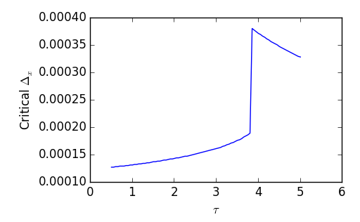{width=32%}
{width=32%}
{width=32%}

Caption: Change in critical resolution required for a stable LBM simulation with $\tau$ for different Schmidt numbers.

Finally, critical resolution also decreases with increasing maximum velocity in the domain as shown in Fig. (#CritGridResolutionVsPV) where $piston velocity$ is a substitute for the maximum velocity in the domain. 

#### Figure: {#CritGridResolutionVsPV}

{width=75%}

Caption: Change in critical resolution required for a stable LBM simulation with maximum velocity in the domain.


## Scalar boundary conditions

The scalar boundary condition is a little different from the typical bounce back boundary conditions because, unlike momentum, scalar does not bounce back from the wall. The wall could have a fixed value of the scalar or a fixed flux or a combination of both. Within the framework of the moment propagation method, the difficulty lies in finding the contribution $P_k(\vec{x} - \vec{e}_k \, \delta t, t + \delta t)$ at the node adjacent to the wall. We first consider the case of a specified value of scalar at the wall (Dirichlet boundary condition).

#### Figure: {#fig:scalarBC}

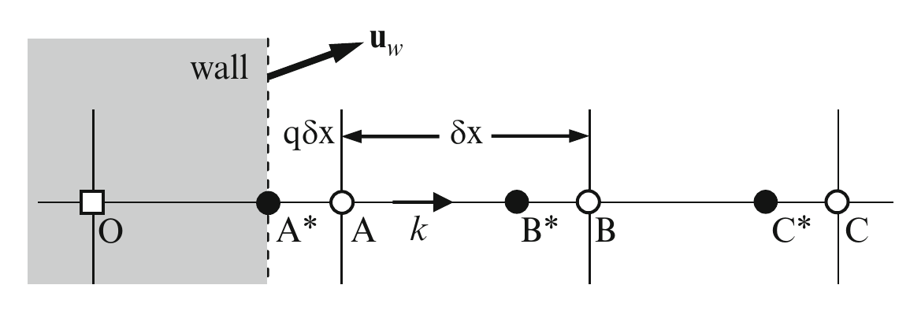{width=75%}

Caption: Node system used in developing the boundary conditions for scalar concentration by Wang et. al. [@Wang2010].

$A^*$, $B^*$ and $C^*$ are three virtual nodes one lattice apart such that $A^*$ is the node on the boundary. The scalar boundary condition for a fixed value of the scalar at the boundary involves calculating the contribution $P_k(\vec{x} - \vec{e}_k \, \delta t, t + \delta t)$ at $B^*$ and $C^*$ and extrapolating it to A. This is done in 3 steps as shown below.

1. Estimate the density and particle distribution function in the $k$ direction at $A^*$ as
~~~math
\rho_{A^*} = \rho_A  + (\rho_A - \rho_B) q.
~~~

The particle distribution function (post-collision) at $A^*$ is split into equilibrium and non-equilibrium parts and evaluate them separately as shown in Eq. (#fAstar). 

~~~math #fAstar
\begin{aligned}
\hat{f}_{k, A^*} &= f_{k, A^*}^{eq} + f_{k, A^*}^{neq}, \\
\textrm{Based on $\mathbf{u}_w$ wall velocity   } f_{k, A^*}^{eq} &= w_{k} \, \rho_{A^*} \, \left [ 1 + 3 \frac{\vec{e}_{k} \cdot \vec{u}_w}{c^2} + \frac{9}{2} \frac{(\hat{e}_{k} \cdot \vec{u}_w)^2 }{c^4} - \frac{3}{2} \frac{(\vec{u}_w \cdot \vec{u}_w)^2}{c^2}  \right ], \\
\textrm{Based on extrapolation   } f_{k, A^*}^{neq} &= f_{k, A}^{neq} + ( f_{k, A}^{neq} - f_{k, B}^{neq}) q.
\end{aligned}
~~~

2. Calculate the contribution $P_k(\vec{x} - \vec{e}_k \, \delta t, t + \delta t)$ at $B^*$ and $C^*$ as shown in Eq. (#PkAstarBstar). While $\hat{f}_k$, $\rho$ and $\phi$ are calculated at  $A^*$ in Step 1, the corresponding quantities are interpolated to $B^*$ using the values at $A$ and $B$ at time $t$. 
~~~math #PkAstarBstar
\begin{aligned}
(P_k)_{A^* \rightarrow B^*, t + \delta t} &= \left ( \frac{\hat{f}_k(A^*,t^+)}{\rho(A^*,t^+)} - w_k \Delta^* \right ) \phi(A^*, t) \\
(P_k)_{B^* \rightarrow C^*, t + \delta t} &= \left ( \frac{\hat{f}_k(B^*,t^+)}{\rho(B^*,t^+)} - w_k \Delta^* \right ) \phi(B^*, t)
\end{aligned}
~~~

3. Calculate the contribution $P_k(\vec{x} - \vec{e}_k \, \delta t, t + \delta t)$ at $A$ using linear extrapolation from $B^*$ and $C^*$ as 

~~~math
P_k(\vec{x} - \vec{e}_k \, \delta t, t + \delta t)_A = (P_k)_{A^* \rightarrow B^*, t + \delta t} + \left [ (P_k)_{A^* \rightarrow B^*, t + \delta t} - (P_k)_@{B^* \rightarrow C^*, t + \delta t} \right ] (1 - q).
~~~

This procedure is extended to the case with a specified scalar flux at the boundary (Neumann boundary condition).


## Calculation of scalar flux at the boundary #scalarFluxCalc
When using the moment propagation method for a scalar in LBM, the difference between the scalar streamed to and from the node that is adjacent to the boundary to calculate the mass flux across the boundary. As shown in Eq. (#scalarFluxAcrossBoundary), the difference when summed over all the nodes adjacent to the boundary gives the mass flux across the entire boundary.
~~~math #scalarFluxAcrossBoundary
\textrm{Mass flux out of domain} = \sum_{A \in \textrm{all nodes adjacent to boundary}} \left (P_{k'}(\vec{x} - \vec{e}_{k'} \, \delta t, t + \delta t)_A - P_k(\vec{x} - \vec{e}_k \, \delta t, t + \delta t)_A  \right ) \frac{\Delta^3}{t_{cf}} \; mol/s,
~~~
where $k$ is the direction going from the node to the boundary, $k'$ is the mirror image of $k$, $\Delta^3$ is the physical volume surrounding each node and $t_{cf}$ is the physical time corresponding to one LBM time step. 


# Tests with piston case

We chose the piston setup to test this boundary condition. The left and right cylinders of the piston are moving at the same velocity in the $x$ direction, while the domain is periodic in the other two directions, thus making it an infinitely wide piston. For this purpose, Farhad modified the Couette setup into a piston setup. The development of this code can be tracked at the [Piston](https://github.com/BioGI/Intestine-Particles/tree/Piston) and [Piston-Flux](https://github.com/BioGI/Intestine-Particles/tree/Piston-Flux) branches on github.

## Dirichlet - Fixed zero scalar boundary condition

The scalar boundary condition used is

~~~math #bcFixedZero
\phi_{wall} = 0.0
~~~


#### Figure: {#BCfixedZero}

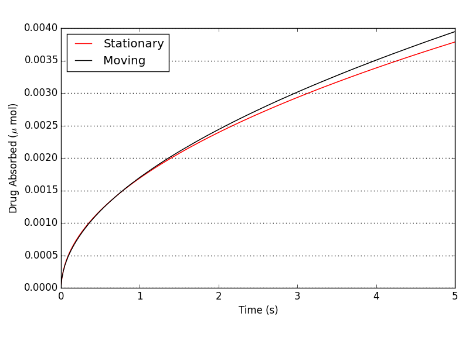{width=33%}
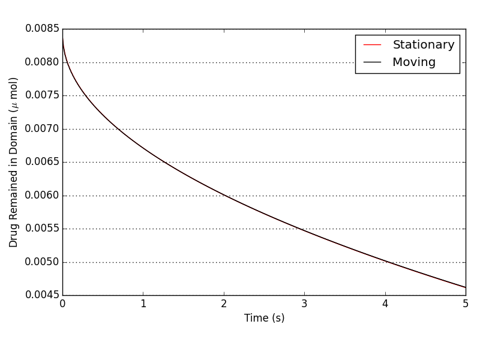{width=33%}
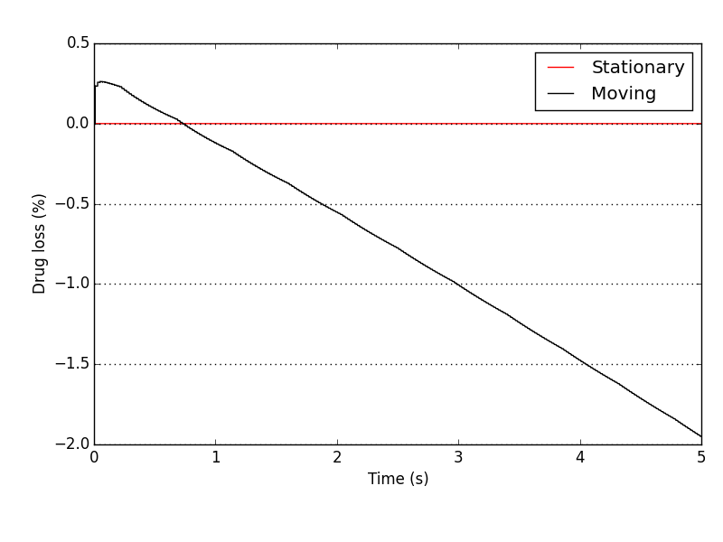{width=33%} \
{width=33%}
{width=33%}
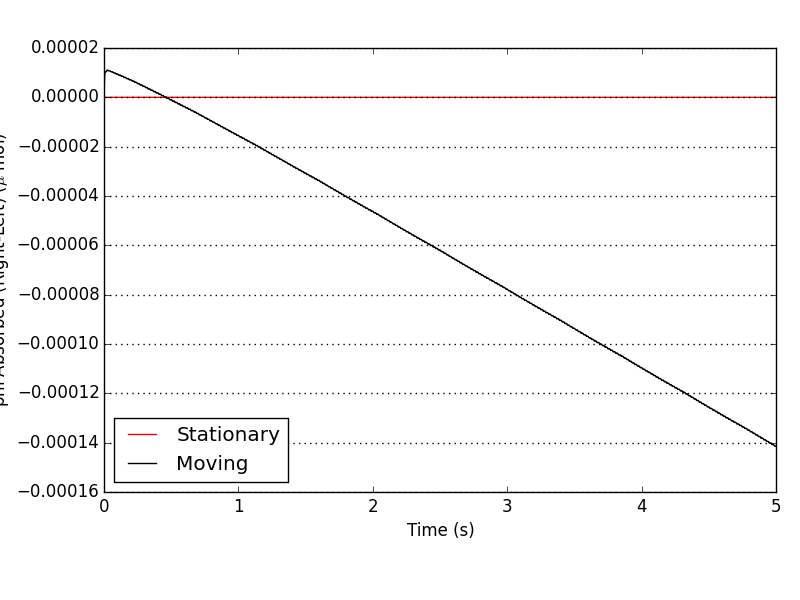{width=33%} 

Caption: Comparison of scalar conservation and absorption between stationary and moving piston cases with fixed zero scalar boundary condition.

## Dirichlet - Fixed non-zero scalar boundary condition

The scalar boundary condition used is

~~~math #bcFixedNonZero
\phi_{wall} = 0.5
~~~


#### Figure: {#BCfixedNonZero}

{width=33%}
{width=33%}
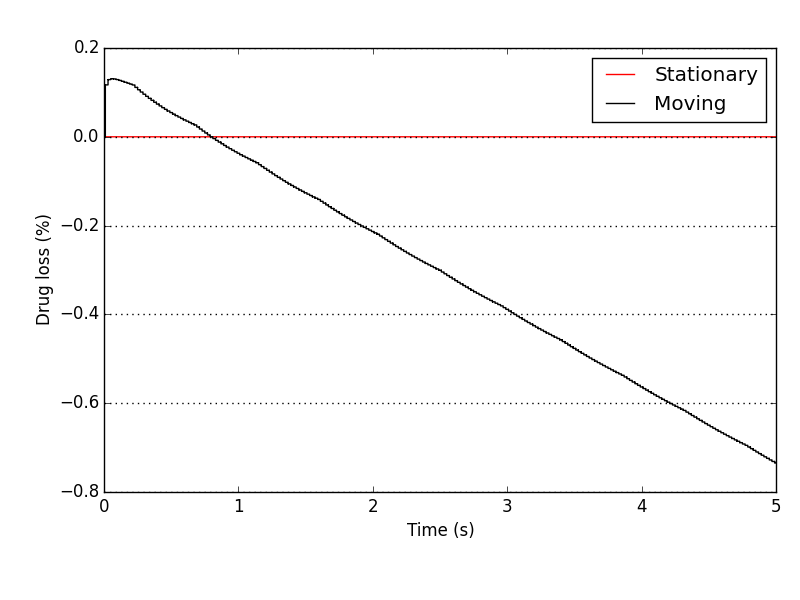{width=33%} \
{width=33%}
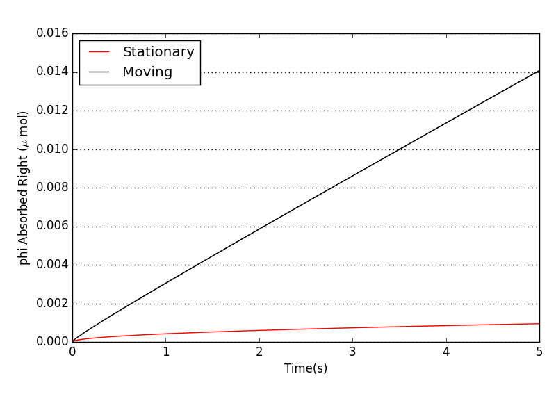{width=33%}
{width=33%} 

Caption: Comparison of scalar conservation and absorption between stationary and moving piston cases with fixed non-zero scalar boundary condition.

After changing the book keeping as described here (#changingBookKeeping), the scalar conservation improved dramatically as shown in Fig. (#BCfixedNonZeroBookKeepingFix). Note that the main difference is in the Drug absorbed on the left and right pistons; the difference between the two has come down from $\sim 3000\%$ to $\sim 0.8\%$. The drug loss error remains roughly the same because this is a special case where the symmetric movement of the right and left pistons cancels the errors in the drug absorption to maintain the total scalar conservation, i.e. the previous implementation gave the correct answer for the wrong reasons.

#### Figure: {#BCfixedNonZeroBookKeepingFix}

{width=33%}
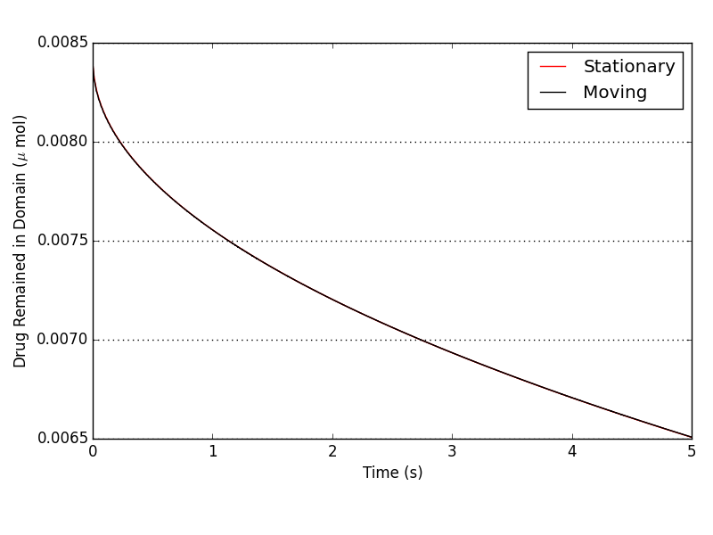{width=33%}
{width=33%} \
{width=33%}
{width=33%}
{width=33%} 

Caption: Comparison of scalar conservation and absorption between stationary and moving piston cases with fixed non-zero scalar boundary condition and new book keeping procedure.


## Neumann - zero flux boundary condition

The scalar boundary condition used is

~~~math #bcZeroFlux
\left . \frac{\partial \phi}{\partial n} \right |_{wall} = 0.0
~~~


#### Figure: {#BCzeroFlux}

{width=33%}
{width=33%}
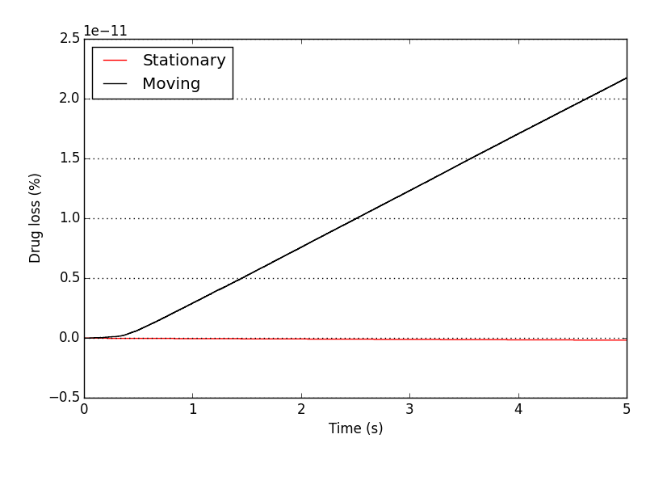{width=33%} \
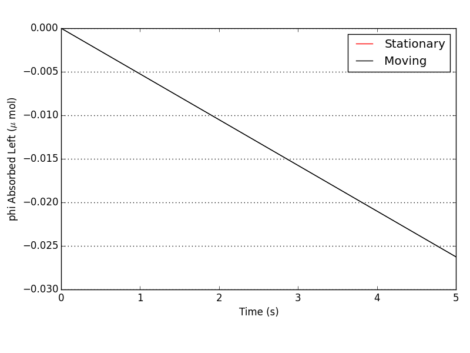{width=33%}
{width=33%}
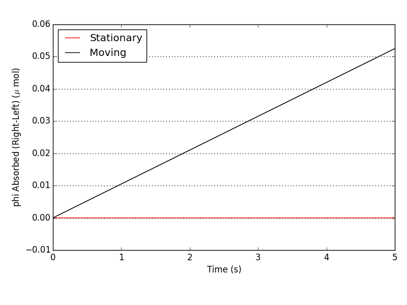{width=33%} 

Caption: Comparison of scalar conservation and absorption between stationary and moving piston cases with zero flux scalar boundary condition.

## Neumann - non-zero flux boundary condition

The scalar boundary condition used is

~~~math #bcNonZeroFlux
\left . \frac{\partial \phi}{\partial n} \right |_{wall} = 0.05 \; \textrm{ in lattice units}
~~~


#### Figure: {#BCnonZeroFlux}

{width=33%}
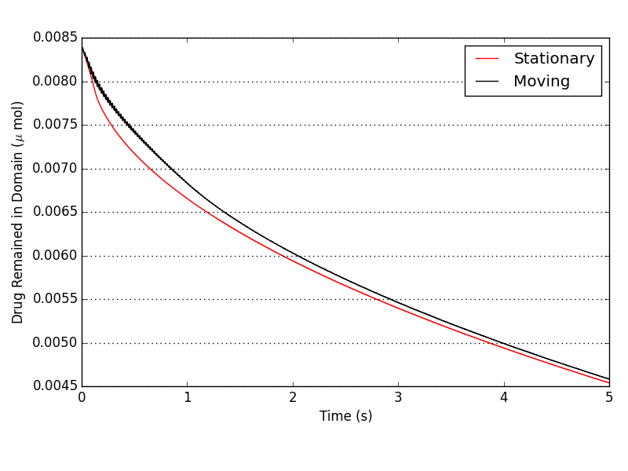{width=33%}
{width=33%} \
{width=33%}
{width=33%}
{width=33%} 

Caption: Comparison of scalar conservation and absorption between stationary and moving piston cases with non-zero flux scalar boundary condition.

After changing the book keeping as described here (#changingBookKeeping), the scalar conservation and absorption improved dramatically as shown in Fig. (#BCnonZeroFluxBookKeepingFix). 

#### Figure: {#BCnonZeroFluxBookKeepingFix}

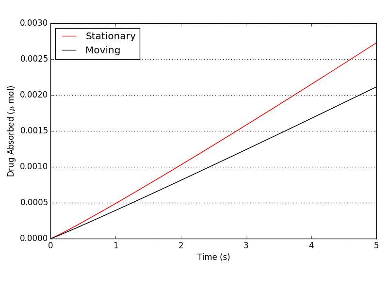{width=33%}
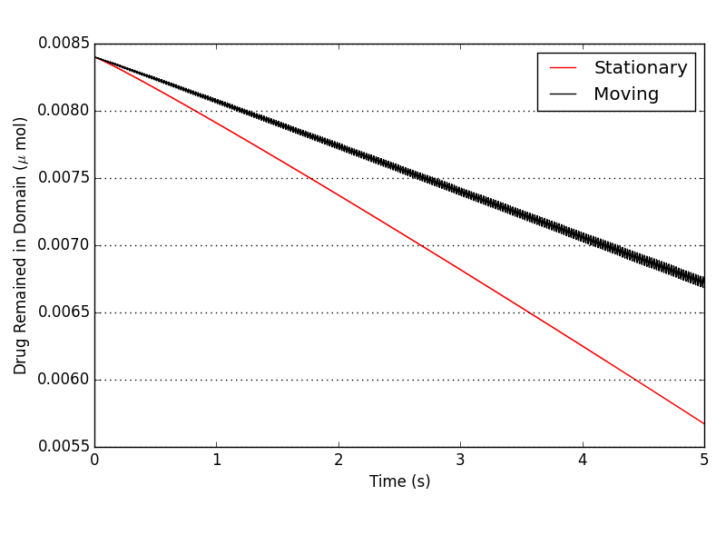{width=33%}
{width=33%} \
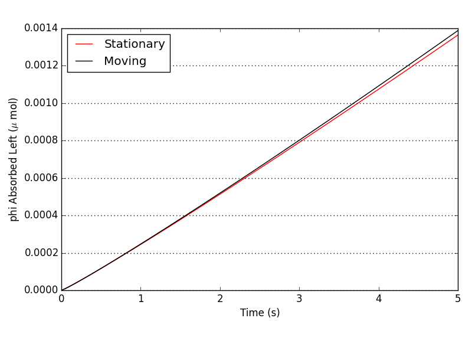{width=33%}
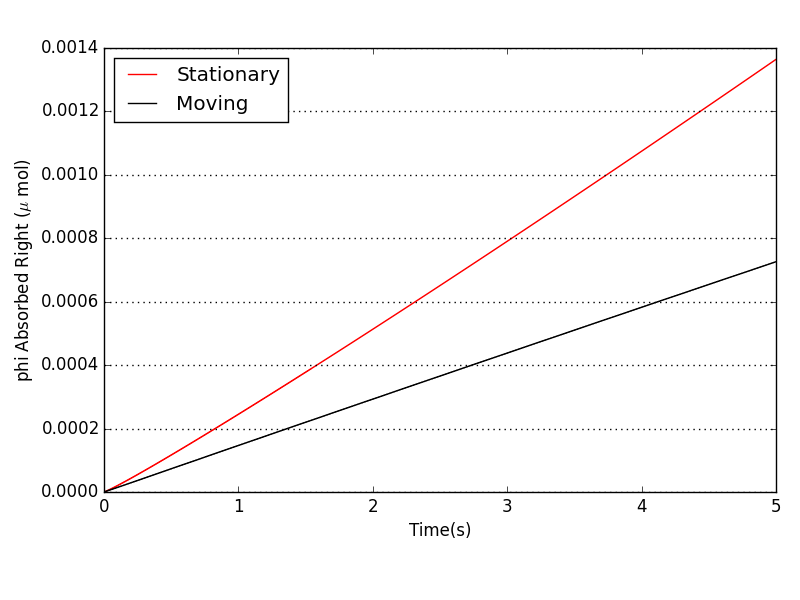{width=33%}
{width=33%} 

Caption: Comparison of scalar conservation and absorption between stationary and moving piston cases with non-zero flux scalar boundary condition and new book keeping procedure.

Note that the drug loss error has come down from $\sim 160\%$ to $\sim 6\%$, while the difference between the scalar absorbed on the two sides comes down from $\sim 500\%$ to $\sim 70\%$. The new book keeping procedure almost completely fixes the scalar absorbed calculation on the left piston, while the right piston continues to exhibit a large error compared to the stationary case. This is also observed in the asymmetric evolution of $\phi$ in the domain as shown in Fig. (#phiDomainBCnonZeroFluxBookKeepingFix).


####Figure: {#phiDomainBCnonZeroFluxBookKeepingFix}

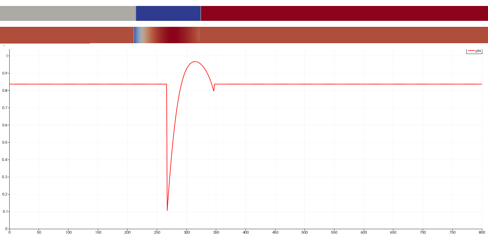{width=75%}

Caption: Visualization of scalar in the domain with a moving piston, non-zero flux boundary condition and new book keeping procedure.

This suggests that the remaining error is due to the procedure for assigning a value to the uncovered node. The current procedure to assign the value of scalar for a newly uncovered node and flux boundary conditions is to average the value from the nodes around it. We changed this to be based on the quadrature rules using the specified flux at the wall. Adding this fix, the scalar conservation and absorption improves further as shown in Fig. (#BCnonZeroFluxBookKeepingUncoveredNodeFix). 

#### Figure: {#BCnonZeroFluxBookKeepingUncoveredNodeFix}

{width=33%}
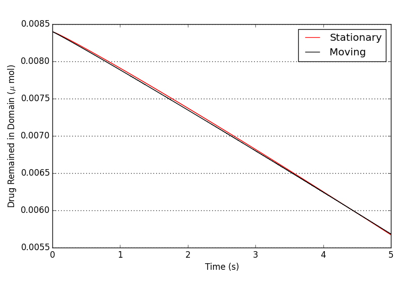{width=33%}
{width=33%} \
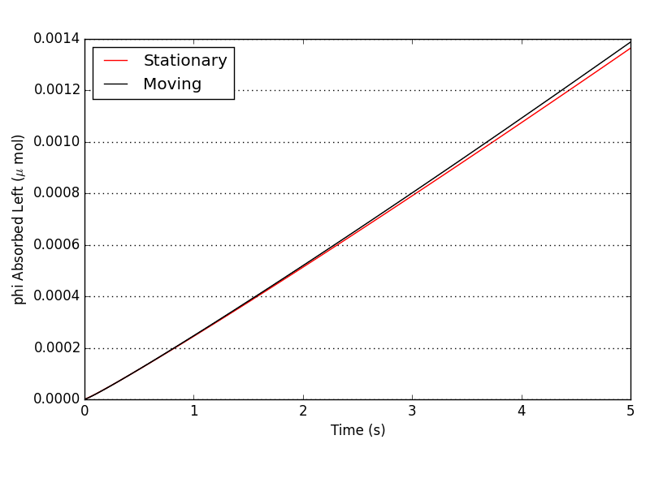{width=33%}
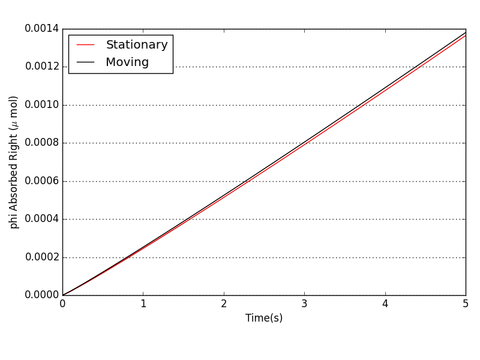{width=33%}
{width=33%} 

Caption: Comparison of scalar conservation and absorption between stationary and moving piston cases with non-zero flux scalar boundary condition, new book keeping procedure and new algorithm to assign scalar values at uncovered node.

The drug loss error has come down from $\sim 160\%$ to $\sim 0.6\%$, while the difference between the scalar absorbed on the two sides comes down from $\sim 500\%$ to $\sim 0.8\%$. This fix makes the evolution of scalar in the domain completely symmetric as shown in Fig. (#phiDomainBCnonZeroFluxBookKeepingUncoveredNodeFix).

####Figure: {#phiDomainBCnonZeroFluxBookKeepingUncoveredNodeFix}

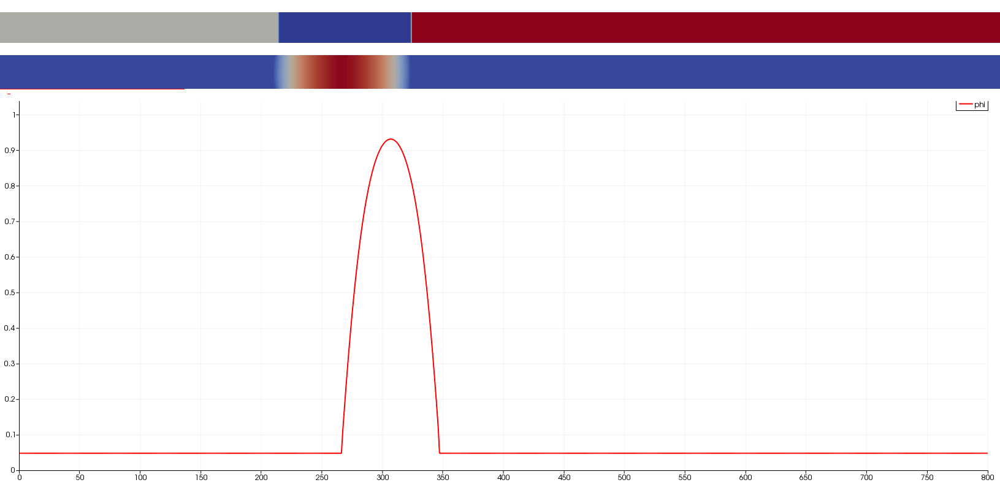{width=75%}

Caption: Visualization of scalar in the domain with a moving piston, non-zero flux boundary condition and new book keeping procedure.


## Mixed - constant permeability boundary condition

The permeability $P_w$ is defined as

~~~math #permeability
\frac{\partial \phi}{\partial n} = \frac{P_w}{D_m} C_w ,
~~~

where $D_m$ is the diffusivity, $C_w$ is the scalar concentration at the wall, and $n$ is the distance co-ordinate in the direction from the wall into the fluid. The permeability used in this comparison is such that $P_w/D_m = 2.0$ in lattice units. This corresponds to a physical permeability of $1e-4 cm/s$.

#### Figure: {#BCconstPermeability}

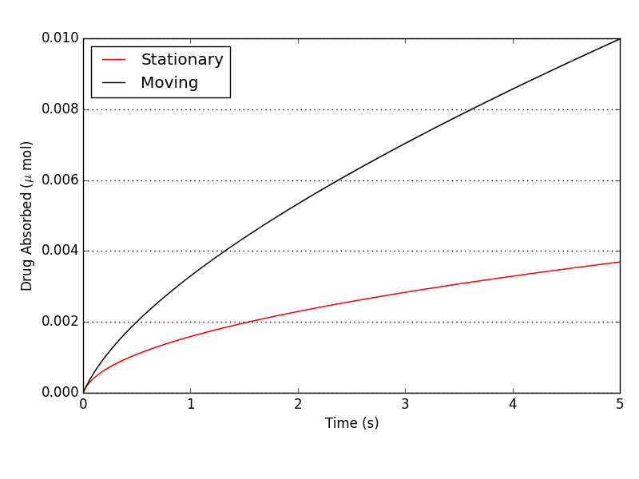{width=33%}
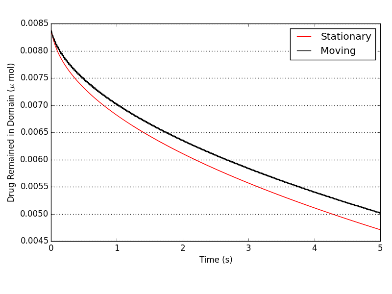{width=33%}
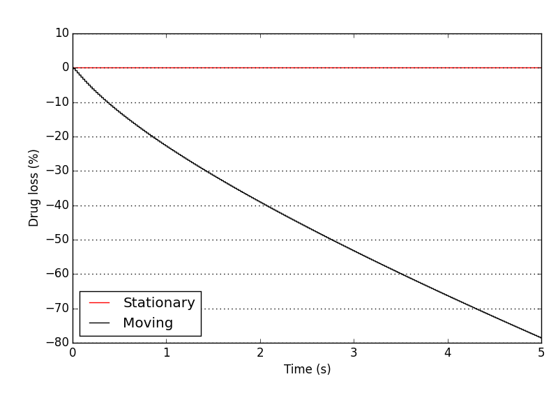{width=33%} \
{width=33%}
{width=33%}
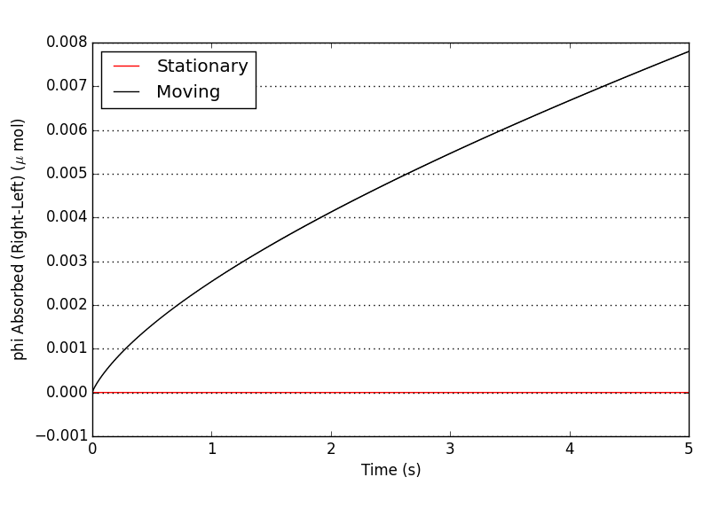{width=33%} 

Caption: Comparison of scalar conservation and absorption between stationary and moving piston cases with constant permeability scalar boundary condition.

After changing the book keeping as described here (#changingBookKeeping) and the procedure for assinging scalar values to the uncovered nodes, the scalar conservation and absorption improves dramatically as shown in Fig. (#BCconstPermeabilityBookKeepingUncoveredNodeFix).

#### Figure: {#BCconstPermeabilityBookKeepingUncoveredNodeFix}

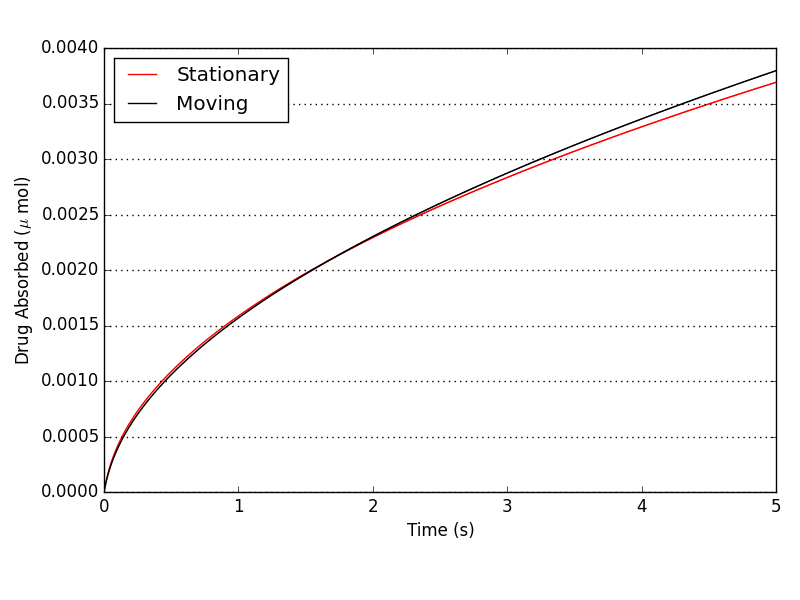{width=33%}
{width=33%}
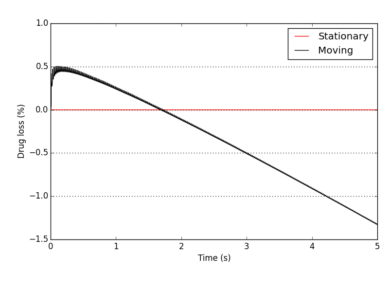{width=33%} \
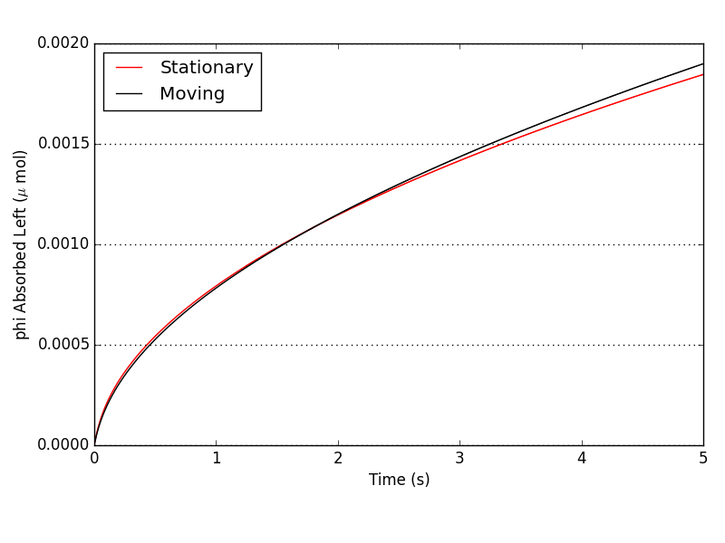{width=33%}
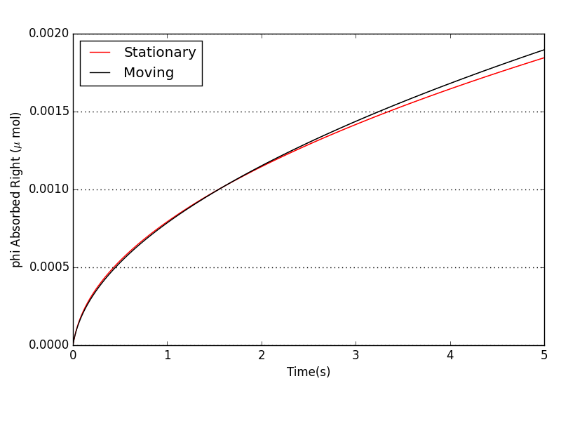{width=33%}
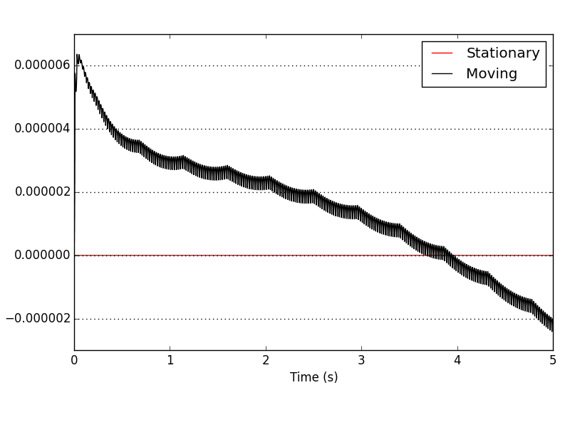{width=33%} 

Caption: Comparison of scalar conservation and absorption between stationary and moving piston cases with constant permeability scalar boundary condition.

The drug loss error has come down from $\sim 80\%$ to $\sim 1.5\%$, while the difference between the scalar absorbed on the two sides comes down from $\sim 4\%$ to $\sim 0.1\%$.

####Figure: {#phiDomainBCconstPermeabilityBookKeepingUncoveredNodeFix}

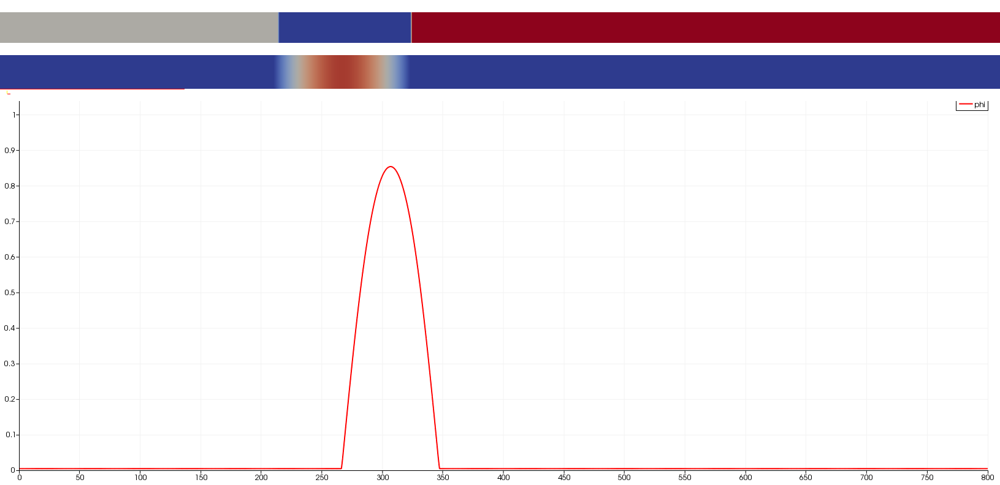{width=75%}

Caption: Visualization of scalar in the domain with a moving piston, constant permeability boundary condition and new book keeping procedure.


## Generalized formulation of the scalar boundary condition

The different boundary conditions are currently implemented in the code using different constructs. This leads to very complicated code handling with a different branch of development for each boundary condition. To avoid this, we propose to formulate a generalized scalar boundary condition in the code as

~~~math #generalizedScalarBC
(coeffPhi) \; C_w + (coeffGrad) \; \left . \frac{\partial C}{\partial n} \right |_w  = \; coeffConst,
~~~

where $coeffPhi$, $coeffGrad$ and $coeffConst$ are constants, $\left . \right |_w$ represents a value at the wall, and $n$ is in the direction from the wall into the fluid. The code with this version of the boundary condition is commit [891069a5b3b87984a1664eaf65db839266a160b9](https://github.com/BioGI/Intestine-Particles/commit/891069a5b3b87984a1664eaf65db839266a160b9)


## Changing book keeping for scalar absorbed #changingBookKeeping

There are two parts to the scalar boundary condition; the first is the determination of the scalar that streams from the wall into the node adjacent to it and the second is the computation of the difference between $P_k$ and $P_{k'}$ to keep track of the total scalar absorbed through the wall. The second part is purely a book keeping exercise and does not affect the evolution of the scalar in the domain. The first part, i.e. the scalar boundary condition seems to work reasonably well in keeping the profiles of $\phi$ symmetric across the piston walls even when it's moving. However, the book keeping exercise records asymmetric values of drug absorbed on the right and left faces when the piston is moving. Using this clue, we redesigned the book keeping exercise to not use the velocity of the fluid/wall in the calculation of the drug absorbed. 

## Summary

Summary of all cases. Table (#table:comparisonDrugLoss) compares the drug loss across different boundary conditions for the moving piston case with different improvements/fixes.

#### Table:  {#table:comparisonDrugLoss}

| Boundary condition  |  Trad. Book Keeping  | Book keeping fix  | Book keeping + uncovered node fix  |
|---------------------|----------------------|-------------------|------------------------------------|
|   Zero scalar       |          -2%         | -                 |  -                                 |
|   Non-zero scalar   |          -0.7%       | -0.7%             |  -                                 |
|   Zero flux         |$2 \times 10^{-11}\%$ | -                 |  -                                 |
|   Non-zero flux     |         -160%        |       -6%         |          -0.6%                     |
| Const permeability  |         -80%         |       -           |          -1.5%                     |

Caption: Comparison of drug loss across different boundary conditions for the moving piston case with different improvements/fixes.

Table (#table:comparisonRightLeftAbsorption) compares the difference in scalar absorbed between right and left piston across different boundary conditions for the moving piston case with different improvements/fixes.


<div align=center>

#### Table:  {#table:comparisonRightLeftAbsorption}

| Boundary condition  |  Trad. Book Keeping  | Book keeping fix  | Book keeping + uncovered node fix  |
|---------------------|----------------------|-------------------|------------------------------------|
|   Zero scalar       |          7.7%        | -                 |  -                                 |
|   Non-zero scalar   |          3000%       | 0.8%              |  -                                 |
|   Zero flux         | 0.05 ($\mu mol$)     | -                 |  -                                 |
|   Non-zero flux     |        500%          |       70%         |          0.8%                      |
| Const permeability  |         444%         |       -           |          0.1%                      |

Caption: Comparison of difference in scalar absorbed between right and left piston across different boundary conditions for the moving piston case with different improvements/fixes.

</div>

# Curved and accelerating piston

## Curved piston

The next step is to make sure that the boundary conditions work on a curved boundary. Continuing with the piston setup, we decided to make it into a curved piston. The new piston shape will be a cosine curve in the z-direction to satisfy the periodicity requirement as

~~~math #curvedPistonShape
x = \textrm{Left end location} + \frac{D_z}{2} \left ( 1+  cos \left ( \frac{2z}{D_z} \pi \right ) \right ),
~~~

where $D_z$ is the extent of the domain in the $z$ direction. The amplitude of the cosine curve is set to be equal to half of the domain length in the $z$ direction.

####Figure: {#curvedPistonShape}

{width=75%}

Caption: Visualization of curved piston shape for further testing of the scalar boundary conditions.


The normal vector to this curve is obtained using the slope of the curve in Eq. (#curvedPistonShape). The slope of the tangent at each point of the curved piston is

~~~math #curvedPistonTangent
\frac{dx}{dz} = - \pi \; sin \left ( \frac{2z}{D_z} \pi \right )
~~~

Fig. (#lineVectorDirection) shows the process of obtaining the normal direction vector from the slope of a line. 


####Figure: {#lineVectorDirection}

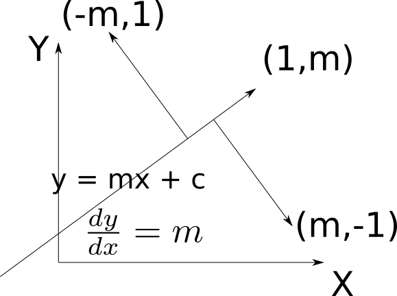{width=50%}

Caption: Determination of vector normal to a line with a given slope.

The computation of the normal direction vector for the left piston will be carried out in code as 


```fortran

dxdz = - pi * sin(2*z*pi/Dz)

if (dxdz .eq. 0) then ! m = infinity

   normalVector[1] = 1.0
   normalVector[2] = 0.0
   normalVector[3] = 0.0   

else

   mag = sqrt(1.0 +  1.0_dbl/(dxdy * dxdy) )
   normalVector[1] = 1.0_dbl/dxdy/mag
   normalVector[2] = 0.0
   normalVector[3] = -1.0/mag
   
end if

```

The progress of the code with the changed geometry can be tracked at the [PistonCurved](https://github.com/BioGI/Intestine-Particles/tree/PistonCurved) branch on github. The first commit [b5bbe713b9fee8f1340a98347040d0a5bce24e58](https://github.com/BioGI/Intestine-Particles/commit/b5bbe713b9fee8f1340a98347040d0a5bce24e58) contains just the updated geometry. We had to first fix the computation of $q$ to the generalized case. We decided on a minimum resolution of $40$ points in the direction with the curvature of the piston. For most of the curved piston simulations presented below, the parameters are $L_x = 40mm, L_y = 0.5mm, L_z = 2mm$ with a resolution of $\Delta_x = \Delta_y = \Delta_z = 5 \times 10^{-5}m$. The distance between the two pistons is $4mm$ in the $x$ direction with the wave speed set to a constant $4mm/s$. Thus the relevant time scale is the time taken by the pistons to travel the length between the pistons, i.e., $1s$.

We confirmed that both the first and second order momentum bounce back boundary conditions yield the same results (Fig. (#curvedPistonFirstOrderVsSecondOrder)).


#### Figure: {#curvedPistonFirstOrderVsSecondOrder}

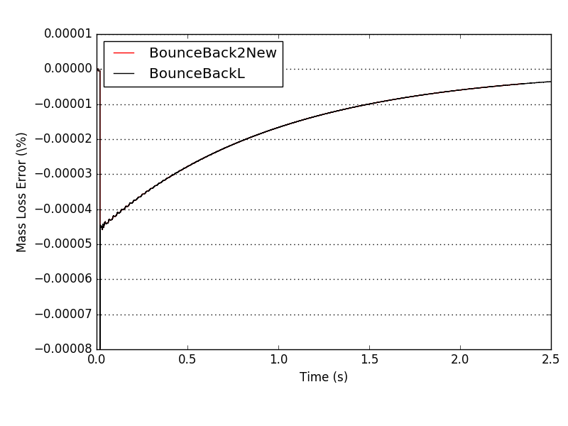{width=33%} \
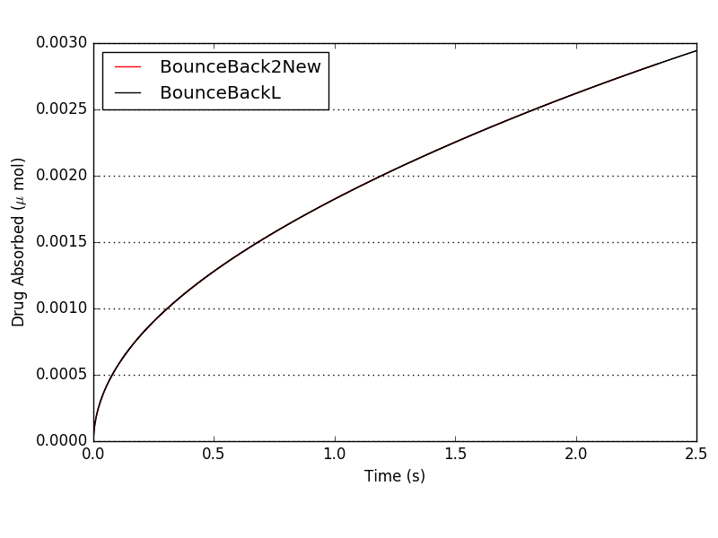{width=33%}
{width=33%}
{width=33%} \
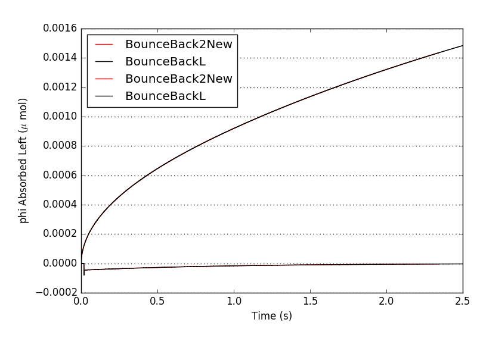{width=33%}
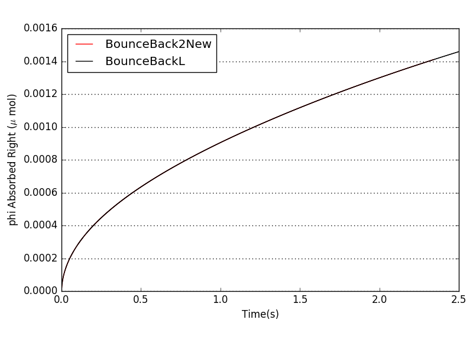{width=33%}
{width=33%} 

Caption: Comparison of mass conservation and scalar conservation and absorption between first order and second order bounce back boundary conditions for momentum and immediate uptake scalar boundary condition.


Both the first and second order bounceback boundary conditions exhibit transient pressure fluctuations at the start that appear to reduce in amplitude with time as shown in Fig. (#curvedPistonPressureOscillations). 

#### Figure: {#curvedPistonPressureOscillations}

{width=49%}
{width=49%}

Caption: Transient pressure fluctuations in the moving curved piston cases with both first and second order bounce back boundary conditions.

However, the magnitude of the pressure fluctuations are $\sim O(10^{-4}) Pa$ and is hence ignored. A useful thing to do with the real intestine simulations might be to introduce scalar in the domain after the flow has reached steady state. We decided to use the second order bounce back boundary conditions for all the curved piston simulations from this point.

The resolution does seem to make quite a lot of difference on the calculation of the scalar absorbed as shown in Fig. (#curvedPistonResolution). For the purpseo of this study, the resolution is halved in all directions in the **2X** case compared to the **1X** case. Hence the time step is reduced by 4 times for the the same $\tau$. Surprisingly, the resolution seems to only affect the calculation of the drug absorbed and not the total scalar remaining in the domain. Hence the drug loss errors increase in the **2X** resolution case compared to the **1X** resolution case. 

#### Figure: {#curvedPistonResolution}

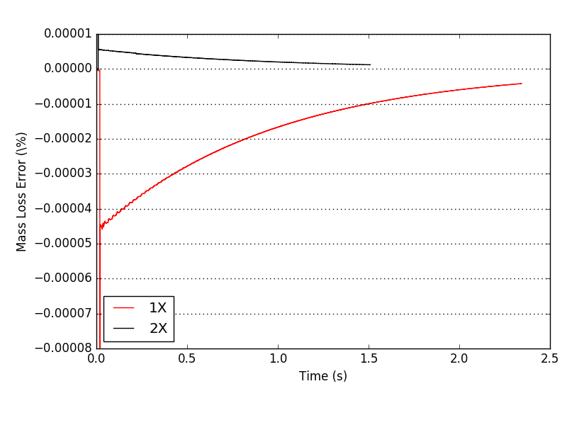{width=33%} \
{width=33%}
{width=33%}
{width=33%} \
{width=33%}
{width=33%}
{width=33%} 

Caption: Effect of resolution on mass conservation and scalar conservation and absorption with second order bounce back boundary conditions for momentum and immediate uptake scalar boundary condition.


Figure (#curvedPistonAstarAvsAstarBstar) shows that using $A^*$ and $A$ in the scalar boundary conditions improves scalar conservation compared to using $A^*$ and $B^*$. Hence $A^*$ and $A$ are used in the scalar boundary conditions for all future curved piston simulations. 

#### Figure: {#curvedPistonAstarAvsAstarBstar}

{width=33%}
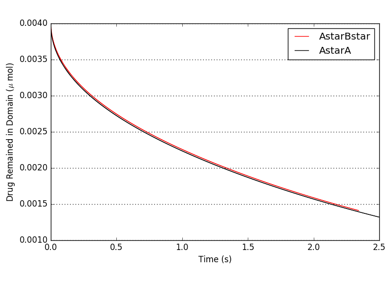{width=33%}
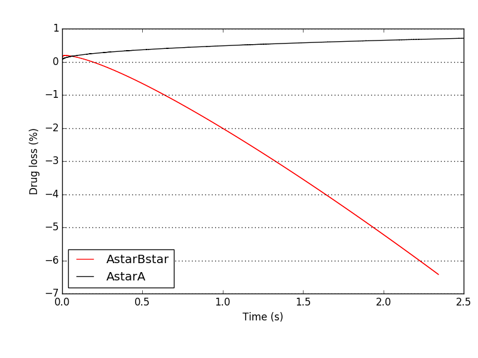{width=33%} \
{width=33%}
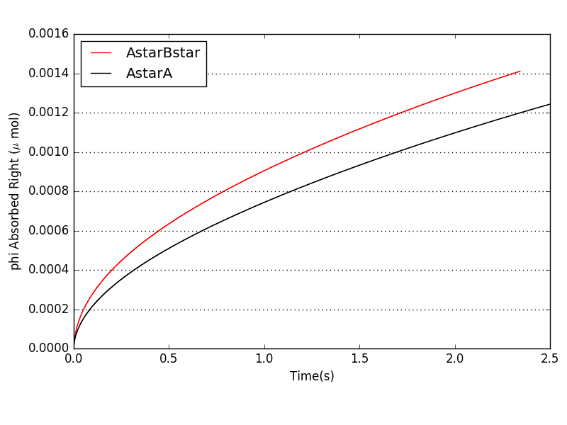{width=33%}
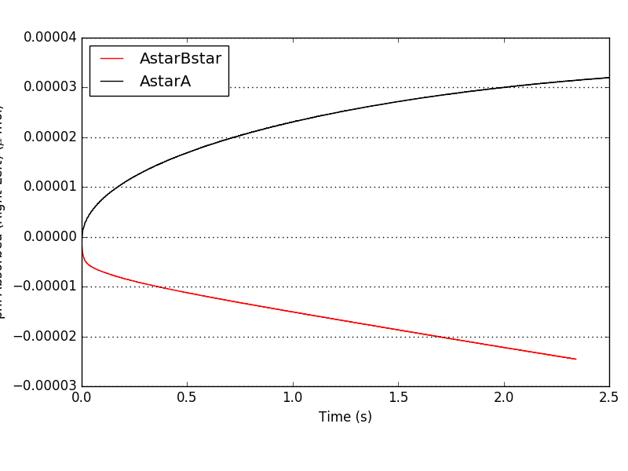{width=33%} 

Caption: Effect of using $A^*$ and $A$ vs. $A^*$ and $B^*$ in the scalar boundary condition on scalar conservation and absorption with second order bounce back boundary conditions for momentum and immediate uptake scalar boundary condition.


The current method for fixing the value of scalar in an uncovered node was based on interpolation along the wall normal direction. In the case of a straight piston, the wall normal direction is known ahead of time; however the wall normal direction is not as straight forward in the case of a curved piston. One method to fix this issue is as follows:

* for every node adjacent to the boundary, determine the density distribution direction that is closest to the wall normal direction,
* interpolate the scalar values along this direction.

Another approach is to fix the value of scalar on the wall to the prescribed value at the surface. However this method will only work for uniform Dirichlet scalar boundary conditions. Fig. (#curvedPistonUncoveredNode) shows that the interpolation of the scalar in the direction closest to the correct local normal yields the best scalar conservation. This will be used in the future. 


#### Figure: {#curvedPistonUncoveredNode}

{width=33%}
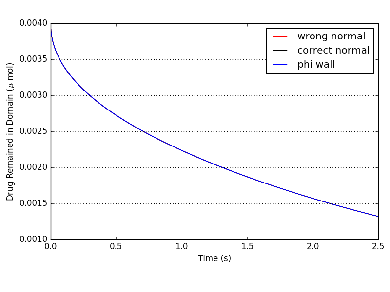{width=33%}
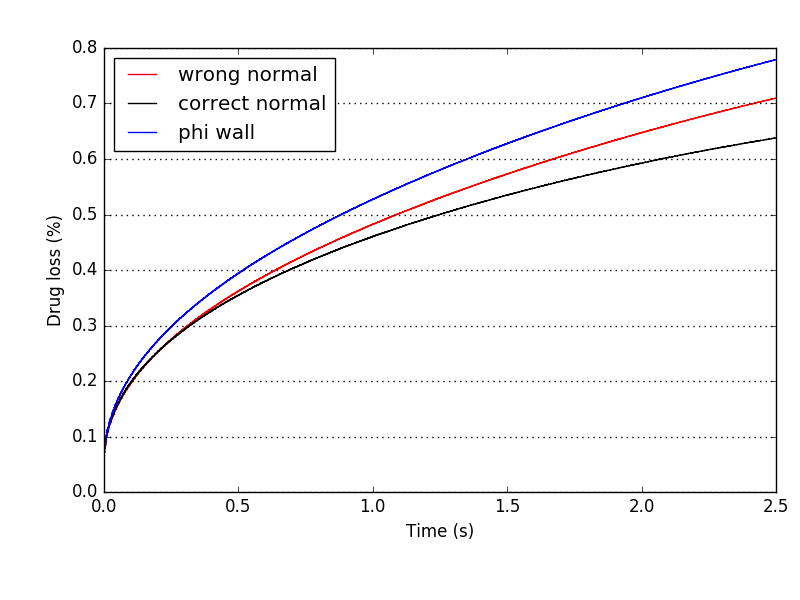{width=33%} \
{width=33%}
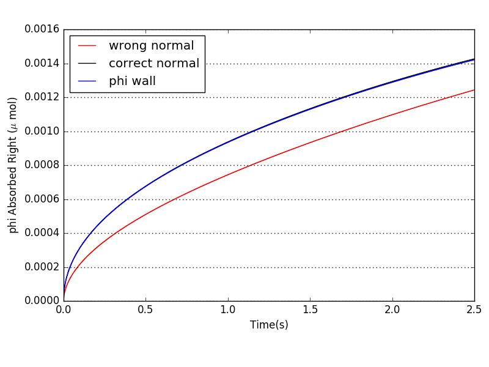{width=33%}
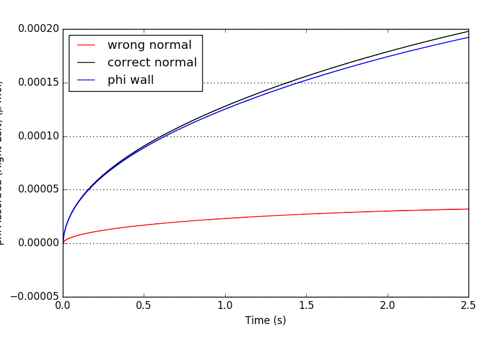{width=33%} 

Caption: Effect of using different interpolation methods to fix scalar in an newly uncovered node on scalar conservation and absorption with second order bounce back boundary conditions for momentum and immediate uptake scalar boundary condition.


## Accelerating Piston

In the real intestine, the wall is not moving at a constant velocity and experiences local acceleration. In order to make sure that the scalar boundary conditions work properly in the real intestine, we simulate the evolution of scalar between two constantly accelerating pistons. The progress of this test can be tracked on the [Piston-accelerating](https://github.com/BioGI/Intestine-Particles/tree/Piston-Accelerating) branch on github.


Balaji had suggested a fix to improve the mass conservation as follows:

* for the uncovered node, the density is set to 1.0,
* in the Bounceback boundary conditions, a density of 1.0 is used.

In the accelerating piston case, when using Balaji's fix to the momentum BC, the total pressure (and hence mass) drops over time as shown in Fig. (#acceleratingPistonPressureDrop).

####Figure: {#acceleratingPistonPressureDrop}

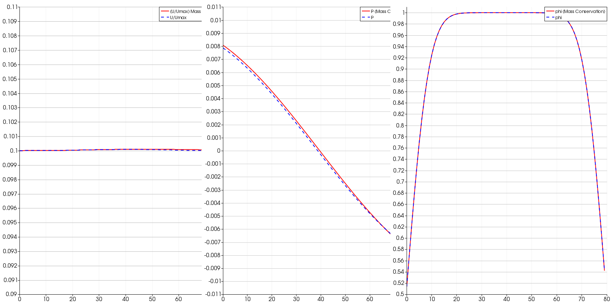{width=75%} \
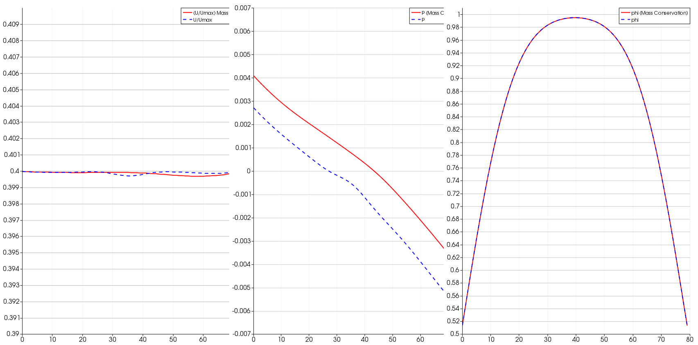{width=75%} \
{width=75%} \
{width=75%}

Caption: Evolution of streamwise velocity, pressure and scalar in the accelerating piston with the immediate update scalar boundary condition.

Hence Farhad came up with a new fix that brings mass conservation errors to near machine precision zero without affecting drug conservation in accelerating piston: 

* At each time step, the density everywhere is adjusted so as to bring the average density back to denL.
* For the uncovered node, the density is set to the average density of the fluid nodes around it.
* In the Bounceback boundary conditions, the real density is used instead of 1.0.

The above fix reduces the mass conservation errors as shown in Fig. (#acceleratingPistonNewFix).

####Figure: {#acceleratingPistonNewFix}

{width=49%}
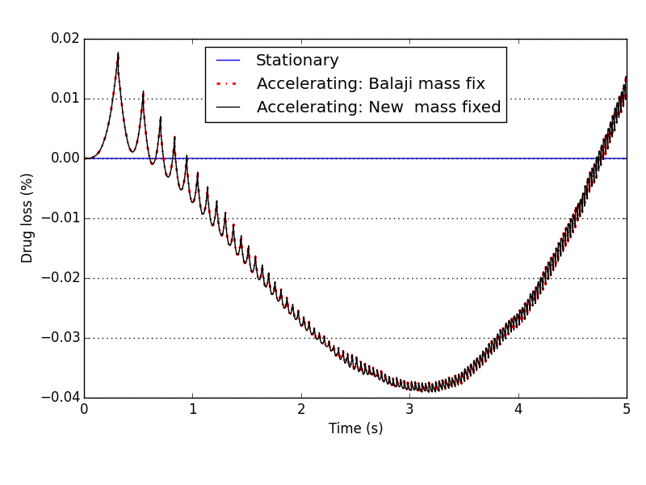{width=49%} \
{width=49%}
{width=49%}

Caption: (a)-(b) Comparison of mass and drug loss error with and without the fix; (c)-(d) the correction in density required at each time step to fix the mass conservation problems. 

Finally, using the new fix, Fig. (#acceleratingPistonComparisonStationaryMoving) compares the output of accelerating piston to the stationary and moving piston cases to make sure they are the same.

#### Figure: {#acceleratingPistonComparisonStationaryMoving}

{width=33%}
{width=33%}
{width=33%} \
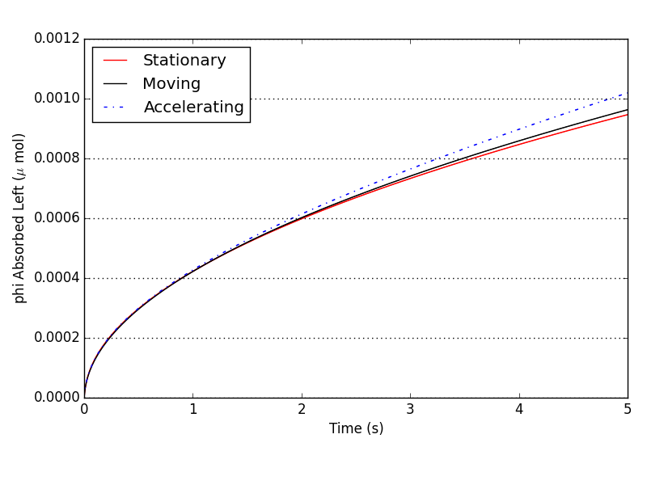{width=33%}
{width=33%}
{width=33%} 

Caption: Comparison of scalar conservation and absorption between accelerating, stationary and moving piston cases with immediate update scalar boundary condition.


## Summary of lessons learned from curved piston, accelerating piston simulations.

1. Using Astar and A seems to be better that using Astar and Bstar in the scalar boundary condition and book keeping.
2. Transient small pressure fluctuations exist in curved piston cases that decrease over time....probably not important.
3. Bounceback2 vs. BounceBackL doesn't seem to make a difference in the mass conservation in the curved piston. BounceBack2 seems to improve drug conservation though.
4. In the accelerating piston when using Balaji's fix to the momentum BC, i.e. uncovered node density is set to denL and $\rho= 1.0$ in the bounce back BC, the total pressure (and hence mass) drops over time.
5. New fix that brings mass conservation errors to near machine precision zero without affecting drug conservation in accelerating piston: 
    * At each time step, the density everywhere is adjusted so as to bring the average density back to denL.
    * For the uncovered node, the density is set to the average density of the fluid nodes around it.
	* In the Bounceback boundary conditions, the real density is used instead of 1.0.

# Summary of lessons learned from intestine simulations.

We have implemented the new generalized version of the scalar boundary condition and modified book keeping in the intestine version of the code. The iterative algorithm to calculate q is now used everywhere. Based on lessons learned from accelerating and curved piston cases, we use Astar and A for the scalar boundary conditions and book keeping instead of Astar and Bstar. The five different cases that were run to test the choice of parameters were

0. Old book keeping for scalar absorbed, first order bounce back for momentum BC with Balaji's fix,
1. New book keeping for scalar absorbed, first order bounce back for momentum BC with Balaji's fix,
2. New book keeping for scalar absorbed, first order bounce back for momentum BC with new fix,
3. New book keeping for scalar absorbed, second order bounce back for momentum BC with Balaji's fix,
4. New book keeping for scalar absorbed, second order bounce back for momentum BC with new fix,

where the term **new fix** for the momentum is used to represent

* at each time step, the density everywhere is adjusted so as to bring the average density back to denL. The density distribution functions $f$ and $fPlus$ are also scaled to be consistent with the corrected density, 
* for the uncovered node, the density is set to 1.0,
* in the Bounceback boundary conditions, a density of 1.0 is used,

and the term **Balaji's fix** is used to represent

* for the uncovered node, the density is set to 1.0,
* in the Bounceback boundary conditions, a density of 1.0 is used.


####Figure: {#intestineZeroScalar}

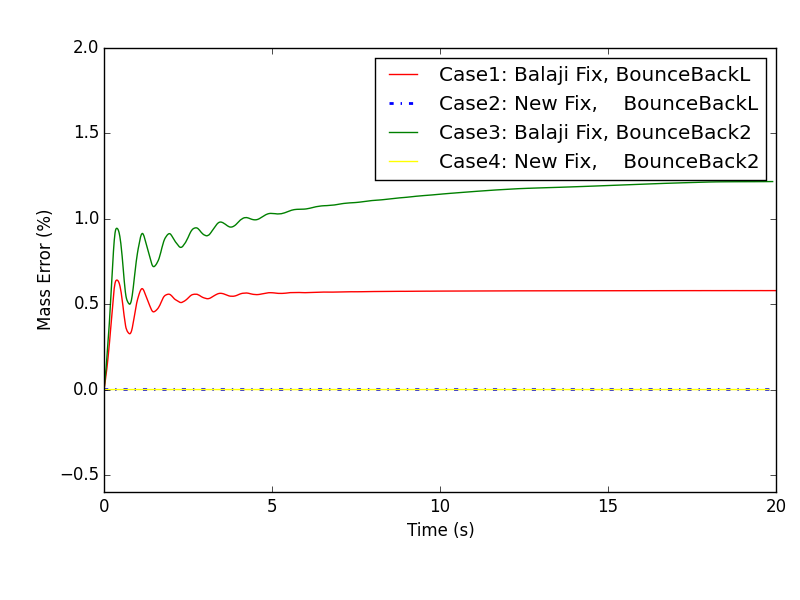{width=49%}
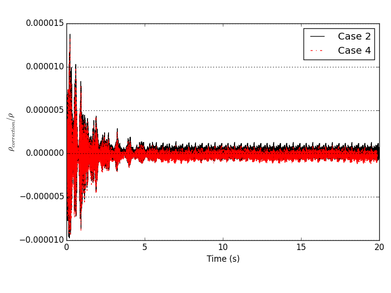{width=49%} \
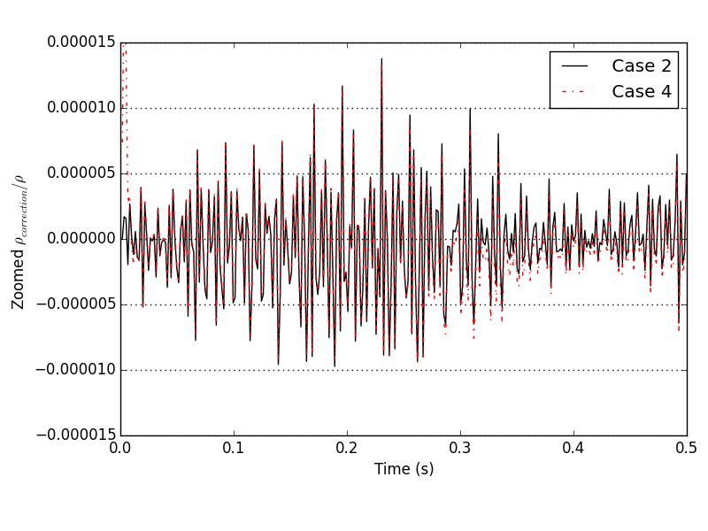{width=49%} 
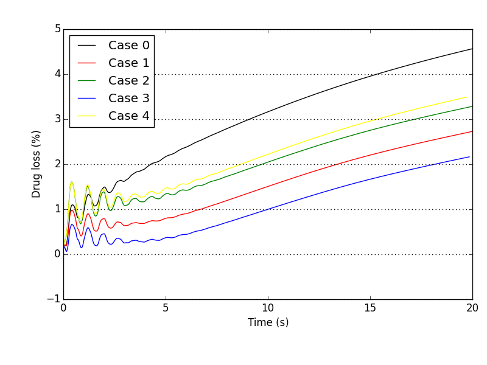{width=49%} \

Caption: Comparison of mass and drug loss error between different cases of intestine simulations with immediate update scalar boundary conditions ($\phi_{wall} = 0$).. 

The second order bounce back boundary conditions continues to show better drug conservation than the first order boundary conditions as shown by comparison of cases 1 vs. 3 and 2 vs. 4 in Fig. (#intestineZeroScalar).


