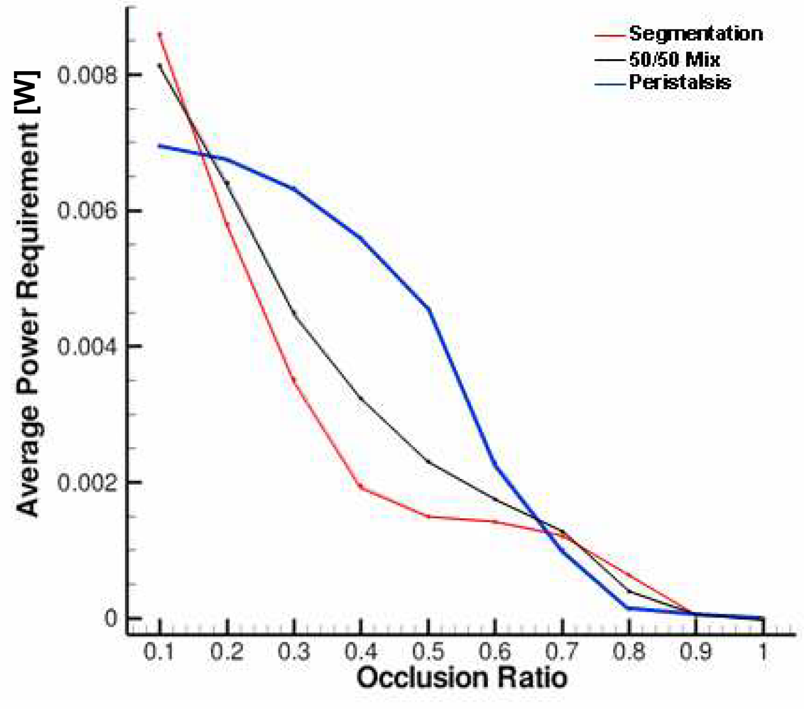

# Selected summary of Gino's simulations and results

Gino Banco, in his Ph.D thesis [@Banco2010], simulated the nutrient absorption in the gut using 2D and 3D LBM. I'm only interested in replicating a few of his 3D results. Hence I'll reproduce a selected summary of his numerical experiments and results. 

## Modeling of the intestinal motility

He modeled the motility of the intestinal wall using a combination of Peristalsis and Segmentation motions as 

~~~math
h(x,t) &= w_p h_p(x,t) + w_x h_s(x,t) \textrm { subject to the constraint } \\
w_s + w_p &= 1
~~~
"where $h_s(x,t)$ is the contribution from segmentation and $h_p(x,t)$ is the contribution from peristalsis. The weighting coefficients, $w_p$ and $w_s$, control the relative influence of peristalsis and segmentation respectively on the overall geometry. The  geometry  is  symmetric  about  the  centerline,  and  periodic  in  both  space  and  time.  A straight segment of the gut, rather than an intestinal segment, or loop, with more curvature, is used for simplicity."

Peristalsis is modeled as an infinite train of continuous sinusoidal waves propagating along the upper and lower walls from left to right with constant velocity. Segmentation  is  modeled  as  a  series  of  alternating  180º  out-of-phase  contractions. The  time-changing  geometry  was constructed using straight piecewise sections for the contracting segments, and quarter sine waves  connecting  the  straight  sections  for  spatial  continuity. Figure (#segmentationAndPeristalsisGino) shows the segmentation and peristalsis waves as defined by Gno. 

#### Figure: {#segmentationAndPeristalsisGino}


Caption: Segmentation and Peristalsis modes as defined by Gino Banco [@Banco2010].

This is effectively implemented in the code in [Geometry.f90](https://github.com/gantech/GI/blob/intestine3D/Geometry.f90) as follows

```fortran
! Mode 1 - Peristalsis
s1                                                        ! Peristaltic wave speed
a1        = (0.5_dbl*D)/(2.0_dbl - epsOVERa1)             ! mean half-width of wave1    
eps1      = epsOVERa1*a1                                  ! occlusional distance
lambda1   = L/numw1                                       ! wavelength
aOVERlam1 = a1/lambda1                                    ! ratio of mean half-width to wavelength
kw1       = (2.0_dbl*PI)/lambda1            	     	  ! wave number
amp1      = 0.5_dbl*((0.5_dbl*D)-eps1)                    ! amplitude of the wave
Tp        = lambda1/s1                                    ! peristaltic period
Re1       = ((s1*(0.5_dbl*D))/nu)*((0.5_dbl*D)/lambda1)   ! Reynolds number based on mode 1        

DO i=0,nz-1

  h1(i)         = amp1*(COS(kw1*(zz(i) - (s1*time)))) + (0.5_dbl*D - amp1) !! Yanxing's expression
!  h1(i)         = amp1*sin(2.0_dbl*PI*((real(i,dbl)-0.5_dbl)/real(nz,dbl)-0.1_dbl*iter/real(nz,dbl))+pi/2.0_dbl)+ (0.5_dbl*D - amp1)

END DO
! since PI cannot be stored exactly, the wavelength(s) does/do not EXACTLY span the domain...
! set h1(nz) to h1(0) and h1(nz+1) to h(1) to ensure periodicity

h1(nz)  = h1(0)
h1(nz+1)= h1(1)
```

Translating this into readable code, the input parameters are

~~~math
s_1 & \rightarrow \textrm{ Wave speed}\\
D & \rightarrow \textrm{ Max diameter}\\
\frac{\epsilon}{a} & \rightarrow \textrm{ Occlusion ratio}\\
L & \rightarrow \textrm{ Length of domain} \\
num_{w1} & \rightarrow \textrm{ Number of waves in the domain}
~~~

The peristaltice waves get computed as 

~~~math
a_1 &= \frac{0.5 \; D}{ 2 - (\epsilon/a_1)} \longleftarrow \textrm{ Because } 2(a-\epsilon) + \epsilon = 0.5 \; D \\
\epsilon_1 &= \frac{\epsilon}{a_1} a_1 \\
\lambda_1 &= \frac{L}{num_{w1}} \\
\textrm{self defined} \frac{a}{\lambda_1} & \\
k_{w1} &= \frac{2 \pi}{\lambda_1} \\
amp_1 &= 0.5 ( 0.5 \; D - \epsilon_1) \\
T_p &= \frac{\lambda_1}{ s_1} \\
Re_1 &= \frac{s_1 (0.5 \; D)}{ \nu} \frac{0.5 \; D}{\lambda_1} \\
h_1(z,t) &= amp_1 \times cos(k_{w1} \; (z - (s_1 \; t)) \; ) + (0.5 \; D - amp_1)
~~~

The segmentation part seems to be more complicated

```fortran
! Mode 2 - Segmental Contractions
a2        = (0.5_dbl*D)/(2.0_dbl - epsOVERa2)     ! mean half-width of wave1 (based on peristalsis definition)
eps2      = epsOVERa2*a2                          ! occlusional distance
lambda2   = L/numw2                               ! wavelength (physical units)
nlambda2  = nz/numw2                              ! wavelength (nodes)
aOVERlam2 = a2/lambda2                            ! ratio of mean half-width to wavelength 
amp2      = 0.5_dbl*((0.5_dbl*D)-eps2)            ! amplitude of the wave
shift2    = 0.5_dbl*((0.5_dbl*D)+eps2)            ! amplitude of the wave
segment   = nlambda2/6_lng                        ! length of each segment of the segmental wave   !!!!! CAREFUL HERE WITH SYMMETRY!
seg1L     = 1_lng + segment                       ! left point of sloped segement 1
seg1R     = 1_lng + 2_lng*segment                 ! right point of sloped segement 1
seg2R     = nlambda2 - segment                    ! right point of sloped segement 2
seg2L     = nlambda2 - (2_lng*segment)            ! left point of sloped segement 2
s2        = (0.5_dbl*D)/Ts                        ! speed of collapse fo segmental contraction
Re2       = (s2*(0.5_dbl*D))/nu                   ! Reynolds number based on mode 2

! Calculate the geometry for the first wave                                                                                          
! First Straight Piece                                                                                                                
DO i=0,seg1L

  h2(i) = amp2*(COS(((2.0_dbl*PI)/Ts)*time)) + shift2

END DO

! Second Straight Piece
DO i=seg1R,seg2L

  h2(i) = amp2*(COS(((2.0_dbl*PI)/Ts)*(time-(Ts/2.0_dbl)))) + shift2

END DO

! Third Straight Piece
DO i=seg2R,nlambda2+1

  h2(i) = amp2*(COS(((2.0_dbl*PI)/Ts)*time)) + shift2

END DO

! First Cos Piece
Ac      = 0.5_dbl*(h2(seg1L)-h2(seg1R))
lambdaC = 2.0_dbl*(zz(seg1L)-zz(seg1R))
shiftC  = 0.5_dbl*(h2(seg1L)+h2(seg1R))
DO i=seg1L+1,seg1R-1

  h2(i) = Ac*COS((2.0_dbl*PI/lambdaC)*(zz(i)-zz(seg1L))) + shiftC

END DO

! Second Cos Piece
Ac                      = 0.5_dbl*(h2(seg2L)-h2(seg2R))
lambdaC = 2.0_dbl*(zz(seg2L)-zz(seg2R))
shiftC  = 0.5_dbl*(h2(seg2L)+h2(seg2R))
DO i=seg2L+1,seg2R-1

  h2(i) = Ac*COS((2.0_dbl*PI/lambdaC)*(zz(i)-zz(seg2L))) + shiftC

END DO
```

#Analysis of the effect of intestinal motility on the absorption rate

Using the 2D model, Gino conducted a preliminary sensitivity analysis to relevant geometric parameters: length scale, time scale, weighted mix of motility modes, and occlusion ratio. Gino found that length scale (wavelength) and time scale (period of contraction) within a reasonable extension of the physiological range played a negligible role in overall characteristics of absorption. The weighted mix of segmentation and peristalsis and the occlusion ratio however, have a much more significant and interesting impact on the absorption. Hence he focused his 3D numerical experiments on varying these two parameters. 


## Numerical experiments

1. Vary percentage contribution of peristalsis and segmentation. $w_s = 0,0.5,1.0$ with $w_p$ varying appropriately.
2. Occlusion ratio $\epsilon/a$ varied from 0.1 to 1.0.
3. Two different initial conditions for the distribution of scalar concentration, limiting cases of 
 * Homogenized Chyme - Uniform initial concentration of 1.0 at all computational nodes
 * Localized concentration distribution far from  the walls -  normalized 3D Gaussian distribution in the center of the computational domain

### Details of the domain, grid size and other LBM parameters.

Based on the figures

~~~math
s_1 & \rightarrow \textrm{ Wave speed}\\
0.005m = D & \rightarrow \textrm{ Max diameter}\\
0.1 - 1.0 = \frac{\epsilon}{a} & \rightarrow \textrm{ Occlusion ratio}\\
0.01m = L & \rightarrow \textrm{ Length of domain} \\
1 = num_{w1} & \rightarrow \textrm{ Number of waves in the domain}
~~~


## Main results

Gino uses the two main quantities, percentage absorbed after 20 periods and the number of periods for 90% aborption to compare the effect of the parameter variations. Figure (#absorptionVsOcclusionAndMode) shows that absorption rate goes down with increasing occlusion ratio. It also shows that the total time to 90% absorption goes up by approximately 20 time periods from the blob initial condition to the uniform initial condition (not sure if the total scalar is the same between the two).


#### Figure: {#absorptionVsOcclusionAndMode}


Caption: Effect of occlusion ratio and intestinal motility mode on the aborption rate in the intestine. (c)-(d) Percentage absorbed after 20 periods, (e)-(f) Number of periods required for 90% absorption. Images on the left are for the blob initial condition and the ones on the right are for the uniform initial condition.

Gino also analyzed the average power requirement for each motility case in Figure (#powerRequirement). The lower occlusion ratios clearly need more power compared to the high occlusion ratio cases, while Segmentation wins out over peristalsis in the most common occlusion ratio range (0.4-0.7). 


#### Figure: {#powerRequirement}



Caption: Average power requirement for the different intestinal motility modes


# References


