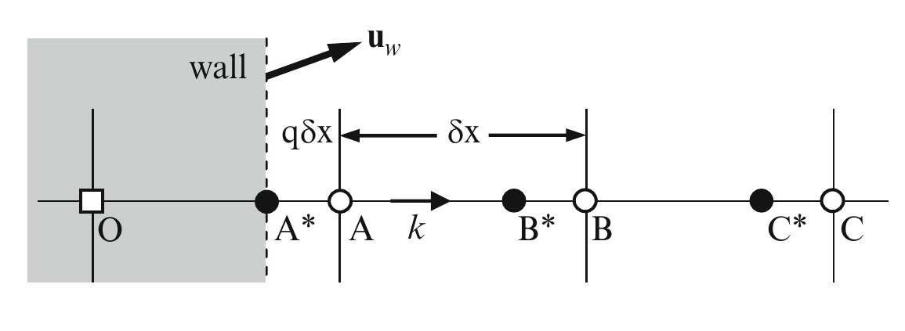
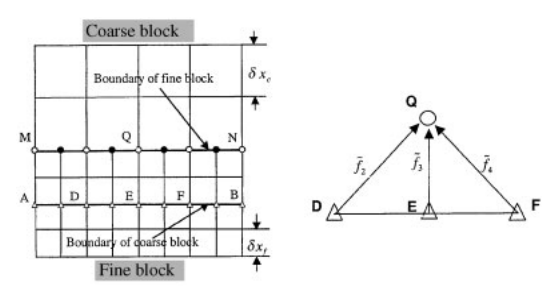
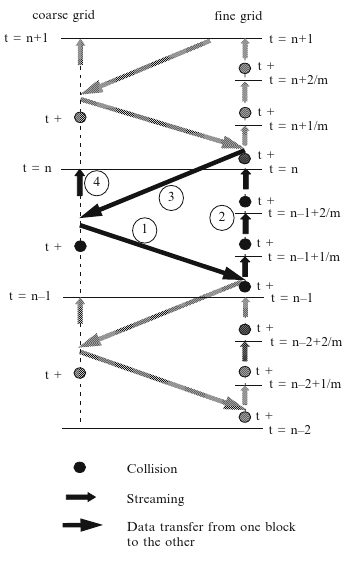

# Basic Boltzmann Gas concepts

The first concept to understand is that the gas is described as number of molecules interacting with one another only through collisions. A number density function [@Gombosi1994] is defined as the number of molecules $\Delta^3 N$ in a volume $\Delta^3 x$ around $\vec{x}$ at a given time $t$.

~~~math
n(\vec{x},t) = \lim_{\Delta^3 x \to 0} \frac{\Delta^3 N(\vec{x},t)}{\Delta^3 x}
~~~

This is probably related to the density through a scaling factor

~~~math
\rho(\vec{x},t) = n(\vec{x},t) \times \frac{MolecularWeight}{AvogradoNumber}
~~~

The Boltzmann theory further splits the number density into a distribution function in a phase space that includes the velocity of the molecules. So $f(\vec{x}, \vec{v}, t)$ is distribution function of the number of molecules $\Delta^3 N$ in a volume $\Delta^3 x$ around $\vec{x}$ and in a certain "velocity-volume" $\Delta^3 v$ around a velocity $\vec{v}$ at a given time $t$

~~~math
f(\vec{x},\vec{v},t) = \lim_{\Delta^3 x, \Delta^3 v \to 0} \frac{\Delta^3 N(\vec{x},\vec{v},t)}{\Delta^3 x \; \Delta^3 v}
~~~

$f(\vec{x}, \vec{v}, t)$ is connected to $n(\vec{x}, t)$ through integration over all possible velocity magnitudes and directions at the same location $\vec{x}$

~~~math
n(\vec{x},t) = \iiint_{\infty} f(\vec{x},\vec{v},t) d^3v
~~~

I borrow the rest of this material from Sukop and Thorne [@Sukop2006]. Let's say there's an external force acting on the molecules \vec{F} $(\vec{F} \ll \textrm{Intermolecular forces})$. If there are no collision, The molecules at $(\vec{x},\vec{v},t)$ will get moved to a new position in the phase space $(\vec{x} + \vec{dx}, \vec{v} + \vec{dv},t \; + \;dt)$ such that $\vec{dv} = (\vec{F}/\rho)dt$ and $\vec{dx} = \vec{v} \; dt$. Through the **streaming process**, the particle distribution function $f$ also gets streamed to the new location such that

~~~math
f(\vec{x} + \vec{dx}, \vec{v} + \vec{dv},t \; + \;dt) \; \vec{dx} \; \vec{dv} = f(\vec{x}, \vec{v},t) \; \vec{dx} \; \vec{dv}
~~~

I have a **big** question here. Can't particles arrive at $(\vec{x} + \vec{dx}, \vec{v} + \vec{dv},t \; + \;dt)$ from somewhere else in the phase space? I'm pretty sure it's not impossible. According to everything I've read so far, they just write this for the case of no collisions. I say that even with no collisions and well.. even no forces, it's possible for molecules from two different positions to come to one place. May be they'll collide there, but no collision until then. Got to figure out the reasoning behind this.

Moving on, there are collisions that result in some phase points starting at $(\vec{x},\vec{v},t)$ and not arriving at $(\vec{x} + \vec{dx}, \vec{v} + \vec{dv},t \; + \;dt)$ and some not starting at $(\vec{x},\vec{v},t)$ and arriving there (this probably answers the question above).

~~~math
\textrm{Number of molecules that do not arrive at } (\vec{x} + \vec{dx}, \vec{v} + \vec{dv},t \; + \;dt) \textrm{ due to collision } & \longrightarrow \Gamma^- \vec{dx} \; \vec{dv} \; dt \\

\textrm{Number of molecules that do arrive at } (\vec{x} + \vec{dx}, \vec{v} + \vec{dv},t \; + \;dt) \textrm{ from somewhere else } & \longrightarrow \Gamma^+ \vec{dx} \; \vec{dv} \; dt \\
~~~

Combining the streaming process and the model for collisions, we get the Boltzmann equation

~~~math
f(\vec{x} + \vec{dx}, \vec{v} + \vec{dv},t \; + \;dt) \; \vec{dx} \; \vec{dv} &= f(\vec{x}, \vec{v},t) \; \vec{dx} \; \vec{dv} + (\Gamma^+ - \Gamma^-) \vec{dx} \; \vec{dv} \; dt \\
\left ( f(\vec{x}, \vec{v},t) + \vec{dx} \cdot \nabla_x f + \vec{dv} \cdot \nabla_v f + \frac{\partial f}{\partial t} dt \right ) \; \vec{dx} \; \vec{dv} &= f(\vec{x}, \vec{v},t) \; \vec{dx} \; \vec{dv} + (\Gamma^+ - \Gamma^-) \vec{dx} \; \vec{dv} \; dt \\
\frac{\partial f}{\partial t} + \vec{v} \cdot \nabla_x f + \frac{\vec{F}}{\rho} \cdot \nabla_v f &= (\Gamma^+ - \Gamma^-)
~~~

The term $(\Gamma^+ - \Gamma^-)$ is usually modeled as a return to equilibrium using the Bhatnagar-Grossman-Krook (BGK) collision operator with a single relaxation time scale $\tau$.

# Application to the Lattice Boltzmann Method

The first thing that nobody seems to mention regarding the Lattice Boltzmann Method is that they go ahead and assume that $f$ already contains the scaling factor such that

~~~math
\rho(\vec{x},t) = \iiint_{\infty} f(\vec{x},\vec{v},t) d^3v
~~~

Instead of a continuum of possible positions and velocity for the molecules, the positions are limited to a set of points on a lattice and the velocities are restricted to a set of magnitudes and directions. The set of possible velocities are connected to the lattice and the time step. The D2Q9 and D3Q15 are very commonly used in 2D and 3D simulations respectively. The basic lattice distance $\delta x$ is set to 1 as is the time step $\delta t$. Thus, the _grid speed_ is $c = \delta x / \delta t = 1$. Of course, there conversion factors for each quantity like $\delta x, \delta t, c$ to their corresponding physical values. Figure [#latticeDiscretization2D3D] shows the two basic lattice models used are the D2Q9 version for 2D and D3Q15 for 3D. 

#### Figure: {#latticeDiscretization2D3D}


Caption: Illustrations of the lattice and directional densities on a D2Q9 (left) and D3Q15 (right) arrangement (from [@Nourgaliev2003117]).

I now explain how the choice of the discrete velocity vectors are tied to the grid and the time step. In Figure [#latticeDiscretization2D3D], the red vectors are of unit distance in lattice units in both D2Q9 and D3Q15 models. The corresponding velocity vectors are lattice unit per time step. The choice of the velocity vectors is done such that that any molecule with that velocity at that point will get _streamed_ to the first neighboring node along the velocity direction in one time step. Thus the green distance and velocity vectors are $\sqrt{2}$ lattice units in the D2Q9 model and $\sqrt{3}$ units in the D3Q15 model. Thus the continuous particle distribution $f(\vec{x}, \vec{v}, t)$ becomes the discrete _directional densities_ $f_{\alpha}(\vec{x},t), \, \alpha=1,b$ at each lattice point/node, where $b$ is the number of directions used in the lattice model (9 for the D2Q9 and 15 for the D3Q15 models). The macroscopic properties density ($\rho$) and velocity ($\vec{v}$) are recovered from the directional densities as

~~~math
\rho(\vec{x},t) &= \Sigma_{\alpha = 1}^b f_{\alpha} (\vec{x},t) \\
\rho(\vec{x},t) \; \vec{v}(\vec{x},t) &= \Sigma_{\alpha = 1}^b f_{\alpha} (\vec{x},t) \hat{e}_{\alpha}
~~~
The pressure is recovered through the equation of state, where

~~~math
P(\vec{x},t) = \rho(\vec{x},t) c_s^2 
~~~

where $c_s$ is the speed of sound in lattice units $c_s = \sqrt{RT} = \sqrt{1/3}$ in lattice units. I wonder why the ratio of specific heats $\gamma$ is missing from the expression for the speed of sound. In any case, this tells us that the LBM method is essentially a compressible method. 

The basic LBM method for the momentum and continuity equations thus becomes

~~~math
f_{\alpha}(\vec{x} + \hat{e}_{\alpha} \; \delta t,t + \delta t) = f_{\alpha} (\vec{x},t) - \frac{1}{\tau} \left [ f_{\alpha} (\vec{x},t) - f_{\alpha}^{eq} (\vec{x},t) \right ]
~~~

The time advance in the LBM method is carried out algorithmically in two steps, viz.,

1. Collision step

~~~math
#eq:LBMcollision
\hat{f}_{\alpha}(\vec{x}, t) = f_{\alpha} (\vec{x},t) - \frac{1}{\tau} \left [ f_{\alpha} (\vec{x},t) - f_{\alpha}^{eq} (\vec{x},t) \right ]
~~~

2. Streaming step
~~~math
#eq:LBMstreaming
f_{\alpha}(\vec{x} + \hat{e}_{\alpha} \; \delta t,t + \delta t) = \hat{f}_{\alpha} (\vec{x},t) 
~~~

where $\hat{f}_{\alpha} (\vec{x},t)$ is the _post-collision pre-streamed_ directional densities. The boundary conditions are typically applied on $\hat{f}$.


## BGK collision operator

The rate of relaxation towards equilibrium is typically a measure of the rate of molecular mixing and is hence proportional to the kinematic viscosity. In lattice units

~~~math
\nu = (2 \tau - 1) \frac{c \; \delta x}{6}
~~~
The viscosity in physical units is matched to the viscosity in lattice units by matching the Reynolds numbers between the physical and lattice units. For numerical stability purposes, the choice of $\tau$ is designed to be such that the viscosity is positive and hence $\tau > 0.5$. The farther away it is from $0.5$, the more stable the simulation is expected to be.

In the low Mach number limit, the equilibrium distribution function $f^{eq}$ is written as

~~~math
f^{eq}_{\alpha} (\vec{x},t) = w_{\alpha} \rho(\vec{x},t) \left [ 1 + 3 \frac{\hat{e}_{\alpha} \cdot \vec{v}}{c^2} + \frac{9}{2} \frac{(\hat{e}_{\alpha} \cdot \vec{v})^2 }{c^4} - \frac{3}{2} \frac{(\vec{v} \cdot \vec{v})^2}{c^2}  \right ]
~~~

For the D2Q9 model,

~~~math
w_{\alpha} =  \left \{ \begin{aligned} 4/9 & \, \alpha = 0 \\ 1/9 & \, \alpha = 1,3,5,7 \\ 1/36 & \, \alpha = 2,4,6,8 \end{aligned} \right.
~~~

The rest of the stuff to be written up are

# Conversion of lattice units to physical units

The code converts the physical units to lattice units as follows in [Geometry.f90]()

```fortran
! Define the lattice <=> physical conversion factors
IF(domaintype .EQ. 0) THEN
xcf = (0.5_lng*D)/(nx-1_lng)   ! length conversion factor: x-direction
ycf = (0.5_lng*D)/(ny-1_lng)   ! length conversion factor: y-direction
ELSE
! begin Balaji added
xcf = (1.0_lng*D)/(nx-1_lng)   ! length conversion factor: x-direction
ycf = (1.0_lng*D)/(ny-1_lng)   ! length conversion factor: y-direction
! end Balaji added
ENDIF

zcf = L/nz                     ! length conversion factor: z-direction
tcf = nuL*((xcf*xcf)/nu)       ! time conversion factor
dcf = den/denL                 ! density conversion factor
vcf = xcf/tcf                  ! velocity conversion factor
pcf = cs*cs*vcf*vcf            ! pressure conversion factor

! Determine the number of time steps to run
nt = ANINT((nPers*Tmix)/tcf)
```

In human readable form, this becomes

~~~math
x_{cf} &= \frac{D}{n_x-1} \\
y_{cf} &= \frac{D}{n_y-1} \\
z_{cf} &= \frac{L}{nz} \\
t_{cf} &= \nu_L \frac{x_{cf} \; x_{cf}}{\nu} \\
\rho_{cf} &= \frac{\rho}{\rho_L} \\
v_{cf} &= \frac{x_{cf}}{t_{cf}}
~~~

The quantities with $f_L$ are in lattice units. For e.g $\rho_L = 1.0$ is the density in lattice units and $\nu_L$ is the viscosity in lattice units defined in `LBM.f90` as $\nu_L = (2 \tau - 1)/6$.

~~~fortran
nuL = (2.0_dbl*tau - 1.0_dbl)/6.0_dbl
~~~

## Example

For the conditions in the `input.txt` given by Balaji,

~~~math
\tau &= 1.0 \\
\nu_L &= \frac{2-1}{6} = 0.16667 \\
n_x = n_y &= 81 \\
D &= 0.012m \\
x_{cf} = y_{cf} &= 1.5 \times 10^{-4}m \\
L &= 0.024m \\
n_z &= 160 \\
z_{cf} &= 1.5 \times 10^{-4}m \\
\nu &= 2.4 \times 10^{-6} m^2/s \\
t_{cf} &= 0.1667 \frac{1.5 \times 10^{-4} \times 1.5 \times 10^{-4}}{2.4 \times 10^{-6}} = 1.5628 \times 10^{-3}s \\
v_{cf} &= \frac{1.5 \times 10^{-4}m}{ 1.5628 \times 10^{-3}} = 0.09598 m/s
~~~

The motility parameters are

~~~math
s_1 &= 0.004m/s \textrm{ Wave speed for Peristalsis}\\
D &= 0.012m \textrm{ Max diameter}\\
num_{w1} &= 1 \textrm{ Number of waves in the domain} \\
\lambda_1 &= \frac{L}{num_{w1}} = 0.024m \textrm{ Wavelength of peristaltic wave}\\
Re_1 &= \frac{s_1 (0.5 \; D)}{ \nu} \frac{0.5 \; D}{\lambda_1} = \frac{0.004 \times 0.006}{2.4 \times 10^{-6}} \frac{0.006}{0.024} = 2.5 \\
~~~

Trying to estimate Reynolds number in lattice units

~~~math
\textrm{Wave speed in lattice units } &=  s_1/v_{cf} = 0.004/0.09598 = 0.040568 \\
\textrm{Radius in lattice units } &= 40 \\
\textrm{Length in lattice units } &= 160 \\
\textrm{Reynolds number in lattice units } &= \frac{0.040568 \times 40}{0.16667} \frac{40}{160} = 2.434
~~~

 Thus, the Reynolds number in lattice units is made to match up with the one in physical units. I still don't understand completely as to why the two Reynolds numbers need to match.

# Boundary conditions

# Treatment of passive scalar

## Scalar boundary conditions

The scalar boundary condition is a little different from the typical bounce back boundary conditions because, unlike momentum, scalar does not bounce back from the wall. The wall could have a fixed value of the scalar or a fixed flux or a combination of both. Within the framework of the moment propagation method, the difficulty lies in finding the contribution $P_k(\vec{x} - \vec{e}_k \, \delta t, t + \delta t)$ at the node adjacent to the wall. We first consider the case of a specified value of scalar at the wall (Dirichlet boundary condition).


#### Figure: {#fig:scalarBC}

{width=75%}

Caption: Node system used in developing the boundary conditions for scalar concentration by Wang et. al. [@Wang2010].

$A^*$, $B^*$ and $C^*$ are three virtual nodes one lattice apart such that $A^*$ is the node on the boundary. The scalar boundary condition for a fixed value of the scalar at the boundary involves calculating the contribution $P_k(\vec{x} - \vec{e}_k \, \delta t, t + \delta t)$ at $B^*$ and $C^*$ and extrapolating it to A. This is done in 3 steps as shown below.

1. Estimate the density and particle distribution function in the $k$ direction at $A^*$ as
~~~math
\rho_{A^*} = \rho_A  + (\rho_A - \rho_B) q.
~~~

The particle distribution function (post-collision) at $A^*$ is split into equilibrium and non-equilibrium parts and evaluate them separately as shown in Eq. (#fAstar). 

~~~math #fAstar
\hat{f}_{k, A^*} &= f_{k, A^*}^{eq} + f_{k, A^*}^{neq}, \\
\textrm{Based on $\mathbf{u}_w$ wall velocity   } f_{k, A^*}^{eq} &= w_{k} \, \rho_{A^*} \, \left [ 1 + 3 \frac{\vec{e}_{k} \cdot \vec{u}_w}{c^2} + \frac{9}{2} \frac{(\hat{e}_{k} \cdot \vec{u}_w)^2 }{c^4} - \frac{3}{2} \frac{(\vec{u}_w \cdot \vec{u}_w)^2}{c^2}  \right ], \\
\textrm{Based on extrapolation   } f_{k, A^*}^{neq} &= f_{k, A}^{neq} + ( f_{k, A}^{neq} - f_{k, B}^{neq}) q. \\
~~~

2. Calculate the contribution $P_k(\vec{x} - \vec{e}_k \, \delta t, t + \delta t)$ at $B^*$ and $C^*$ as shown in Eq. (#PkAstarBstar). While $\hat{f}_k$, $\rho$ and $\phi$ are calculated at  $A^*$ in Step 1, the corresponding quantities are interpolated to $B^*$ using the values at $A$ and $B$ at time $t$. 
~~~math #PkAstarBstar
(P_k)_{A^* \rightarrow B^*, t + \delta t} &= \left ( \frac{\hat{f}_k(A^*,t^+)}{\rho(A^*,t^+)} - w_k \Delta^* \right ) \phi(A^*, t) \\
(P_k)_{B^* \rightarrow C^*, t + \delta t} &= \left ( \frac{\hat{f}_k(B^*,t^+)}{\rho(B^*,t^+)} - w_k \Delta^* \right ) \phi(B^*, t)
~~~

3. Calculate the contribution $P_k(\vec{x} - \vec{e}_k \, \delta t, t + \delta t)$ at $A$ using linear extrapolation from $B^*$ and $C^*$ as 

~~~math
P_k(\vec{x} - \vec{e}_k \, \delta t, t + \delta t)_A = (P_k)_{A^* \rightarrow B^*, t + \delta t} + \left [ (P_k)_{A^* \rightarrow B^*, t + \delta t} - (P_k)_{B^* \rightarrow C^*, t + \delta t} \right ] (1 - q).
~~~

This procedure is extended to the case with a specified scalar flux at the boundary (Neumann boundary condition).


## Calculation of scalar flux at the boundary #scalarFluxCalc
When using the moment propagation method for a scalar in LBM, the difference between the scalar streamed to and from the node that is adjacent to the boundary to calculate the mass flux across the boundary. As shown in Eq. (#scalarFluxAcrossBoundary), the difference when summed over all the nodes adjacent to the boundary gives the mass flux across the entire boundary.
~~~math #scalarFluxAcrossBoundary
\textrm{Mass flux out of domain} = \sum_{A \in \textrm{all nodes adjacent to boundary}} \left (P_{k'}(\vec{x} - \vec{e}_{k'} \, \delta t, t + \delta t)_A - P_k(\vec{x} - \vec{e}_k \, \delta t, t + \delta t)_A  \right ) \frac{\Delta^3}{t_{cf}} \; mol/s,
~~~
where $k$ is the direction going from the node to the boundary, $k'$ is the mirror image of $k$, $\Delta^3$ is the physical volume surrounding each node and $t_{cf}$ is the physical time corresponding to one LBM time step. 


# Multi-grid scheme

Yangxing Wang [@Wang2010] and Gino Banco [@Banco2010] had implemented the multiple-grid scheme of Yu, Mei and Shyy [@Yu2002] and extended them to scalars transport using the Moment propagation method. Yangxing's validation study of the method using the lid driven cavity was in 2D while Banco extended the method to 3D. As of now, we do not have a code that contains the implementation of the multiple grid strategy. This section will describe our understanding of the method as described by Wang et. al. [@Wang2010], Banco [@Banco2010] and Yu et. al. [@Yu2002].

The main puupose of the multiple grid scheme is to preseve the required resolution near complicated boundaries without paying the penalty of using the same resolution away from these boundaries. While this strategy could be generalized to a series of smaller and smaller grids until the required resolution is reached, the implementation is discussed only for one level of refinement between a coarse and fine grid. The overlap between the coarse and the fine grids is no more than 1 coarse lattice unit as shown in Figure (#fig:coarseToFineGridInterface). 

#### Figure: {#fig:coarseToFineGridInterface}

{width=75%}

Caption: Interface structure betwee two blocks of different lattice spacing as shown by Yu et. al. [@Yu2002].

The grid-speed in lattice units is retained between the two grids. The lattice unit distance and the time step between the two grids is of ratio $m = \delta x_c/\delta x_f$, where $c$ and $f$ indicate the coarse and the fine grids respectively. $m$ should preferably be an integer, such that the streaming process over 1 coarse grid lattice unit $\delta x_c$ takes $m$ lattice time steps in the fine grid. To maintain continuity of viscosity across the grid interface

~~~math
(2 \tau_f - 1) \frac{c \; \delta x_f}{6} & = \nu = (2 \tau_c - 1) \frac{c \; \delta x_c}{6} \\
\rightarrow (2 \tau_f - 1) &= m (2 \tau_c - 1) \\
\rightarrow \tau_f &= \frac{1}{2} + m \left ( \tau_c - \frac{1}{2} \right )
~~~

Yu et. al. split the directional density distribution at each lattice node into an equilibrium and a non-equilibrium part. This is mathematically represented as

~~~math
f_{\alpha}(\vec{x},t) = f_{\alpha}^{(eq)}(\vec{x},t) + f_{\alpha}^{(neq)}(\vec{x},t) \\
~~~

They argue that, for velocity and density to be continuous across the interface

~~~math
#eq:rhoVContinuityInterface
f_{\alpha}^{(eq,c)}(\vec{x},t) = f_{\alpha}^{(eq,f)}(\vec{x},t)
~~~

They also write a formula to compute the deviatoric stresses from the non-equilibrium part of the directional density in 2D as
~~~math
#eq:deviatoricStressFromNonEqDirectionalDensity
\tau_{ij} = \left ( 1 - \frac{1}{2 \tau} \right ) \sum_{\alpha} f_{\alpha}^{(neq)} \left ( \vec{e}_{\alpha i} \vec{e}_{\alpha j} - \frac{1}{2} \vec{e}_{\alpha} \cdot \vec{e}_{\alpha} \delta_{ij} \right )
~~~

Hence for the deviatoric stresses to be continuous across the interface, they argue that

~~~math
#eq:continuityDeviatoricStress
\left ( 1 - \frac{1}{2 \tau_c} \right ) f_{\alpha}^{(neq,c)} &= \left ( 1 - \frac{1}{2 \tau_f} \right ) f_{\alpha}^{(neq,f)} \\
\rightarrow f_{\alpha}^{(neq,c)} &= m \frac{\tau_c}{\tau_f} f_{\alpha}^{(neq,f)}
~~~

As a reminder, the collision process is modeled as a return to equilibrium with a single time scale $\tau$ using the BGK model (see Equation (#eq:LBMcollision)). Hence,

~~~math
\hat{f}_{\alpha}(\vec{x},t + \delta t) &= \left (1 - \frac{1}{\tau} \right ) f_{\alpha}(\vec{x},t) + \frac{1}{\tau} f_{\alpha}^{(eq)}(\vec{x},t) \\
&= \left (1 - \frac{1}{\tau} \right ) \left [ f_{\alpha}^{(eq)}(\vec{x},t) + f_{\alpha}^{(neq)}(\vec{x},t) \right ] + \frac{1}{\tau} f_{\alpha}^{(eq)}(\vec{x},t)
~~~
This tells us in a very nice form that the effect of the collision operator is to reduce the contribution of the non-equilibrium directional density as

~~~math
#eq:LBMcollisionEqNonEq
\hat{f}_{\alpha} = f_{\alpha}^{(eq)} + \frac{\tau - 1}{\tau}  f_{\alpha}^{(neq)}
~~~

Using Equation (#eq:LBMcollisionEqNonEq) for the coarse grid and substituting Equation (#eq:continuityDeviatoricStress) into it

~~~math 
\hat{f}_{\alpha}^{c} &= f_{\alpha}^{(eq,c)} + \frac{\tau_c - 1}{\tau_c}  f_{\alpha}^{(neq,c)} \\
&= f_{\alpha}^{(eq,f)} + \frac{\tau_c - 1}{\tau_c}  f_{\alpha}^{(neq,c)} \\
&= f_{\alpha}^{(eq,f)} + m \frac{\tau_c - 1}{\tau_f}  f_{\alpha}^{(neq,f)} \\
&= f_{\alpha}^{(eq,f)} + m \frac{\tau_c - 1}{\tau_f} \frac{\tau_f}{\tau_f - 1} \left [ \hat{f}_{\alpha}^{f} - f_{\alpha}^{(eq,f)} \right ]
~~~

This kind of jumping around with algebra essentially allows us to write the post collision directional density on the coarse grid $\hat{f}_{\alpha}^{c}$ in terms of the equilibrium $f_{\alpha}^{eq,f}$ and post collision directional density $\hat{f}_{\alpha}^{f}$ on the fine grid.

~~~math #eqfineToCoarseDD
\rightarrow \hat{f}_{\alpha}^{c} = f_{\alpha}^{(eq,f)} + m \frac{\tau_c - 1}{\tau_f - 1} \left [ \hat{f}_{\alpha}^{f} - f_{\alpha}^{(eq,f)} \right ]
~~~

Doing a similar algebraic manipulation the other way around,

~~~math
#eq:coarseToFineDD
\hat{f}_{\alpha}^{f} = f_{\alpha}^{(eq,f)} + \frac{1}{m} \frac{\tau_f - 1}{\tau_c - 1} \left [ \hat{f}_{\alpha}^{c} - f_{\alpha}^{(eq,c)} \right ]
~~~

Equations (#eq:rhoVContinuityInterface), (#eqfineToCoarseDD) and (#eq:coarseToFineDD) are used to make an algorithm for LBM with multiple grids

## An algorithm for LBM with multiple grids

Figure (#fig:coarseToFineGridAlgorithm) shows the LBM Algorithm using multiple grids as described by Wang et. al. [@Wang2010]. The essential steps are as follows and correlate with the darkened arrows and numbers in the figure. 

1. Begin with a collision step on the coarse grid.
2. Interpolate the post-collision directional densities to the fine grid using Equation (#eq:coarseToFineDD). Perform a series of $m$ streaming and collision steps on the fine grid.
   * This starts from the streaming step at time $t = (n - 1 + \frac{1}{m}) \delta t_c$. This is basically $\delta t_c/m$ coarse grid time steps after the $n^{th}$ time step.
   * This ends with the collision step at time $t = (n + \frac{1}{m}) \delta t_c$. This is basically $\delta t_c/m$ coarse grid time steps after the $(n+1)^{th}$ time step.
3. Interpolate the post-collision directional densities to the coarse grid using Equation (#eqfineToCoarseDD).
4. Perform a streaming step on the coarse grid to reach the $(n+1)^{th}$ time step. 
   
   
#### Figure: {#fig:coarseToFineGridAlgorithm}

{width=75%}

Caption: LBM Algorithm using multiple grids as shown in Wang et. al. [@Wang2010]


Yu et. al. comment that

> Generally speaking, it is difficult to maintain simultaneously the continuity of mass, momentum, and stresses across the interface between neighboring blocks because interpolations are applied to each dependent variable. In the present multi-block LBE method, the continuities of mass and stresses are ensured through ... The most important point is that interpolations are only applied to $f_i$’s along the interface and this automatically ensures consistency in the transfer of various terms across the interface.

## Calculation of scalar flux at the boundary
The method described in Sec. (#scalarFluxCalc) is extended to the multi-block algorithm to calculate the mass flux across the boundary. The mass flux is calculated separately on the two meshes and added up. There are a couple of issues however. 

1. It is possible to double count the mass flux if the domain boundary passes through the overlap region between the two meshes. To avoid this, one idea is to calculate the mass flux on the coarse mesh first and then on the fine mesh. When calculating the mass flux on the coarse mesh, the fine mesh nodes that intersect with the volume surrounding a coarse mesh node will be marked depending on the degree of the overlap in the volume. Thus, when calculating the mass flux from the fine mesh, the calculated flux from each node will be reduced based on the degree of overlap with any coarse mesh node that is also adjacent to the boundary. For this to work, I have to make sure that each fine mesh node will overlap with the volume around only one coarse mesh node adjacent to the boundary.

2. The mass flux from the fine mesh has to be summed up over one coarse mesh time step and recorded. The mass flux variable should be zeroed out only at the beginning of the coarse mesh time step. 

# References


