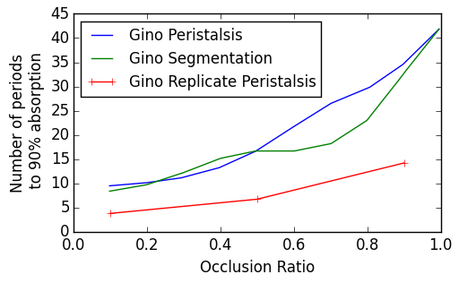

1. What features were only developed in the Couette code? (other than parallel particle tracking and polydisperse)

   * Updated qCalc
   * Parallel particle tracking and I/O for particles
        Yanxing had implemented some particle tracers. Balaji wrote his own and compared the lagrangian trajectories to Yanxing's results. 
   * Implemented Drug dissolution model
   * Original scalar BC in the Couette code was crap. Yanxing had developed this BC, while Gino had implemented it. Yanxing's implementation is incorrect and doesn't conserve scalar. Scalar flux BC is tricky. 
   * Balaji validated it to the extent that Gino's code produces the same peristalsis results as Yanxing's code.
   * Set occlusion ratio to 1.0 and set the wall velocity. You should get a straight velocity profile and exact mass conservation.
     
2. In particle dissolution model, it was assumed that particle size is small compared to the lattice mesh size. Increasing the mesh resolution (especially for fasting mode), what assumptions are becoming invalid?

If the particle is larger than the mesh size, then the local particle concentration may become larger than the saturation concentration. This is not physical.

3. Was there any effort on running the Intestine code with polydisperse particle distribution?

No. Intestine code doesn't have the drug dissolution model. 

4. What are the intestine domain dimensions (We got different values form Balaji’s code and Gino’s dissertation)

No clear idea. Nobody has any details on this. 

5. Could you please clarify the output in scalar-000*.dat. Here’s what we found in Output.f90 given by Balaji.

```fortran
!Scalar
OPEN(2472,FILE='scalar-'//sub//'.dat')
WRITE(2472,'(A100)') 'VARIABLES = "iter", "phiA", "phiAS", "phiAV", "phiT-phiD", "phiD", "phA+phiD","phiAverage"'
WRITE(2472,*) 'ZONE F=POINT'
WRITE(2472,'(I8,7E25.15)') iter, 4.0_dbl*phiAbsorbed*zcf3, 4.0_dbl*phiAbsorbedS*zcf3, 4.0_dbl*phiAbsorbedV*zcf3,(phiTotal-phiDomain)*zcf3,4.0_dbl*phiDomain*zcf3, (phiAbsorbed+phiDomain)*zcf3, phiAverage*zcf3
```

Some of these quantities are multiplied by 4 and some are not. The factor of 4 is removed in the Couette code.

Probably the code was written for a quarter of the domain.

6. We tried to reproduce Gino’s results for the 3D intestine – Peristalsis case. We’re getting much faster absorption than Gino.

`@Balaji`: Have you tried to reproduce Gino’s results?

Balaji tried to make sure that Yanxing's code and Gino's code gave the same result for peristalsis. He did not try to match Gino's result. 

`@Yanxing`: Gino’s thesis never mentions the grid resolution he used or the domain size and other parameters. Do you have the input file he used for any of his simulations?

No. Yanxing doesn't have any input file that Gino used.

#### Figure: {#ginoPeristalsisReplicateAttempts}



Caption: Attempts to reproduce Gino's results for Peristalsis

7. Discussion of the multiple grid capability

* How do you do this in parallel? Do you make sure the decomposition is such that the same area of the domain is decomposed into the same processor?

Yanxing put all the coarse grid into 1 processor and then distribute the fine grid uniformly. Decomposition is done by hand.

* How about load balancing? Clearly the processors that contain multiple grids have to do more work than others.

* Interpolation – Is the order of interpolation related to the order of accuracy? Do we do trilinear interpolation or anything else? Yu et. al. talk about cubic spline interpolation.

Yanxing uses the same interpolation as in Yu's paper. Interpolation is only required when going from coarse to find grid.

8. Discussion of code given by Yanxing today

Yanxing gave us a code today that models the scalar dissolution from a freely suspended sphere in the shear flow. It also contains the important multigrid capability. To run this code, you first need to construct the connection relationship of the sub-domains by running conn.exe. The code is currently configured to run on 144 processors. The `conn` files specify the connectivity between different processors. Right now, the decomposition is non-trivial and have to make sure that the boundaries are right. 

9. Any other codes that Yanxing has?

Yanxing sent us another 3D cavity code folder which contains different domain decompositions (with 1,2,4 and 8 subdomains/processors). The scalar is released at the top lid. This code does not have the multi-grid, but it provides a clear picture of the parallelization.


