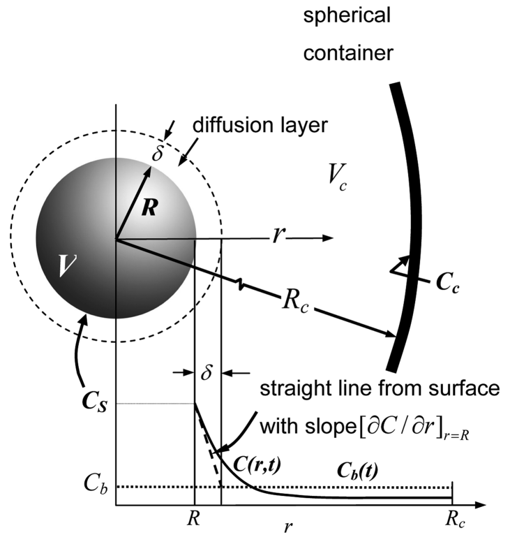

# Abstract

Former dissolution models have assumed a constant diffusion layer from the particle surface and a monodisperse models of dissolution. Yangxing and Brasseur studied this through the NSF grant and then in collaboration with Bertol Abrahamson and Lennat Lindfors at Astrazeneca Pharmaceuticals. They created engineering models from first principles for dissolution from a single particle in [@Wang2012] and extended it to a polydisperse model in [@JPS:JPS24472].

# Single particle dissolution model - Wang et. al. [@Wang2012]

#### Figure: {#singleParticleDissolution}

Caption: Illustration of the concentration field surrounding a single spherical pharmaceutical particle symmetrically placed within an impermeable spherical container (from [@Wang2012]).

Wang et. al. created engineering models from first principles for dissolution from a single spherical particle in a spherical container. They compared a finite domain model (FDM), an infinite domain model (IDM) and a quasi steady state model (QSM) to predict the dissolution rate and found that the QSM model was more than adequate to describe most of the dissolution characteristics.

## Quasi Steady State model (QSM)

The concentration field surrounding the particle is given by 

~~~math
C(r) = (C_s - C_{\infty}) \frac{R}{r} + C_{\infty} \\
~~~

where $C_{\infty}$ is adjusted to match the bulk concentration $C_b$ to account for the confinement effects as

~~~math
C_b &= \gamma C_s + (1 - \gamma) C_{\infty}
\gamma &= \frac{3}{2} \frac{(R_c/R)^2 - 1}{(R_c/R)^3 - 1}
~~~

The Sherwood number becomes the ratio of the diffusion layer thickness $\delta$ to the particle radius. 

~~~math
\frac{1}{Sh} = \frac{\delta}{R} = \frac{C_s - C_b}{C_s - C_{\infty}} = 1 - \gamma
~~~

The dissolution rate from the particle surface is given by 

~~~math
\frac{mol}{area-time} = N^{"}_s(t) = -D_m \left. \frac{\partial C}{\partial r} \right|_{r=R} = D_m \frac{C_s - C_{\infty}}{R}
~~~

The particle volume and radius change with time as 

~~~math
\frac{d V_p}{dt} &= \frac{d}{dt} \left ( \frac{4}{3} \pi R^3 \right ) = A_s \frac{dR}{dt} = -N^{"}_s(t) A_s \nu_m \\
\rightarrow \frac{dR}{dt} &= -N^{"}_s(t) \nu_m
~~~

where $\nu_m$ is the molar volume of the drug, i.e. the inverse of the drug concentration in the solid phase. 

## Methodology to determine the particle radius and bulk concentration with time

Start with the following parameters

1. Initial particle radius $R_0$
2. Assume all drug is inside the particle or know the initial bulk concentration
3. Calculate $C_{tot} = \frac{N_{tot}}{V_c}$

After a time $\Delta t$,

* Calculate the rate of drug release from the particle surface as N^{"}_s(t) = D_m \frac{C_s - C_{\infty}}{R}
* The number of moles released in $\Delta t = N^{"}_s(t) \times (4 \pi R^2) \times \Delta t = \Delta N_b$
* The number of moles in the bulk increases as $N_b = N_b + \Delta N_b$
* Calculate the change in the radius of the particle as $\Delta R = -N^{"}_s(t) \nu_m \times \Delta t$
* New bulk concentration = $\frac{N_b}{V_b} = \frac{N_b}{V_c - (4/3)\pi R^3} = C_b$

# Polydisperse model - Wang et. al. [@JPS:JPS24472]

The polydisperse model contains the QSM model at it's core and tries to predict the dissolution characteristics of a uniformly mixed set of particles of varying sizes. The particles follow the size distribution $Q(R)$ such that $Q(R) \; dR$ gives the total number of particles in a bin of size $dR$ around the radius $R$. The model then applies the QSM model to the particles in that bin. 

## Methodology to determine the particle radius and bulk concentration with time

Lets say that the initial particle size distribution is $Q_0(R)$ with the total number of moles being $N_tot$. This is discretized into a number of bins. Using the QSM model for the $j^{th}$ bin of radius $R_j$, the rate of change of radius of the particles in that bin will be 

~~~math
\frac{dR_j}{dt} = \nu_m D_m \frac{C_s - C_{b_j}(t)}{R_j(t)} Sh_j(t)
~~~

The polydisperse model makes the uniformly mixed approximation such that the bulk concentration for each $C_{b_j} (t) = C_b(t)$, the total bulk concentration ($N_b/V_b$). By following the same procedure as in the QSM model for each particle, the change in the radius of each bin and total bulk concentration can be computed as a function of time. 

# References

