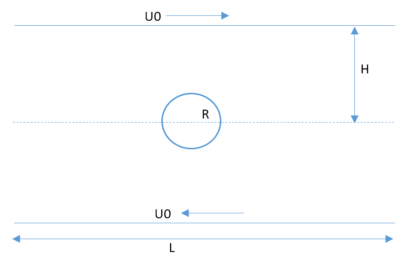

# Validation dataset from Yanxing - Sphere in shear flow at medium $Re_s (0.01 \le Re_s \le 1)$

Yanxing had performed a series of computational experiments with drug releasing from a super-resolved particle in shear  (Couette) flow. I'm reproducing some of the data given by him. Figure (#yanxingCasesetup) describes the case setup.

#### Figure: {#yanxingCasesetup}

Caption: Setup of Yanxing's cases.

Equation (#nonDimParameters) defines the non-dimensional parameters.

~~~math #nonDimParameters
\left.\begin{aligned}
S    & \equiv \frac{U_o}{H} \\
Re_s & \equiv \frac{S \; R^2}{ \nu} \\
S^*  & \equiv Re_s \\
Sc   & \equiv \frac{S R^2}{\nu} \\
\frac{\nu}{D_m} & = \frac{S R^2}{D_m} \\
\end{aligned}
\right\}
\qquad \text{Non-dimensional parameters}
~~~

The parameters of the cases run by Yanxing are:

~~~math
H/R &= 20, \; L/R=50, \; W/R=20, \\
\textrm{ Ratio of coarse grid to fine grid size - } m &= 8 , \\
\textrm{ Number of subdomains of fine grids in the axial direction - } l_x &= 143 , \\
\textrm{ Sphere radius - } R &= 20.025 , \\
\textrm{ Coarse grid resolution - } nxf &= 7, \; nyf = 401, \; nzf = 52 ,\\
\textrm{ Fine grid resolution - } nxc &= 126, \; nyc = 51,  \; nzc = 44. \\
~~~

Table (#table:CasesYanxing) describes the parameters of the cases run by Yanxing.

#### Table:  {#table:CasesYanxing}

| $U_o$    |  $Re_s$ | $\nu$    |$\tau_c$   | $\tau_f = 1/2 + m \left (\tau_c -  1/2 \right )$ |
|----------|---------|----------|-----------|--------------------------------------------------|
|   0.1    |     1   | 0.012516 | 0.537547  |                           0.800375               |
|   0.1    |    0.8  | 0.015645 | 0.546934  |                           0.875469               |
|   0.1    |    0.75 | 0.016688 | 0.550063  |                           0.9005                 |
|   0.1    |    0.6  | 0.020859 | 0.562578  |                           1.000625               |
|   0.1    |    0.5  | 0.025031 | 0.575094  |                           1.10075                |
|   0.1    |    0.4  | 0.031289 | 0.593867  |                           1.250938               |
|   0.1    |    0.25 | 0.050063 | 0.650188  |                           1.7015                 |
|   0.1    |    0.2  | 0.062578 | 0.687734  |                           2.001875               |
|   0.1    |    0.1  | 0.125156 | 0.875469  |                           3.50375                |
|   0.08   |    0.08 | 0.125156 | 0.875469  |                           3.50735                |
|   0.08   |    0.075| 0.1335   | 0.9005    |                           3.704                  |
|   0.06   |    0.06 | 0.125156 | 0.875469  |                           3.50735                |  
|   0.06   |    0.05 | 0.150188 | 0.950563  |                           4.1045                 |
|   0.04   |    0.04 | 0.125156 | 0.875469  |                           3.50735                |
|   0.04   |    0.025| 0.20025  | 1.10075   |                           5.306                  |
|   0.02   |    0.02 | 0.125156 | 0.875469  |                           3.50735                |
|   0.02   |    0.02 | 0.250313 | 1.250938  |                           6.5075                 |

Caption: Cases run by Yanxing

# Drug Properties
Felodipine was chosen for these simulations. The drug properties are shown in Table (#table:FelodipineProperties):

#### Table:  {#table:FelodipineProperties} 

|Parameter |  Value  | Units      |
|----------|---------|------------|
|   $C_s$  |8.9 e-10 | $mol/cm^3$ |
|   $v_m$  |265      | $cm^3/mol$ |
|   $D_m$  |6.7 e-6  | $cm^2/s$   | 

Caption: Felodipine Properties

to calculate the $C_{tot}$ we have:

#### Table:  {#table:C_tot-over-C_s}

|Parameter                                                                             | Value           |
|--------------------------------------------------------------------------------------|-----------------|
| $H/R$                                                                                | $20$            |
| $W/R$                                                                                | $20$            |
| $L/R$                                                                                | $50$            |
| $V_{container}$                                                                      | $2000 R^3$      |
| $V_{particler}$                                                                      | $4/3 \pi R^3$   |
| $\dfrac{V_{particler}}{V_{container}}$                                               | $2.0944 e-4$    |
| $C_{tot}= \Big(\dfrac{V_{particler}}{V_{container}} \dfrac{1}{v_m}\Big)$             | $7.9 e-7$       |   
| $C_{tot} /C_s$                                                                       | $887.6$         |

Caption: Computing $C_{tot}$  over $C_s$ based on the given dimension and the properties of Felodipine.

To have a reasonably small $C_{tot}/C_s$ (i.e. 0.1), we should use a larger $C_s$ as follows:

$\dfrac{C_{tot}} {C_s} = 0.1 \Rightarrow C_s = 7.89 e-6$ 
         

 
#Further description given by Yanxing: 

    In each case with a specific Reynolds number, a couple of scalars with different Schmidt numbers are considered. 
    The number of Schmidt numbers is denoted by “nsc”. The Schmidt numbers are given in “sc.dat”. 
    The quantities related to scalar release are stored in sca-c-01.dat, sca-c-02.dat … and sca-f-01.dat, sca-f-02.dat … 
    “c” stands for coarse grid, and “f” stands for find grid. 
    The numbers “01” “02” correspond the Schmidt number. 
    In each file, there are four variables in the DIMENSIONAL form,
    1. time; 
    2. Total scalar, the spatial integration of scalar concentration; 
    3. Amount of scalar release at the last time step, obtained by integrating the surface flux; 
    4. Total amount of scalar release, obtained by temporal integrating the scalar release at every time step.
    
    The locations of the verification cases:
    /Research/sphere-in-shear-flow/data/s-m-2/re001s/                            Re=0.01
    /Research/sphere-in-shear-flow/data/s-m-2/re01s-b/                           Re=0.1
    /Research/sphere-in-shear-flow/data/s-m-2/re1s-b/                             Re=1
    Please see “sc.dat” in each directory to find the corresponding Schmidt number.

That's it for now.

