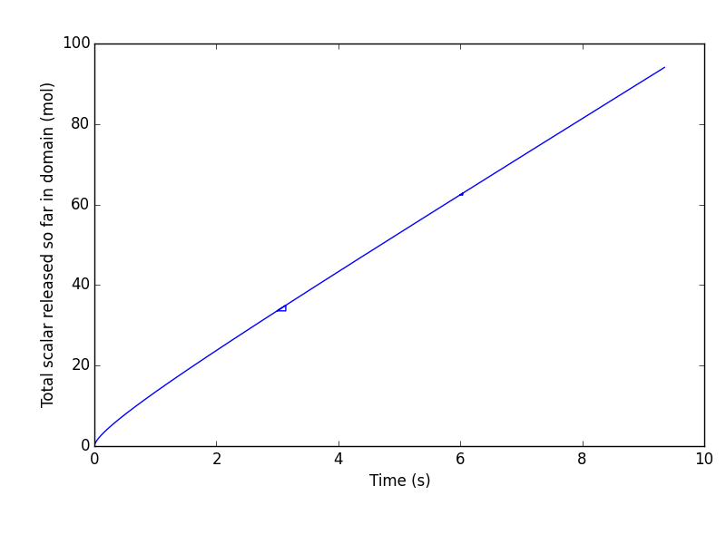
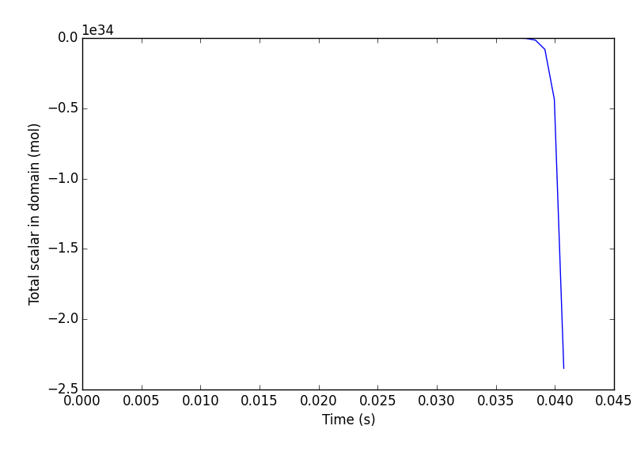
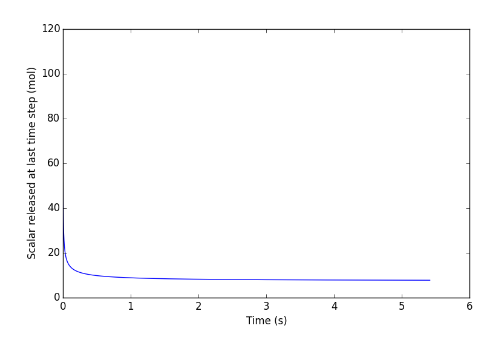
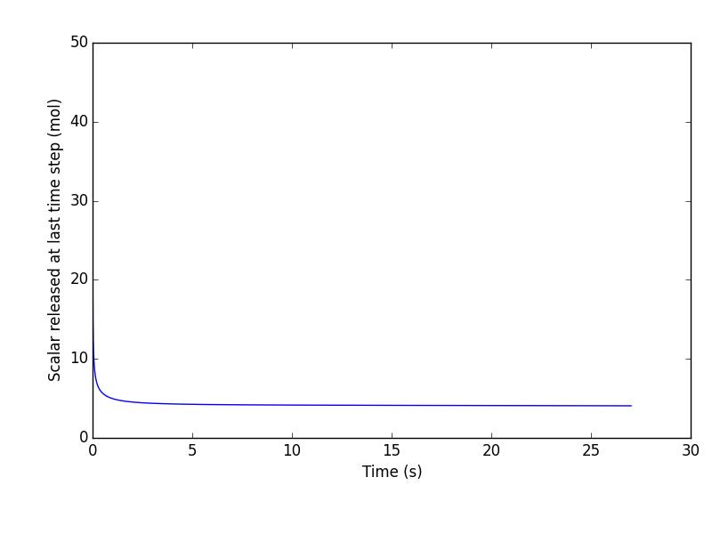
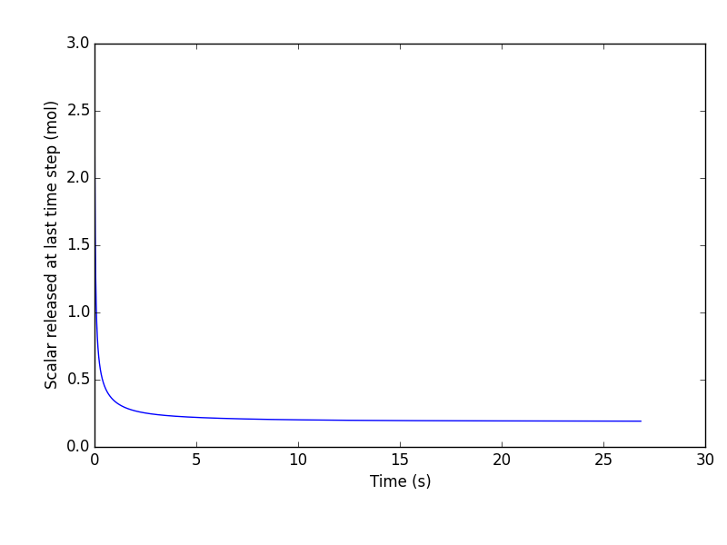

# Validation dataset from Yanxing - Sphere in shear flow at medium $Re_s (0.01 \le Re_s \le 1)$

Yanxing had performed a series of computational experiments with drug releasing from a super-resolved particle in shear  (Couette) flow. I'm reproducing some of the data given by him. Figure (#yanxingCasesetup) describes the case setup.

#### Figure: {#yanxingCasesetup}

Caption: Setup of Yanxing's cases.

Equation (#nonDimParameters) defines the non-dimensional parameters.

~~~math #nonDimParameters
\left.\begin{aligned}
S    & \equiv \frac{U_o}{H} \\
Re_s & \equiv \frac{S \; R^2}{ \nu} \\
S^*  & \equiv Re_s \; Sc  = \frac{S R^2}{\nu} \; \frac{\nu}{D_m} = \frac{S R^2}{D_m}
\end{aligned}
\right\}
\qquad \text{Non-dimensional parameters}
~~~

The parameters of the cases run by Yanxing are:

~~~math
H/R &= 20, \; L/R=50, \; W/R=20, \\
\textrm{ Ratio of coarse grid to fine grid size - } m &= 8 , \\
\textrm{ Number of subdomains of fine grids in the axial direction - } l_x &= 143 , \\
\textrm{ Sphere radius - } R &= 20.025 , \\
\textrm{ Coarse grid resolution - } nxf &= 7, \; nyf = 401, \; nzf = 52 ,\\
\textrm{ Fine grid resolution - } nxc &= 126, \; nyc = 51,  \; nzc = 44. \\
~~~

Table (#table:CasesYanxing) describes the parameters of the cases run by Yanxing.

#### Table:  {#table:CasesYanxing}

| $U_o$    |  $Re_s$ | $\nu$    |$\tau_c$   | $\tau_f = 1/2 + m \left (\tau_c -  1/2 \right )$ | $Sc_1$ | $Sc_2$ | $Sc_3$ | $Sc_4$ | $Sc_5$ |  $Sc_6$ | $S^*_1$ | $S^*_2$ | $S^*_3$ | $S^*_4$ | $S^*_5$ | $S^*_6$
|----------|---------|----------|-----------|--------------------------------------------------|------|------|------|------|------|------|------|------|------|------|-----|-----|
|   0.1    |     1   | 0.012516 | 0.537547  |                           0.800375               |    | 20 | 40 | 60 | 80 | 100 |    | 20 | 40 | 60 | 80 | 100 | 
|   0.1    |    0.8  | 0.015645 | 0.546934  |                           0.875469               |    |    |    |    |    |     |    |    |    |    |    |     | 
|   0.1    |    0.75 | 0.016688 | 0.550063  |                           0.9005                 | 10 | 20 | 40 | 60 | 80 | 100 | 7.5 | 15 | 30 | 45 | 60 | 75 | 
|   0.1    |    0.6  | 0.020859 | 0.562578  |                           1.000625               |    |    |    |    |    |     |    |    |    |    |    |     | 
|   0.1    |    0.5  | 0.025031 | 0.575094  |                           1.10075                | 10 | 20 | 40 | 60 | 80 | 100 |   5 | 10 | 20 | 30 | 40 | 50 | 
|   0.1    |    0.4  | 0.031289 | 0.593867  |                           1.250938               |    |    |    |    |    |     |    |    |    |    |    |     | 
|   0.1    |    0.25 | 0.050063 | 0.650188  |                           1.7015                 | 10 | 20 | 40 | 60 | 80 | 100 | 2.5 |  5 | 10 | 15 | 20 | 25 | 
|   0.1    |    0.2  | 0.062578 | 0.687734  |                           2.001875               |    |    |    |    |    |     |    |    |    |    |    |     | 
|   ***0.1***    |   ***0.1***  | ***0.125156*** | ***0.875469***  |                           ***3.50375***                | ***10*** | 20 | 40 | 60 | 80 | 100 |   ***1*** |  2 |  4 |  6 |  8 | 10 | 
|   0.08   |    0.08 | 0.125156 | 0.875469  |                           3.50735                |    |    |    |    |    |     |    |    |    |    |    |     | 
|   0.08   |    0.075| 0.1335   | 0.9005    |                           3.704                  | 10 | 20 | 40 | 60 | 80 | 100 | 0.75|1.5 |  3 |4.5 |  6 | 7.5| 
|   0.06   |    0.06 | 0.125156 | 0.875469  |                           3.50735                |    |    |    |    |    |     |    |    |    |    |    |     | 
|   0.06   |    0.05 | 0.150188 | 0.950563  |                           4.1045                 | 10 | 20 | 40 | 60 | 80 | 100 |  0.5| 1  |  2 |  3 |  4 |  5 | 
|   0.04   |    0.04 | 0.125156 | 0.875469  |                           3.50735                |    |    |    |    |    |     |    |    |    |    |    |     | 
|   0.04   |    0.025| 0.20025  | 1.10075   |                           5.306                  | 10 | 20 | 40 | 60 | 80 | 100 | 0.25| 0.5 | 1 | 1.5 | 2 | 2.5 |  
|   0.02   |    0.02 | 0.125156 | 0.875469  |                           3.50735                |    |    |    |    |    |     |    |    |    |    |    |     | 
|   0.02   |    0.01 | 0.250313 | 1.250938  |                           6.5075                 | 10 | 20 | 40 | 60 | 80 | 100 |  0.1 | 0.2 | 0.4 | 0.6 | 0.8 | 1 |   

Caption: Cases run by Yanxing. Alternate rows contain the Schmidt number data as well. We have the data for these cases in the hard drive that Yanxing left behind. The highlighted case is the first case that we will run to compare against Yanxing. 

## Plots of Yanxing's data

I merely plot Yanxing's data here.

#### Figure: {#re001s}

{width=33%}
{width=33%}
{width=33%} \
{width=33%}
{width=33%}
{width=33%} \
{width=33%}
{width=33%}
{width=33%} \
{width=33%}
{width=33%}
{width=33%} \
{width=33%}
{width=33%}
{width=33%} 

Caption: Scalar in the domain for $Re_s = 0.001$. The left column is the total scalar in the domain, the middle column is the scalar released at that time over a time-step, the right column is the total scalar released so far obtained by time-integration. Ideally, the left and the right column should be the same.

#### Figure: {#re0025s}

{width=33%}
{width=33%}
{width=33%} \
{width=33%}
{width=33%}
{width=33%} \
{width=33%}
{width=33%}
{width=33%} \
{width=33%}
{width=33%}
{width=33%} \
{width=33%}
{width=33%}
{width=33%} \
{width=33%}
{width=33%}
{width=33%} 

Caption: Scalar in the domain for $Re_s = 0.0025$. The left column is the total scalar in the domain, the middle column is the scalar released at that time over a time-step, the right column is the total scalar released so far obtained by time-integration. Ideally, the left and the right column should be the same.

#### Figure: {#re005s}

{width=33%}
{width=33%}
{width=33%} \
{width=33%}
{width=33%}
{width=33%} \
{width=33%}
{width=33%}
{width=33%} \
{width=33%}
{width=33%}
{width=33%} \
{width=33%}
{width=33%}
{width=33%} \
{width=33%}
{width=33%}
{width=33%}

Caption: Scalar in the domain for $Re_s = 0.005$. The left column is the total scalar in the domain, the middle column is the scalar released at that time over a time-step, the right column is the total scalar released so far obtained by time-integration. Ideally, the left and the right column should be the same.

#### Figure: {#re0075s}

{width=33%}
{width=33%}
{width=33%} \
{width=33%}
{width=33%}
{width=33%} \
{width=33%}
{width=33%}
{width=33%} \
{width=33%}
{width=33%}
{width=33%} \
{width=33%}
{width=33%}
{width=33%} \
{width=33%}
{width=33%}
{width=33%} 

Caption: Scalar in the domain for $Re_s = 0.0075$. The left column is the total scalar in the domain, the middle column is the scalar released at that time over a time-step, the right column is the total scalar released so far obtained by time-integration. Ideally, the left and the right column should be the same.

#### Figure: {#re01s}

{width=33%}
{width=33%}
{width=33%} \
{width=33%}
{width=33%}
{width=33%} \
{width=33%}
{width=33%}
{width=33%} \
{width=33%}
{width=33%}
{width=33%} \
{width=33%}
{width=33%}
{width=33%} \
{width=33%}
{width=33%}
{width=33%}

Caption: Scalar in the domain for $Re_s = 0.1$. The left column is the total scalar in the domain, the middle column is the scalar released at that time over a time-step, the right column is the total scalar released so far obtained by time-integration. Ideally, the left and the right column should be the same.

#### Figure: {#re025s}

{width=33%}
{width=33%}
{width=33%} \
{width=33%}
{width=33%}
{width=33%} \
{width=33%}
{width=33%}
{width=33%} \
{width=33%}
{width=33%}
{width=33%} \
{width=33%}
{width=33%}
{width=33%} \
{width=33%}
{width=33%}
{width=33%}

Caption: Scalar in the domain for $Re_s = 0.25$. The left column is the total scalar in the domain, the middle column is the scalar released at that time over a time-step, the right column is the total scalar released so far obtained by time-integration. Ideally, the left and the right column should be the same.

#### Figure: {#re05s}

{width=33%}
{width=33%}
{width=33%} \
{width=33%}
{width=33%}
{width=33%} \
{width=33%}
{width=33%}
{width=33%} \
{width=33%}
{width=33%}
{width=33%} \
{width=33%}
{width=33%}
{width=33%} \
{width=33%}
{width=33%}
{width=33%}

Caption: Scalar in the domain for $Re_s = 0.5$. The left column is the total scalar in the domain, the middle column is the scalar released at that time over a time-step, the right column is the total scalar released so far obtained by time-integration. Ideally, the left and the right column should be the same.

#### Figure: -{#re075s-b}

{width=33%}
{width=33%}
{width=33%} \
{width=33%}
{width=33%}
{width=33%} \
{width=33%}
{width=33%}
{width=33%} \
{width=33%}
{width=33%}
{width=33%} \
{width=33%}
{width=33%}
{width=33%} \
{width=33%}
{width=33%}
{width=33%}

Caption: Scalar in the domain for $Re_s = 0.75$. The left column is the total scalar in the domain, the middle column is the scalar released at that time over a time-step, the right column is the total scalar released so far obtained by time-integration. Ideally, the left and the right column should be the same.

#### Figure: {#re1s-b}

{width=33%}
{width=33%}
{width=33%} \
{width=33%}
{width=33%}
{width=33%} \
{width=33%}
{width=33%}
{width=33%} \
{width=33%}
{width=33%}
{width=33%} \
{width=33%}
{width=33%}
{width=33%} \
{width=33%}
{width=33%}
{width=33%}

Caption: Scalar in the domain for $Re_s = 1$. The left column is the total scalar in the domain, the middle column is the scalar released at that time over a time-step, the right column is the total scalar released so far obtained by time-integration. Ideally, the left and the right column should be the same.

## Calculating dimensional quantities from non-dimensional parameters

We inverse calculate the dimensional quantites from the non-dimensional parameters as follows:
~~~math #inverseCalcDimNonDim
Re_s &= \frac{S \; R^2}{ \nu} = \frac{U_o}{H} \; \frac{R^2}{ \nu} = \frac{U_o R}{ \nu} \frac{R}{H} =  \frac{U_o R}{20 \; \nu}, \\
R &= \frac{20 \; Re_s \; \nu }{U_o}, \\
D_m &= \frac{\nu}{Sc}.
~~~

Using Eqn. (#inverseCalcDimNonDim), the quantities in Table (#table:CasesYanxing) become as shown in Table

#### Table:  {#table:CasesYanxingDimensionalData}

| $U_o$ | $Re_s$  | $\nu$ | $R$ | $H$ | $L$ | $W$ | 
|-------|---------|-------|-----|-----|-----|-----| 
| 0.1 | 1.000 | 0.012516 | 2.503200 | 50.064000 | 125.160000 | 50.064000 | 
| 0.1 | 0.750 | 0.016688 | 2.503200 | 50.064000 | 125.160000 | 50.064000 | 
| 0.1 | 0.500 | 0.025031 | 2.503100 | 50.062000 | 125.155000 | 50.062000 | 
| 0.1 | 0.250 | 0.050063 | 2.503150 | 50.063000 | 125.157500 | 50.063000 | 
| 0.1 | 0.100 | 0.125156 | 2.503120 | 50.062400 | 125.156000 | 50.062400 | 
| 0.1 | 0.075 | 0.133500 | 2.503125 | 50.062500 | 125.156250 | 50.062500 | 
| 0.1 | 0.050 | 0.150188 | 2.503133 | 50.062667 | 125.156667 | 50.062667 | 
| 0.0 | 0.025 | 0.200250 | 2.503125 | 50.062500 | 125.156250 | 50.062500 | 
| 0.0 | 0.010 | 0.250313 | 2.503130 | 50.062600 | 125.156500 | 50.062600 | 

Caption: Conversion of non-dimensional parameters in Table (#table:CasesYanxing) to dimensional quantities.

Table (#table:CasesYanxingDimensionalData) The dimensions of the domain and the particle for all cases are roughly the same and any differences between are likely due to the round off error in the representation of $\nu$. Hence, we propose that the dimensional parameters be fixed as

~~~math 
R&= 2.5m, \; H = 50m, \\
L&= 125m, \; W = 50m,
~~~
and that the $\nu$ be adjusted to recover the same $Re_s$ and $U_o$ as $\nu = (U_o R/20 Re_s)$.

# First case chosen from Yanxing's data for validation
One of the Yanxing's simulations was chosen as defined by the parameters below:

~~~math
\left.\begin{aligned}
U_o = 0.1 m/s \\
S^* = 1 \\
Re_s= 0.1 \\
\nu= 0.125 m^2/s \\
\end{aligned}
\right\}
\qquad \text{corresponding to [re01s-b/sca-*-01.dat]}
~~~

The output plots are presented in Figure(#Chhosen-Case-Scalar)

#### Figure: {#Chhosen-Case-Scalar}
{width=95%}
Caption: Total scalar based on Yanxing simulation for $Re_s = 0.1, S^*=1, U_o=0.1 m/s, \nu=0.125 m^2/s$

$(C_b/C_s)$ was computed as a function of time as shown in Figure(#Chhosen-Case-Cb). $C_b $ is global bulk concentration (total moles in the domain divided by the container volume): 

#### Figure: {#Chhosen-Case-Cb}
{width=95%}
Caption: $C_b/C_s$ based on Yanxing simulation for $Re_s = 0.1, S^*=1, U_o=0.1 m/s, \nu=0.125 m^2/s$ 

# Defining dimensional parameters needed

Using below equations we can get the dimensional parameters needed for our simulations:

~~~math
\left.\begin{aligned}
S    = \frac{U_o}{H} \\
Re_s = \frac{S \; R^2}{ \nu} \\
S^*  = Re_s \; Sc \\
H/R = 20\\
L/R = 50 \\
W/R = 20 \\
\end{aligned}
\right\}
\qquad \text{Non-dimensional parameters}
~~~

Therefore we can get all dimensional paramteres as:

~~~math
R   = \frac{20 \; Re_s \; \nu }{U_o} =2.5 m\\
H = 20 R = 50 m  \\
W = 20 R = 50 m  \\
L = 50 R = 125 m \\
Sc  = \frac{S*}{Re_s} = 10\\
D_m = \frac{\nu}{Sc} = 0.0125 m^2/s\\
C_s =1
~~~

# Estimation of the the Sherwood number based on Figure (#Chhosen-Case-Scalar) 

The slope of the curve in figure (#Chhosen-Case-Scalar)  represents $N^"_s A_P$, so:

~~~math
N^"_s A_P =\frac{115} {27}  \frac{mols} {s} = 4.26 \frac{mols} {s} \\
A_P= 4 \pi R^2= 4 \pi (2.5)^2 =78.54 m^2 \\
N^"_s= \frac{4.26} {78.54} =  0.054 \frac{mols} {m^2.s} 
~~~

based on Figure (#Chhosen-Case-Cb), we can assume $C_b = 0$, therefore:

~~~math
Sh= \frac{N^"_s} {D_m  (\frac{C_s-C_b}{R}) }  \\  
Sh= \frac{0.054 * 2.5} {0.0125 [1-0]} = 10.8   \\
~~~

The estimated Sherwood number of 10.8 is much larger than the value we get from correlations wich is around 1.3.

<!---
## Simplified estimation of the total drugs released 

Using parameters defined in previous section, the total drug released in the domain in 20 seconds can be estimated as:
~~~math 
N^"_s =  \frac{Sh \; D_m \; [C_s-C_b] }{R}  \\
Total Moles Released = N^"_s A \Delta t = (4 \pi R^2) N^"_s \Delta t
~~~

Assuming $C_b= 0$ and $Sh= 1.3$, an estimation for moles released in 20 s would be:

~~~math
N^"_s =  \frac{Sh \; D_m \; [C_s-C_b] }{R} =\frac{1.3 * 0.0125 [1-0] }{2.5} = 0.0065 \\
A= 4 \pi R^2 = 4 \pi 2.5^2 = 78.54 \\
moles = N^"_s A \Delta t= 0.0065 * 78.54 *20 = 10.21
~~~

## Drug Properties
Felodipine was chosen for these simulations. The drug properties are shown in Table (#table:FelodipineProperties):

#### Table:  {#table:FelodipineProperties} 

|Parameter |  Value  | Units      |
|----------|---------|------------|
|   $C_s$  |8.9 e-10 | $mol/cm^3$ |
|   $v_m$  |265      | $cm^3/mol$ |
|   $D_m$  |6.7 e-6  | $cm^2/s$   | 

Caption: Felodipine Properties

to calculate the $C_{tot}$ we have:

#### Table:  {#table:C_tot-over-C_s}

|Parameter                                                                             | Value           |
|--------------------------------------------------------------------------------------|-----------------|
| $H/R$                                                                                | $20$            |
| $W/R$                                                                                | $20$            |
| $L/R$                                                                                | $50$            |
| $V_{container}$                                                                      | $2000 R^3$      |
| $V_{particler}$                                                                      | $(4/3) \pi R^3$ |
| $\dfrac{V_{particler}}{V_{container}}$                                               | $2.0944 e-4$    |
| $C_{tot}= \Big(\dfrac{V_{particler}}{V_{container}} \dfrac{1}{v_m}\Big)$             | $7.9 e-7$       |   
| $C_{tot} /C_s$                                                                       | $888$           |

Caption: Computing $C_{tot}/C_s$  based on the given dimensions and properties of Felodipine.

To have a reasonably small $C_{tot}/C_s$ (i.e. 0.1), we should use a larger $C_s$ as follows:

$\dfrac{C_{tot}} {C_s} = 0.1 \Rightarrow C_s = 7.89 e-6$ 
         

 
-->

#Further description given by Yanxing: 

    In each case with a specific Reynolds number, a couple of scalars with different Schmidt numbers are considered. 
    The number of Schmidt numbers is denoted by “nsc”. The Schmidt numbers are given in “sc.dat”. 
    The quantities related to scalar release are stored in sca-c-01.dat, sca-c-02.dat … and sca-f-01.dat, sca-f-02.dat … 
    “c” stands for coarse grid, and “f” stands for find grid. 
    The numbers “01” “02” correspond the Schmidt number. 
    In each file, there are four variables in the DIMENSIONAL form,
    1. time; 
    2. Total scalar, the spatial integration of scalar concentration; 
    3. Amount of scalar release at the last time step, obtained by integrating the surface flux; 
    4. Total amount of scalar release, obtained by temporal integrating the scalar release at every time step.
    
    The locations of the verification cases:
    /Research/sphere-in-shear-flow/data/s-m-2/re001s/                            Re=0.01
    /Research/sphere-in-shear-flow/data/s-m-2/re01s-b/                           Re=0.1
    /Research/sphere-in-shear-flow/data/s-m-2/re1s-b/                             Re=1
    Please see “sc.dat” in each directory to find the corresponding Schmidt number.

That's it for now.

