I'll document my attempts at implementing a multi-block method in the intestine code.

The main reason for implemeting a multi-block method in the intestine code is to be able to simulate fasting states, where the occlusion ratio for intestinal motility can go really small. The occlusion ratio is not quite the ratio of the occluded diameter to the total diameter of the domain. 

```math
a &= \frac{0.5 \; D}{ 2 - (\epsilon/a)} \\
\rightarrow \frac{a}{0.5 D} &= \frac{1}{ 2 - (\epsilon/a)} \\
\rightarrow \frac{\epsilon}{0.5 D} &= \frac{\epsilon}{a} \frac{a}{0.5 D} =  \frac{\epsilon}{a} \frac{1}{ 2 - (\epsilon/a)}
```
When $\epsilon/a \ll 2$, $\epsilon/(0.5D)$ will become half of $(\epsilon/a)$.

A rule of thumb is that the the occluded region should be resolved with about $\sim 10$ cells. The estimate of the maximum gut diameter we've been using so far is $D = 0.005m$. Lets say this is resolved with a 100 cells in the $x$ and $y$ directions. The resolution will be $\Delta x = 0.005/100 = 5 \times 10^{-5}m$. Table (#table:resolutionRequirements) shows that the resolution requirements increase severely as the occlusion ratio is dropped. It may not be feasible to acheive a reduction of the grid spacing of $\sim O(20-200)$ times with just two grids. I suspect that we will need atleast 3 grids with a reduction ratio of $m-5$ to simulate the occlusion ratio of 0.01 and may be 4 grids with a similar reduction ratio to simulate the occlusion ratio of 0.001.

#### Table:  {#table:resolutionRequirements}

| $\epsilon/a$ |  $\epsilon/R$ | $\Delta x_f$ | Ratio $\Delta x_c / \Delta x_f$ | $nx_f,  $ny_f = 0.1 D / \Delta x_f$ | $nz_f = L/\Delta x_f$ | $nx_f \times ny_f \times nz_f$ |
|--------------|---------------|--------------|-------------------------------|-------------------------------------|-----------------------|--------------------------------|
|   0.5        |     0.32      | $1.667 \times 10^{-4}$m |  0.3  |    -  |   -    |   -     |
|   0.1        |     0.0527    | $2.631 \times 10^{-5}$m |  1.9  |  19   |   380  |  137k   |
|   0.01       |     0.005     | $2.512 \times 10^{-6}$m |  20   |  200  |  4000  |  157M   |
|   0.001      |     0.0005    | $2.501 \times 10^{-7}$m |  200  |  2000 | 40000  |  159B   |

Caption: Demonstration of resolution requirement in the occluded region as the occlusion ratio $\epsilon/a$ is reduced.


## How to design the extent of the fine mesh

Let's say that we require only two grids. Figure (#multiblockDomainDecomposition) shows the proposed design of a slice of ($x=0$ plane) a cylindrical computational domain and the fine mesh within.


#### Figure: {#multiblockDomainDecomposition}

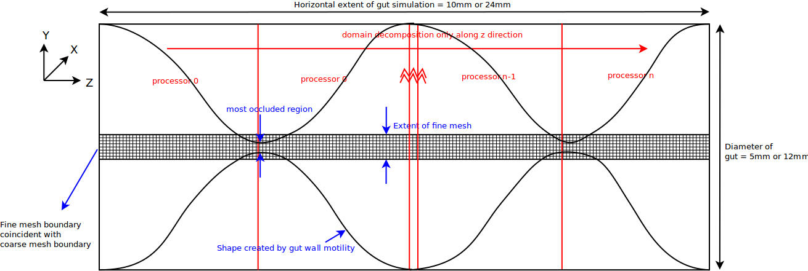

Caption: Proposed design of the computational domain and the fine mesh and it's domain decomposition.

The rule of thumb reg. 10 grid points in the occluded region need to be applied uniformly across the entire gut. Thus, if the max diameter of the gut is resolved with 100 points, the inner 10% of the domain needs to be refined at all times as it would have less than 10 cells by definition. If the fine mesh has been designed according to the rule of thumb, the resolution requirements would start to become astronomical very quickly as shown in the last column in Table (#table:resolutionRequirements).

# Actual design of the multi-block/grid algorithm

All these issues , not withstanding, I'm still going ahead with designing the multi-grid algorithm. I had to print out and study the Intestine code in detail. I'll branch off the Intestine code and not the COuette code as I'm not sure of the readiness of this code to simulate intestinal motility. When Farhad makes the merge between the two codes, my mods to the Intestine code should transfer straight away to the merged code.

## Diagrams that help understanding the basics of the intestine 3D code

This will probably belong in it's own section. But I'll just make a brief description of the Intestine 3D code here.

Most of the LBM algorithm is fairly straight forward. The complicated parts involve the communication between processors to exchange information. This is first done by creating local arrays that are padded on the boundaries in each direction like so in `Setup.f90`

```fortran
! Distribution Functions
ALLOCATE(f(0:NumDistDirs,0:nxSub+1,0:nySub+1,0:nzSub+1),                        &
fplus(0:NumDistDirs,0:nxSub+1,0:nySub+1,0:nzSub+1))
! Velocity, Density
ALLOCATE(u(0:nxSub+1,0:nySub+1,0:nzSub+1),                                                      &
v(0:nxSub+1,0:nySub+1,0:nzSub+1),                                                      &
w(0:nxSub+1,0:nySub+1,0:nzSub+1))
ALLOCATE(rho(0:nxSub+1,0:nySub+1,0:nzSub+1))
```

The numbering scheme for the density distribution function and the lattice velocity vectors are shown in Figure (#densityDistribution).

#### Figure: {#densityDistribution}

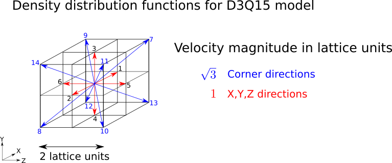

Caption: Numbering scheme of the density distribution directions and lattice velocity vectors in the Intestine 3D code.


Now for the complicated second part. The nodes on the boundaries of each processor could potentially interact with another processor in a variety of directions. To understand this, simply think of the information that a node on the faces, edges and corners of the processor boundaries. This is controlled by the temporary arrays `CDx, CDy and CDz` in the subroutine `SubDomainSetup` inside `Setup.f90`. Figure (#commDirs) shows the communication direction vector numbering scheme. 


#### Figure: {#commDirs}

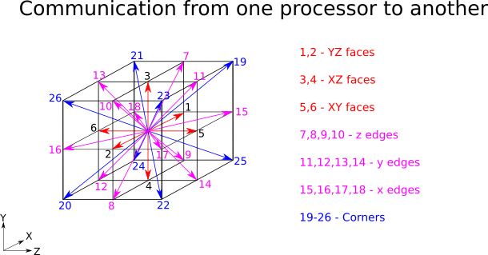

Caption: Numbering scheme of the communication direction vectors in the Intestine 3D code.

This is then used to setup the array `SubID` that contains the neighboring processor in each communication direction through the subroutine `SetSubID`.

All of this information is then used to carefully setup the main arrays `msgSend` and `msgRecv` that is transferred across processors. There are a whole host of supporting arrays and variables that describe the structure of the the two main arrays and how to pack it before sending and unpack it after receiving. The optimization of this array is done pretty well and only information that is absolutely required is transferred. For instance, only certain components of the density distribution function is transferred depending upon the communication direction.

* `OppCommDir`
* `f_Comps`
* `fSize`
* `dsSize`
* `uvwSize`
* `YZ_FaceSize`
* `ZX_FaceSize`
* `XY_FaceSize`
* `msgSize`
* `f_SendSize`
* `ds_SendSize`
* `uvw_SendSize`
* `total_SendSize`
* `XY_SendIndex`
* `YZ_SendIndex`
* `XZ_SendIndex`
* `X_SendIndex`
* `Y_SendIndex`
* `Z_SendIndex`
* `Corner_SendIndex`
* `XY_RecvIndex`
* `YZ_RecvIndex`
* `XZ_RecvIndex`
* `X_RecvIndex`
* `Y_RecvIndex`
* `Z_RecvIndex`
* `Corner_RecvIndex`
* `CommDataStart_f`
* `CommDataStart_rho`
* `CommDataStart_phi`
* `CommDataStart_u`
* `CommDataStart_v`
* `CommDataStart_w`


## Current plan to modify the Intestine code

This is the current list of steps to modify the Intestine code to a multigrid code.


1. Copy `Setup, LBM, Geometry, ICBC, Parallel.f90` files into corresponding `_fine` files.
2. Change the variable names in these files to `_fine`
3. In the mani `Geometry.f90` file, introduce a new type of node called `REFINEMESH`. Identify/Flag the required nodes as `REFINEMESH`.
4. Set the geometry parameters for the fine mesh in `Geometry_fine.f90` and the identify the outer nodes as `COARSEMESH`.
5. In the `Main.f90`, change the algorithm to include the sub-iterations for the fine mesh.
6. Introduce interpolation subroutines to transfer density distribution and other stuff between coarse and fine meshes.

The progress on this can be tracked on the [attemptedMultiGrid](https://github.com/BioGI/Codes/commits/attemptedMultigrid) branch of the Github repository.

##Psuedo-code for multigrid implementation in the Main algorithm

The current outline of the time-stepping in Main.f90 looks like this

```fortran
DO iter = iter0-0_lng,nt

      CALL AdvanceGeometry            ! advance the geometry to the next time step [MODULE: Geometry]
      CALL Collision                  ! collision step [MODULE: Algorithm]
      CALL MPI_Transfer               ! transfer the data (distribution functions, density, scalar) [MODULE: Parallel]

      CALL Stream                     ! perform the streaming operation (with Lallemand 2nd order BB) [MODULE: Algorithm]

      CALL Macro                      ! calcuate the macroscopic quantities [MODULE: Algorithm]

      IF(iter .GE. phiStart) THEN
          CALL Scalar             ! calcuate the evolution of scalar in the domain [MODULE: Algorithm]
      END IF

      CALL PrintFields                   ! output the velocity, density, and scalar fields [MODULE: Output]
      CALL PrintScalar                   ! print the total absorbed/entering/leaving scalar as a function of time [MODULE: Output]
      CALL PrintMass                     ! print the total mass in the system (TEST)
      CALL PrintVolume                   ! print the volume in the system (TEST)

      !   CALL PrintPeriodicRestart     ! print periodic restart files (SAFE GUARD) [MODULE: Output]

      CALL PrintStatus              ! print current status [MODULE: Output]

      CALL MPI_BARRIER(MPI_COMM_WORLD,mpierr)       ! synchronize all processing units before next loop [Intrinsic]

END DO
```

Figure (#multiGridAlgorithm) shows the schematic of the multiblock algorithm for `gridRatio = 4`, i.e., the fine mesh has a resolution that is four times finer than the coarse mesh. 

#### Figure: {#multiGridAlgorithm}

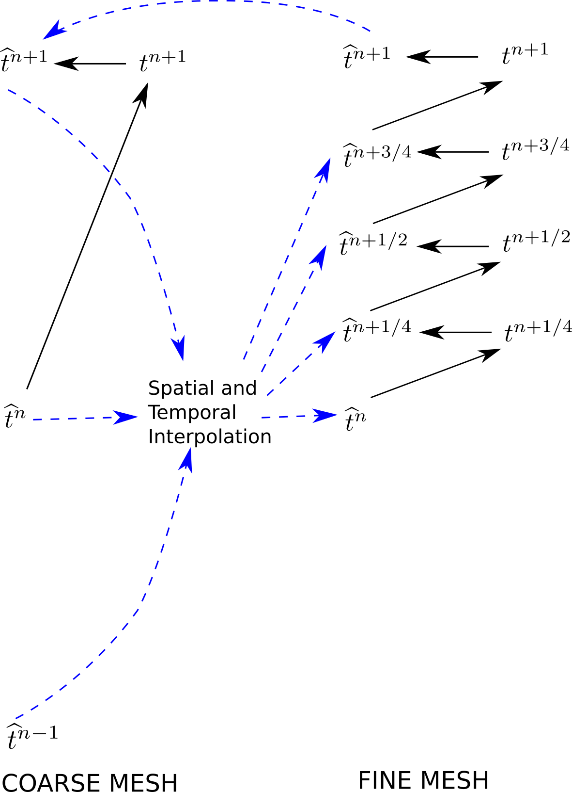{width=65%}

Caption: Schematic of the multiblock time-stepping algorithm. The resolution of the fine block is 4 times that of the coarse block.

Thus, the new time stepping psuedo-code should become

```fortran90
DO iter = iter0-0_lng,nt

      CALL AdvanceGeometry		! advance the geometry to the next time step [MODULE: Geometry]
      CALL Stream			! perform the streaming operation (with Lallemand 2nd order BB) [MODULE: Algorithm]
      CALL Macro			! calcuate the macroscopic quantities [MODULE: Algorithm]
      CALL Scalar             ! calcuate the evolution of scalar in the domain [MODULE: Algorithm]
      CALL Collision                  ! collision step [MODULE: Algorithm]
      CALL MPI_Transfer               ! transfer the data (distribution functions, density, scalar) [MODULE: Parallel]

      CALL SpatialInterpolateToFineGrid      ! Interpolate required variables to fine grid
      DO subIter=1,ratio
          CALL AdvanceGeometry_Fine   ! Advance the geometry on the fine grid
		  CALL TemporalInterpolateToFineGrid
          CALL Stream_Fine            ! Stream fine grid
	      CALL Macro_Fine             ! Calculate Macro properties on fine grid
		  CALL Scalar_Fine       ! Calculate Scalar stuff on fine grid
          CALL Collision_Fine     ! Collision step on the fine grid
	      CALL MPI_Transfer_Fine  ! Transfer the data across processor boundaries on the fine grid
      END DO
	  CALL InterpolateToCoarseGrid    ! Interpolate required variable to coarse grid

END DO
```

## Design of Interpolation from coarse mesh to fine mesh

In this section, I will describe the interface between a coarse and a fine mesh using an example. The coarse mesh has a 101 points in the x and y directions. Points 46-56 in both x and y directions are to be resolved by the fine mesh. The fraction of the total diameter resolved by the fine mesh will be $0.1D$. Figure (#designFineCoarseInterface) shows the interface between the coarse and the fine meshes.


####Figure: {#designFineCoarseInterface}

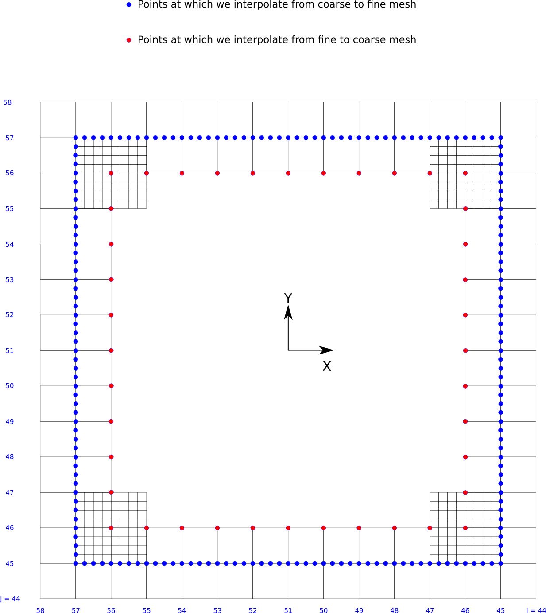{width=75%} \
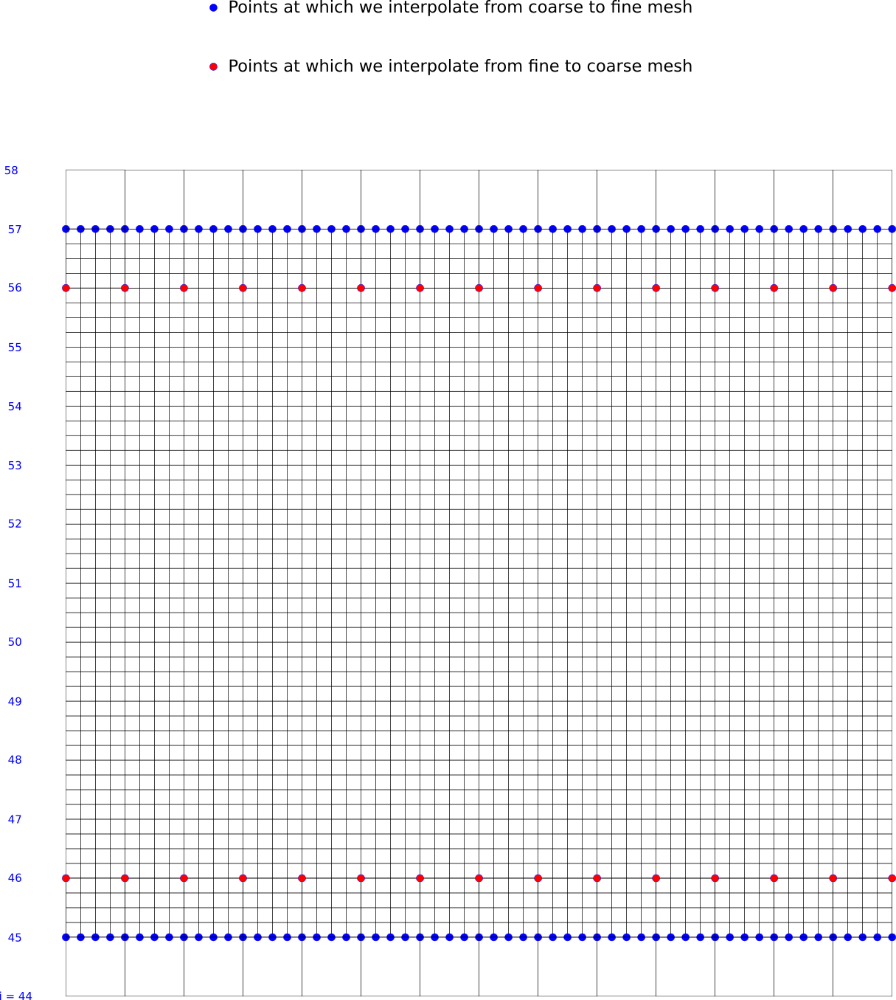{width=49%}
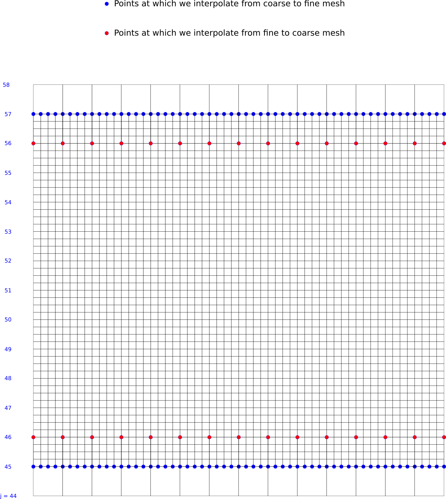{width=49%}

Caption: Design of the interface between the fine and coarse meshes for the multigrid algorithm.


### Symmetric cubic spline interpolation in space
A symmetric cubic spline interpolation procedure is used in all directions when interpolating from the coarse to fine mesh. For each fine mesh node, the nearest `lower` coarse mesh node $f_2$ is identified such that the fine mesh node is always between $f_2$ and $f_3$ with $0 \le s < 1$ as shown in Fig. (#symmetricCubicSplineInterpolation).

####Figure: {#symmetricCubicSplineInterpolation}

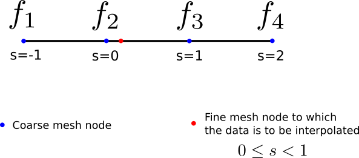{width=75%}

Caption: Design of cubic spline spatial interpolation scheme to transfer data from the coarse to the fine mesh. 

### Second order interpolation in time
A second order interpolation procedure is used interpolating from the coarse to fine mesh in time. The data at the fine mesh is always wanted between time $t_n$ and $t_{n+1}$ as shown in Fig. (#multiGridAlgorithm). 

####Figure: {#secondOrderTimeInterpolation}

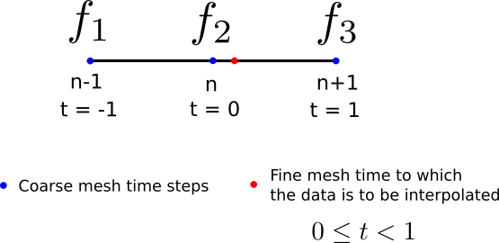{width=75%}

Caption: Design of second order temporal interpolation scheme to transfer data from the coarse to the fine mesh. 


### Special cases - interference of wall with interpolation from coarse to fine mesh

When the intestine wall goes through the interface between the coarse to the fine mesh, the 

```fortran90
FUNCTION spatialInterpolate(f1,f2,f3,f4,n1,n2,n3,n4,s)

!!!Symmetric Cubic spline temporal interpolation 

  REAL(dbl) :: f1, f2, f3, f4, s
  INTEGER   :: n1,n2,n3,n4
  REAL(dbl) :: spatialInterpolate
  REAL(dbl) :: aHat, bHat, cHat, dHat

  if (n3 .eq. SOLID) then
     if (n2 .ne. SOLID) then
        spatialInterpolate = spatialExtrapolate_n1n2(f1,f2,s)
     else
        spatialInterpolate = 0.0
     end if
     
  else if (n2 .eq. SOLID) then
     spatialInterpolate = spatialExtrapolate_n3n4(f3,f4,s)
     
  else if ( (n1 .ne. SOLID) .and. (n4 .eq. SOLID) ) then
     spatialInterpolate = spatialInterpolate_n1n2n3(f1,f2,f3,s)

  else if ( (n1 .eq. SOLID) .and. (n4 .ne. SOLID) ) then
     spatialInterpolate = spatialInterpolate_n2n3n4(f2,f3,f4,s)
     
  else if ( (n1 .eq. SOLID) .and. (n4 .eq. SOLID) ) then
     spatialInterpolate = spatialInterpolate_n2n3(f2,f3,s)

  else if ( (n1 .ne. SOLID) .and. (n2 .ne. SOLID) .and. (n3 .ne. SOLID) .and. (n4 .ne. SOLID) ) then
     spatialInterpolate = spatialInterpolateAllFour(f1,f2,f3,f4,s)
  end if
   
  RETURN
  
END FUNCTION spatialInterpolate
```

# Design of mesh and conversion factors

It turns out that the relaxation parameter $\tau$ cannot be 1.0 for both coarse and fine meshes. This has to do with the conversion/interpolation between the coarse and the fine meshes as descirbed in [lbmBasics.html](./lbmBasics.html#multi-grid-scheme). Hence the design of the mesh requires some thought. Lets say $\tau_c = 1.5$, with a grid ratio of $m = 4$. Then,

~~~math
\tau_f &= \frac{1}{2} + m \left ( \tau_c - \frac{1}{2} \right \\
&= \frac{1}{2} + 4.0 \left ( 0.75 - \frac{1}{2} \right
&= 4.5
~~~

The conversion factors for each mesh will be

#### Table:  {#table:meshDesign}

|                     Coarse mesh                     |                       Fine mesh                        |
|-----------------------------------------------------|--------------------------------------------------------|
| $\nu_L = \frac{2 \times 1.5 - 1}{6} = 0.08333$     | $\nu_L = \frac{2 \times 4.5 - 1}{6} = 0.333333$        |
| $x_{cf} = y_{cf} = z_{cf} = 1.2 \times 10^{-4}m$    | $x_{cf} = y_{cf} = z_{cf} = 0.3 \times 10^{-4}m$       |
| $t_{cf} = \nu_L \frac{x_{cf} x_{cf}}{\nu} = 5e-4s$  | $t_{cf} = \nu_L \frac{x_{cf} x_{cf}}{\nu} = 1.25e-4s$  |
| $v_{cf} = \frac{x_{cf}}{t_{cf}} = 0.24 m/s$         | $v_{cf} = \frac{x_{cf}}{t_{cf}} = 0.24 m/s$            |
| Wave speed = $\frac{0.004}{0.24}$ = 0.016667        | Wave speed = $\frac{0.004}{0.24}$ = 0.016667           |
| Reynolds number lattice = $\frac{0.016667 \times 50 \times 50}{0.08333 \times 200} = 2.5$ | Reynolds number lattice = $\frac{0.016667 \times 200 \times 200}{0.333333 \times 800} = 2.5$ |

Caption: Design of mesh and conversion factors for the coarse and fine mesh

# Preliminary validation results

Comparing single lattice to dual lattice in a pure peristalsis case with occlusion ratio $= 0.1$. Single lattice has same resolution as coarse mesh on dual lattice. The grid ratio between coarse and fine meshes on the dual lattice is 4. The scalar initial condition is $\phi = 1$ on a line running through the center of the domain.

#### Figure: {#singleLattice1XgridRatio4PressureA}

{width=49%}
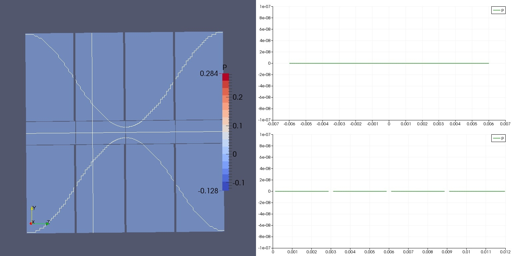{width=49%} \
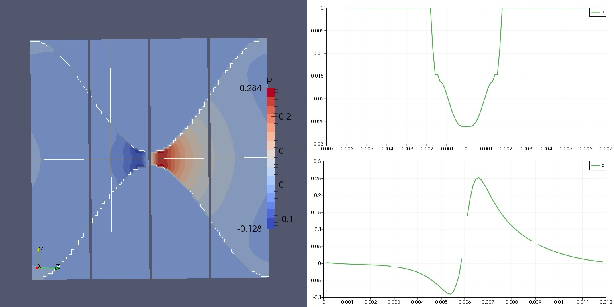{width=49%}
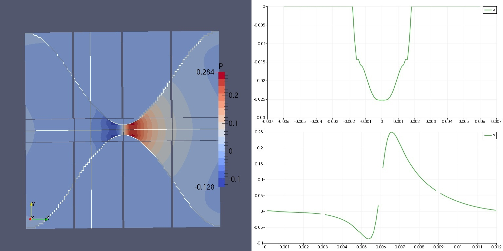{width=49%} \
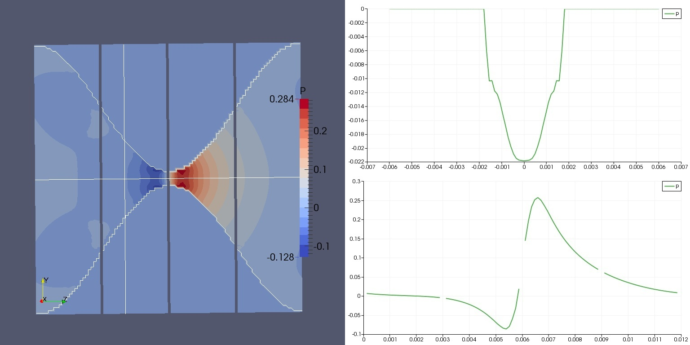{width=49%}
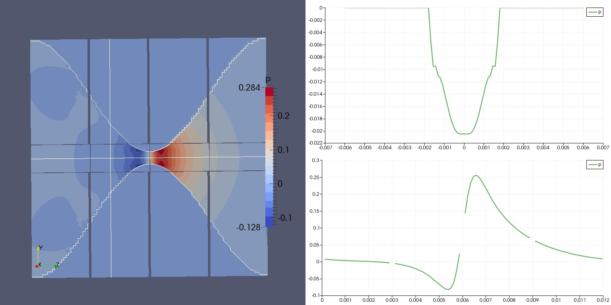{width=49%} \
{width=49%}
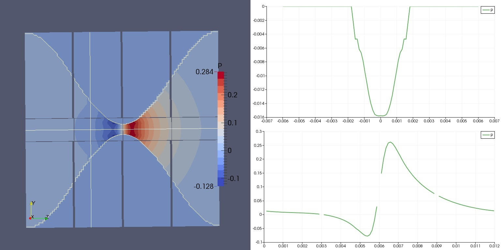{width=49%} \
{width=49%}
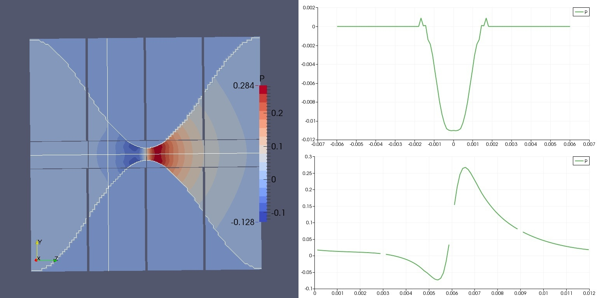{width=49%} \

Caption: Comparison of evolution of flow field between single and dual lattice algorithm for a pure peristalsis case (occlusion ratio = 0.1) through pressure contours. (a),(c),(e),(g),(i) Single lattice algorithm; (d)-(j) Dual lattice algorithm. 

#### Figure: {#singleLattice1XgridRatio4ScalarA}

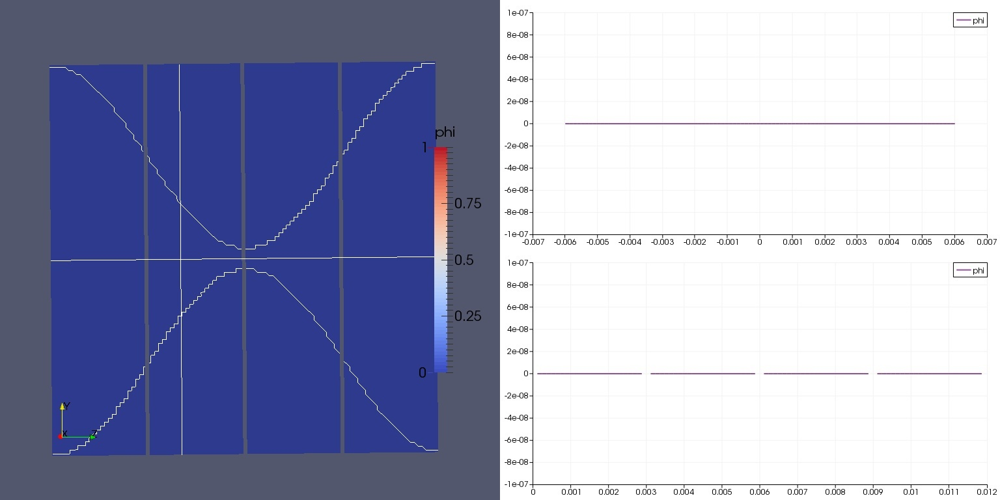{width=49%}
{width=49%} \
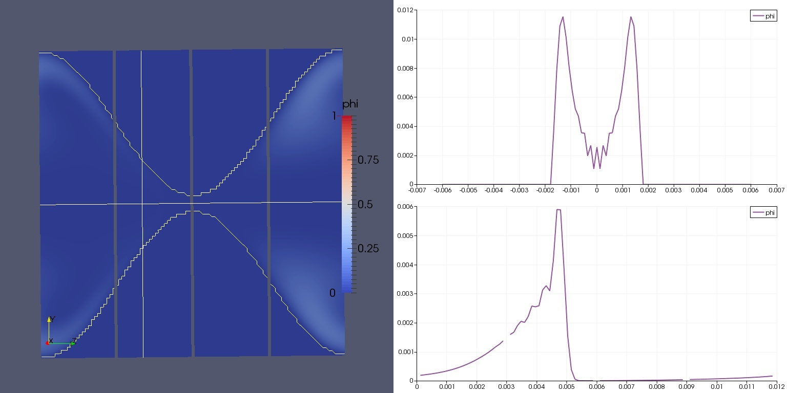{width=49%}
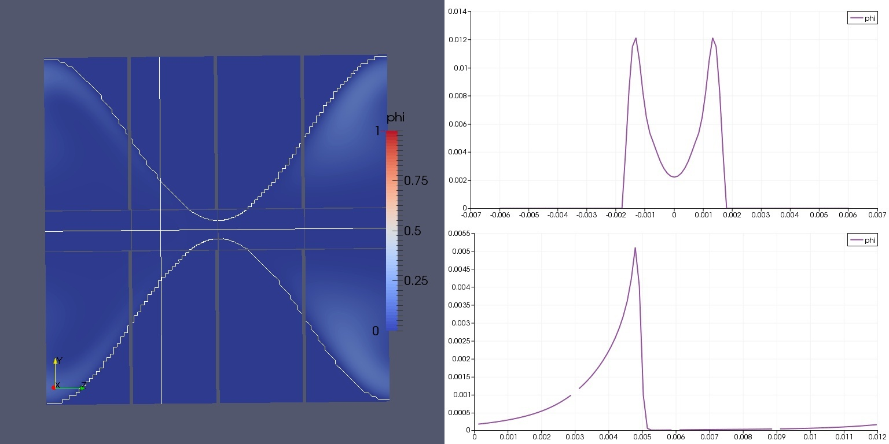{width=49%} \
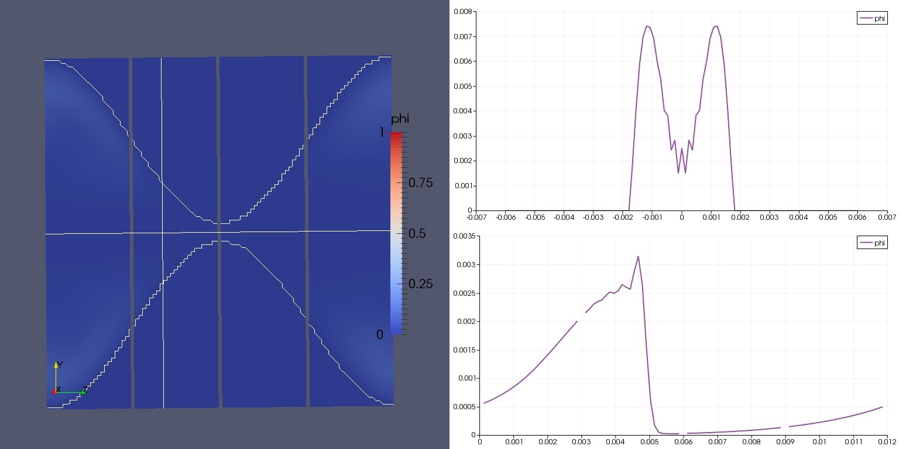{width=49%}
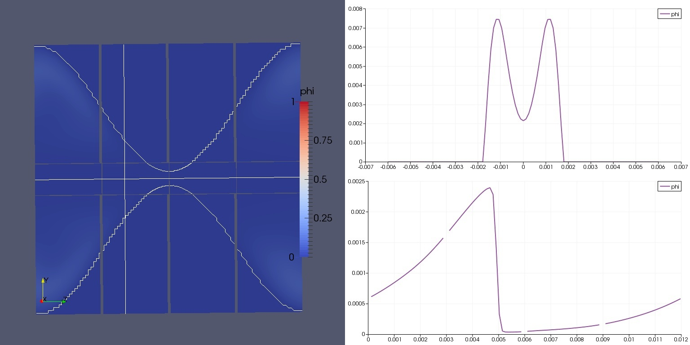{width=49%} \
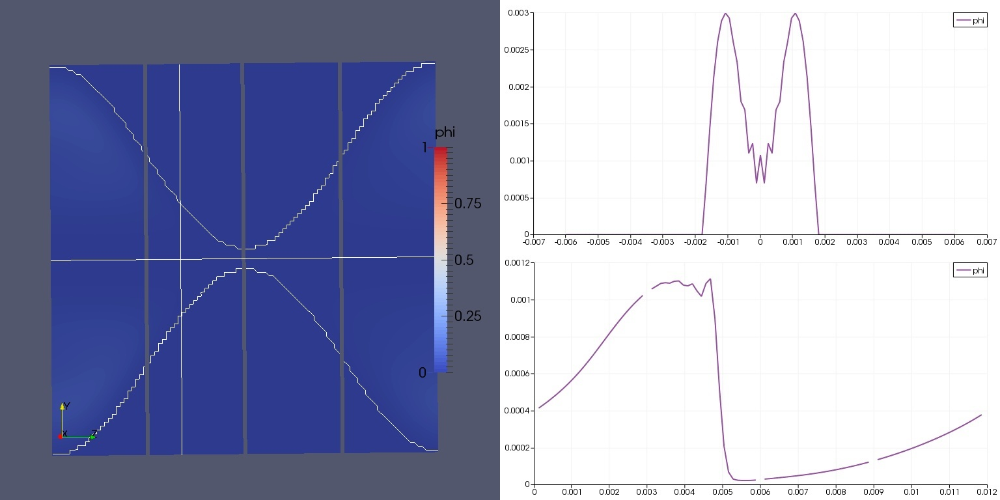{width=49%}
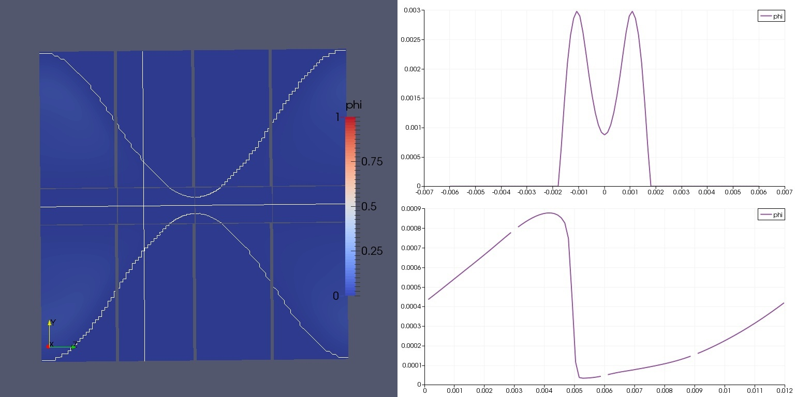{width=49%} \
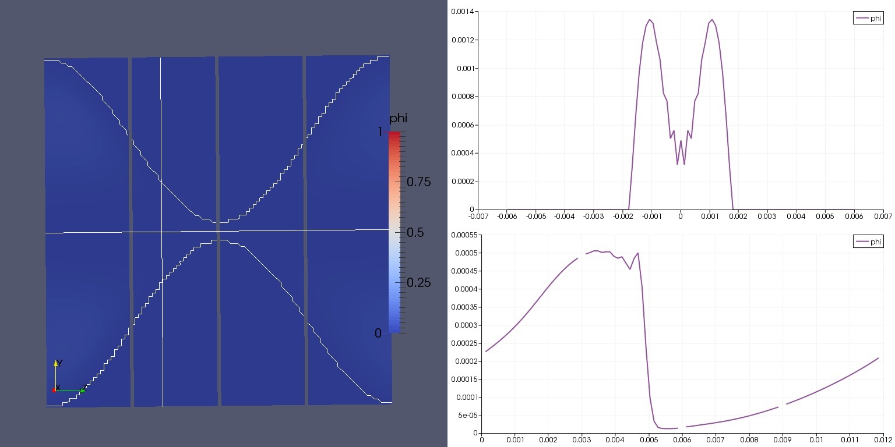{width=49%}
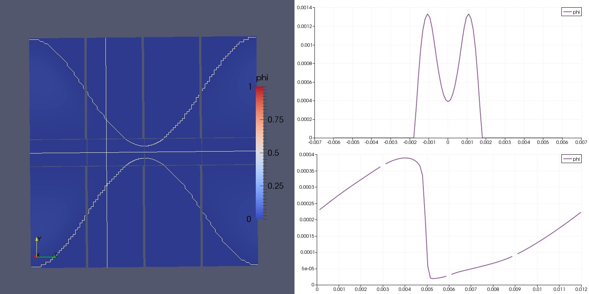{width=49%} \

Caption: Comparison of evolution of flow field between single and dual lattice algorithm for a pure peristalsis case (occlusion ratio = 0.1) through contoursof scalar. (a),(c),(e),(g),(i) Single lattice algorithm; (d)-(j) Dual lattice algorithm. 

It's hard to distinguish between the two algorithms using the pressure contours in Fig. (#singleLattice1XgridRatio4PressureA) and contours of the scalar in Fig. (#singleLattice1XgridRatio4ScalarA). Fig. (#singleLattice1XgridRatio4ScalarAbsorbed) compares the scalar absorbed over time computed using the different algorithms. This includes a double counting of the scalar absorbed in the interface region between the two meshes in the Dual Lattice algorithm. This is corrected in the next section.


#### Figure: {#singleLattice1XgridRatio4ScalarAbsorbed}

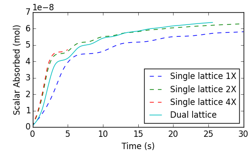{width=33%} 
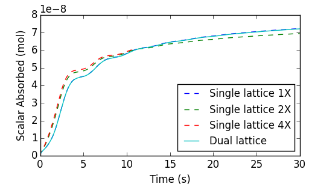{width=33%} 
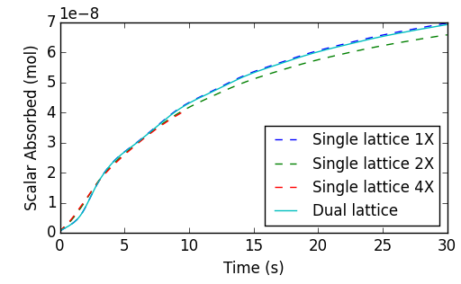{width=33%}

Caption: Comparison of scalar absorbed over time between single and dual lattice algorithm for a pure peristalsis case (occlusion ratio = 0.1,0.25,0.5).


# Avoiding double counting of scalar

The test for avoiding the double counting of scalar is to run the LBM code (both single and dual lattice) for 1 time step with a prescribed scalar profile and gradient at the surface of a prescribed geometry. The prescribed geometry is a straight tube with a radius of $r=0.000671m$, such that the wall goes through the interface in the dual lattice algorithm. The prescribed scalar profile is linear in $r$ such that $\phi=1$ at the center and $\phi=0$ at the wall. Thus, $\phi = 1 - r/0.000671$.

~~~math #calcScalarAbsorbedOverOneTimeStep
\left . \frac{\partial \phi}{ \partial n}  \right |_{wall} &= -\frac{1}{0.000671} mol/m^4 \\
\textrm{Scalar flux at wall } &= -D_m \left . \frac{\partial \phi}{ \partial n}  \right |_{wall} = -4.8 \times 10^{-8} \frac{-1}{0.000671} = 7.15 \times 10^{-5} mol/m^2 s \\
\textrm{Area of tube } &= 2 \; \pi \; r \; L = 2 \pi \times 0.000671 \times 0.012 = 5.0592208093410036 \times 10^{-5} m^2 \\
\textrm{Time step } \Delta t &= 2 \times 10^{-3} s \\
\textrm{Mol absorbed over 1 time step } &= (7.15 \times 10^{-5}) \times (5.0592208093410036 \times 10^{-5}) \times (2 \times 10^{-3}) = 7.23823 \times 10^{-12} mol \\
\textrm{Total scalar in the domain } &= L \int_0^R (2 \pi \; r) \; (1 - r/R) \; dr = L \; \pi \left ( R^2 - \frac{2 \; R^2}{3} \right ) = L \frac{\pi R^2}{3} = 5.657895 \times 10^{-9} mol
~~~

Fig. (#scalarAbsorbedTestr0p000671m) compares the scalar absorbed computed using the single and dual lattice algorithms with the analytical solution presented above. The dual lattice algorithm gives the same results as the single lattice algorithm to the last decimal place. However, the trend of scalar absorbed is not monotonous with grid refinement. One hypothesis for this is the way $q$ is arbitrarily set to 0.25 if it's less than 0.25 in the computation of the scalar boundary condition.

#### Figure: {#scalarAbsorbedTestr0p000671m}

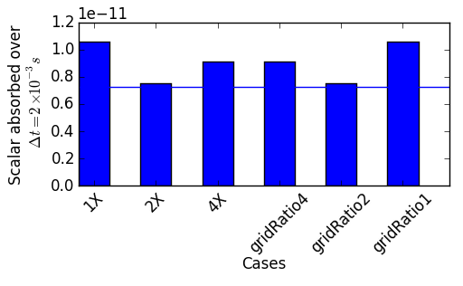

Caption: Comparison of scalar absorbed over $\Delta t = 2 \times 10^{-3}s$ for a cylinder of radius $r = 0.000671m$ with the single and dual lattice algorithms. The straight line is the analytical solution.

While this test was originally intended to test the double counting avoidance procedure for the scalar in the domain and the scalar absorbed, I found that the intestine wall never actually enters the coarse mesh such that an active coarse mesh node (i.e. a node where the computation actually takes place) is adjacent to the wall.

#### Figure: {#avoidDoubleCountingScalarAbsorption}

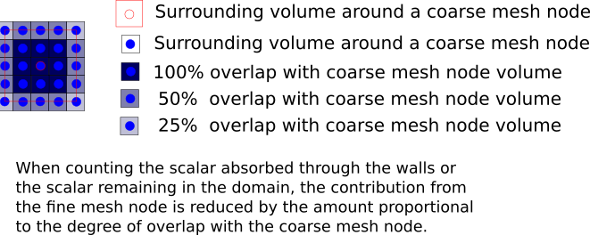

Caption: Scheme of flagging fine mesh nodes that intersect coarse mesh nodes to avoid double counting scalar that is absorbed at the wall when it goes through the interface between the two meshes.

Fig. (#avoidDoubleCountingScalarAbsorption) shows the procedure for flagging fine mesh nodes that intersect coarse mesh nodes to avoid double counting scalar that is absorbed at the wall when it goes through the interface between the two meshes. This has to be done afresh every coarse mesh time step whenever the scalar absorbed computation is done over the coarse mesh. The test performed in Fig. (#scalarAbsorbedTestStraightTube) and Eqn. (#calcScalarAbsorbedOverOneTimeStep) is repeated for cylinders of varying radius. Fig. (#scalarAbsorbedTestStraightTube) shows that the dual lattice algorithm performs no worse than the single lattice algorithm in computing the scalar absorbed through the surface. Also, the scalar absorbed in the dual lattice algorithm follows the single lattice 1X and 4X results respectively at low and high values of the cylinder radius compared to a cylinder going through the mesh interface location.

#### Figure: {#scalarAbsorbedTestStraightTube}

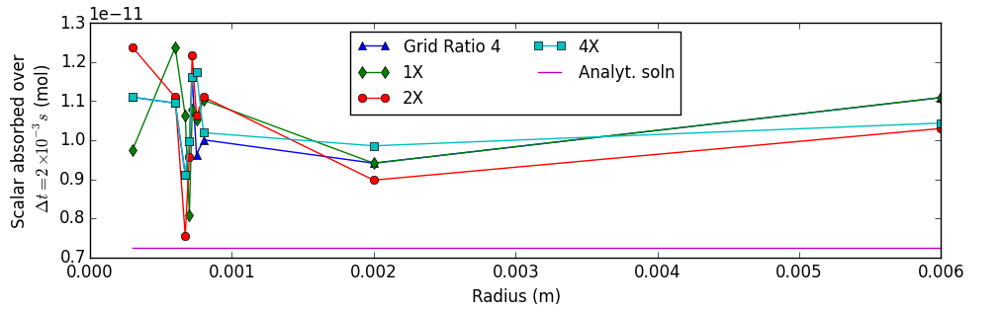 \
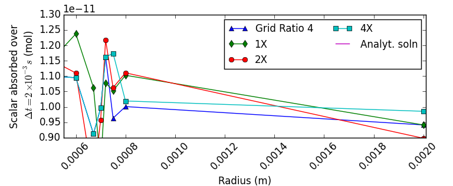

Caption: Comparison of scalar absorbed over $\Delta t = 2 \times 10^{-3}s$ for a cylinder of varying radius with the single and dual lattice algorithms. The straight line is the analytical solution. (a) Full range of radii; (b) Zoomed in.

While the fine mesh nodes are flagged to avoid double counting of the scalar absorbed, the inverse approach is adopted for computing the total amount of scalar in the domain. This flagging procedure however, has to be done only at the beginning of the code once. The test for avoiding the double counting in this case is to compute the total scalar in the domain (for a uniform scalar distribution $(\phi=1)$) per unit disk area and plot the result as a function of the radius. The analytical solution is a straight line equal to the length of the domain. Again, Fig. (#straightTubeTestsVolumeDomain) shows that the dual lattice algorithm performs no worse than the single lattice algorithm. 

#### Figure: {#straightTubeTestsVolumeDomain}

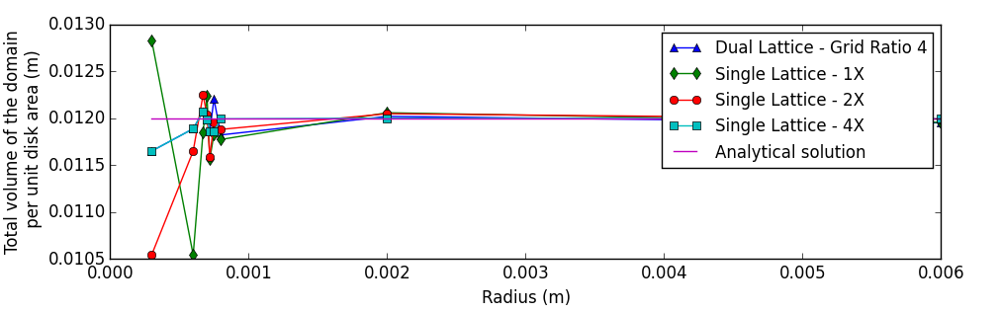 \
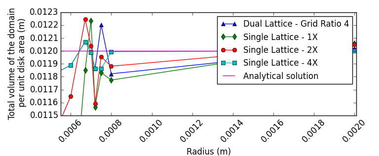

Caption: Comparison of total volume of the domain per unit disk area for a cylinder of varying radius with the single and dual lattice algorithms. The straight line is the analytical solution. (a) Full range of radii; (b) Zoomed in.

# Particle tracking

The current procedure for particle tracking only uses data from 1 mesh. In the dual lattice algorithm, the particles could move from the coarse mesh. When this happens, if it were just an issue of using a different velocity field in the fine mesh, I could just update the `Interpolate_Parvel` function. However, the time-stepping algorithm itself needs to change such that the particle is now time-stepped using the time step corresponding to the fine mesh and not the coarse mesh. Hence, I'll have to check whether the particle is in the fine mesh or the coarse mesh before the time-stepping procedure is carried out. I expect the time-stepping subroutine to be called after the streaming step in both the coarse and the fine mesh. Both subroutines will loop over the same set of particles. However, the bulk of the procedure for a given particle will be carried out only if the particle is in the corresponding region. Hence there will be two subroutines `Particle_Track` and `Particle_Track_fine`; similarly `Interp_Parvel` and `Interp_Parvel_fine` as well. The check for whether the particle is inside the fine mesh could be easily accomplished as

```fortran90
      hardCheckCoarseMesh = ( (current%pardata%xp - fractionDfine * D * 0.5 - xcf) * (current%pardata%xp + fractionDfine * D * 0.5 + xcf) > 0 ) .or. ( (current%pardata%yp - fractionDfine * D * 0.5 - ycf) * (current%pardata%yp + fractionDfine * D * 0.5 + ycf) > 0 )
      softCheckCoarseMesh = ( (current%pardata%xp - fractionDfine * D * 0.5 - (gridRatio-1)*xcf_fine) * (current%pardata%xp + fractionDfine * D * 0.5 + (gridRatio-1)*xcf_fine) > 0 ) .or. ( (current%pardata%yp - fractionDfine * D * 0.5 - (gridRatio-1)*ycf_fine) * (current%pardata%yp + fractionDfine * D * 0.5 + (gridRatio-1)*ycf_fine) > 0 )
      xpNF = current%pardata%xp + current%pardata%up * tcf !Hypothetical new location of particle based on first order extrapolation
      ypNF = current%pardata%yp + current%pardata%vp * tcf !Hypothetical new location of particle based on first order extrapolation
      zpNF = current%pardata%zp + current%pardata%wp * tcf !Hypothetical new location of particle based on first order extrapolation
      hardCheckCoarseMeshNF = ( (xpNF - fractionDfine * D * 0.5 - xcf) * (xpNF + fractionDfine * D * 0.5 + xcf) > 0 ) .or. ( (ypNF - fractionDfine * D * 0.5 - ycf) * (ypNF + fractionDfine * D * 0.5 + ycf) > 0 )  !Check if the hypothetical new location of the particle is clearly in the coarse mesh.
      IF ( hardCheckCoarseMesh .or. (softCheckCoarseMesh .and. flagParticleCF(current%pardata%parid) .and. hardCheckCoarseMeshNF) ) THEN  !Check if particle is in coarse mesh. Also check if the particle is in the interface region and was previously in the fine mesh and is coming out of it.	  
          flagParticleCF(current%pardata%parid) = .false. !PARTICLE IS IN COARSE MESH
	  ELSE
          flagParticleCF(current%pardata%parid) = .true. !PARTICLE IS IN FINE MESH	  
      END IF 
```


## Second order Runge-Kutta time stepping for particle movement

We use a second order Runge-Kutta method for time stepping for tracking the particle movement.

~~~math #secondOrderRungerKuttaParticeTracking
\left. \frac{d \vec{x}}{dt} \right |_{n+1/2} &= \frac{\vec{x}_{n+1} - \vec{x}_n}{\Delta t} = \vec{v}_{n+1/2} = \frac{\vec{v}_{n+1} + \vec{v}_{n}}{2} \\
\vec{x}_{n+1} &= \vec{x}_n + \Delta t \left ( \frac{\vec{v}_{n+1} + \vec{v}_{n}}{2} \right )
~~~

$\vec{v}_{n+1}$ is first estimated as the velocity at $\vec{x} + \Delta t \; \vec{v}_n$, i.e., the velocity at the point the particle is estimated to be at uusing first order time stepping. However, once the updated particle position at $n+1$ is estimated using second order time stepping, the velocity is interpolated to the particle location again.

## Test for particle tracking

The test for particle tracking is to run the LBM code without streaming, collision, macro or any such routine with a prescribed velocity profile and geometry and to make sure that the particle is able to go smoothly through the coarse to fine and fine to coarse mesh interface. I prescribe the velocity profile as

~~~math #prescribedVelocityProfileParticleTrackTest
u = 0, \; v = -0.1, \; w = 1.0 - r/R \; \textrm{in lattice units.}
~~~

 The initial location of the particle is `(0.0003, 0.001, 0.0012)m` in a prescribed geometry of a straight tube of $R=0.005m$. If the particle were to get convected correctly, then it should go down from the coarse into to the fine mesh, emerge back into the coarse mesh and also wrap around the periodic boundary twice before hitting the bottom wall of the intestine. Figure (#particleTrackTest) shows that the particle trajectory computed by the dual lattice algorithm is exactly the same as predicted using a second-order Runge-Kutta time stepping in a separate code using the same velocity profile.

#### Figure: {#particleTrackTest}

{width=49%}
{width=49%} \
{width=49%}
{width=49%}


Caption: Comparison of the particle trajectory computed by the dual lattice algorithm with the analytical solution according to the velocity profile in Eq. (#prescribedVelocityProfileParticleTrackTest). (a) y location; (b) z location; (c) and (d) are zoomed in versions of (a) and (b) respectively. The horizontal lines in (a) and (c) represent the interface between the coarse and the fine mesh.

# Particle dissolution model

There are 2 parts to the implementation of the particle dissolution model. The first is to compute the effective bulk concentration $C_b$ around the particle; the next is to distribute the drug release over one time step into the nodes in the effective volume surrounding the particle.

## Calculation of bulk concentration

Our most modern implementation of the particle dissolution model as 3 cases for the computation of the bulk concentration:

* $V_{eff} < V_{mesh}$ - Use the nearest 8 nodes to perform trilinear interpolation of the concentration field to the particle,
* $V_{mesh} < V_{eff} < 27 \; V_{mesh}$ - Interpolate the concentration field to a set of 64 points surrounding the particle using trilinear interpolation at each point, then average the concentration from those 64 points,
* $V_{eff} > 27 \; V_{mesh}$ - Average the concentration in all the LBM nodes that overlap with the effective volume around the particle.

The process of determining the bulk concentration for a particle is performed in a loop over the particles inside the `Particle_Track` subroutine. This checks whether the particle is in the coarse or the fine mesh. So it's impossible that the bulk concentration for aparticle will be calculated twice. This is extremely important to handle cases when the particle is in the interface between the two meshes.

In the dual lattice case, the particle is deemed to be in the in the coarse mesh if it satisfies the hard check or the soft check + if it's comping into the coarse mesh. When a particle is near the mesh interface, it could happen that the influence volume surrounding the particle crosses over to the other mesh. The process of computing the bulk concentration should be able to handle this. 

The effect of scalar release by the drug particle on the concentration is added at the end of the collision step. The concentration field from the previous time step is used for the computation of the bulk concentration. In the dual lattice algorithm, it is important to be consistent in using the concentration field from the same time step. It would be incorrect to use the concentration from $t_{n+1}$ in the coarse mesh when calculating the bulk concentration for a particle in the fine mesh at a tiem step between $t_n$ and $t_{n+1}$. This problem may not occur when the particle is in the coarse mesh with an effective volume that cuts into the fine mesh.

Going back to the 3 cases described earlier, they can be extended to the dual lattice algorithm as

* $V_{eff} < V_{mesh}$ - irrespective of which mesh the particle is at, as long as this condition is satisfied in that mesh, the computation of bulk concentration will not overlap between meshes. 
* $V_{mesh} < V_{eff} < 27 \; V_{mesh}$ - Some of the 64 points could be a part of the other mesh. Just perform a check on whether each of the 64 points belongs to the coarse or the fine mesh and use the corresponding mesh to interpolate the concentration. 
* $V_{eff} > 27 \; V_{mesh}$ - Volume average over all overlapping nodes. Also use the overlap number already computed for the coarse mesh nodes, the same one used for the computation of the total scalar in the domain. 
 
## Distribution of drug relase to LBM nodes

In the original single lattice code, the time-stepping algorithm started from the post-streaming density distribution at $t_n$ and ended with the post-streaming density distribution at the next time step $t_{n+1}$. The outline of the algorithm that is related to the particle tracking and drug release looked as follows. 

```fortran90
DO iter = iter0-0_lng,nt

      CALL Advance_Geometry
      CALL Collision        ! collision step [MODULE: Algorithm]
      CALL MPI_Transfer     ! transfer the data (distribution functions, density, scalar) 

      CALL Particle_Track - Update particle location, interpolate bulk concentration to new particle location, calculate drug release and distribution to nodes
      CALL Stream			! perform the streaming operation (with Lallemand 2nd order BB) 
      CALL Macro			! calcuate the macroscopic quantities 

      CALL Scalar           ! calcuate the evolution of scalar in the domain and add the drug release calculated in Particle_Track
END DO
```

While the model of calculating the drug release based on scalar concentration from the previous time step seems ok, I don't quite understand the particle trakcing mechanism. The `Particle_Track` routine is called before the streaming and macro steps; this means that `Particle_Track` will never use the updated velocity that it's supposed to in Eq. (#secondOrderRungerKuttaParticeTracking). The drug release model uses the scalar concentration from the previous time step. It also calculates the distribution of the drug release to the neighboring nodes and adds it when going through the `Scalar` subroutine.

I've since changed the outline of LBM algorithm and re-ordered some of the steps. In particular, the new method starts with the post-collision density-distribution at time step $t_n$ and ends with the post-collision density distribution at the next time step $t_{n+1}$. The new algorithm looks as follows.

```fortran90
DO iter = iter0-0_lng,nt

      CALL Advance_Geometry
      CALL Stream			! perform the streaming operation (with Lallemand 2nd order BB) 
      CALL Macro			! calcuate the macroscopic quantities 

      CALL Particle_Track - Update particle location, interpolate bulk concentration to new particle location, calculate drug release and distribution to nodes
      CALL Scalar           ! calcuate the evolution of scalar in the domain and add the drug release calculated in Particle_Track
      CALL Collision        ! collision step 
      CALL MPI_Transfer     ! transfer the data (distribution functions, density, scalar) 

END DO
```

This way, the `Particle_Track` subroutine is able to use the average of the old and the updated velocity correctly as described in Eq. (#secondOrderRungerKuttaParticeTracking). However, the calculation of the bulk concentration for the drug release is still from the previous time step, the same as it was in the previous algorithm design. In principle, This could've been achieved by merely moving the `Particle_Track` subroutine call to after the streaming step in the previous algorithm design. However, the new algorithm design suits the dual lattice algorithm better in my opinion and is consistent with the way Yanxing designed his dual lattice algorithm. 

The rough outline of the dual lattice algorithm that is related to the particle tracking and drug release from particles looks like

```fortran90
DO iter = iter0-0_lng,nt

      CALL Advance_Geometry
      CALL Stream			! perform the streaming operation (with Lallemand 2nd order BB) 
      CALL Macro			! calcuate the macroscopic quantities 

      CALL Particle_Track - Update particle location for those in the coarse mesh, interpolate bulk concentration to new particle location, calculate drug release and distribution to nodes
      CALL Scalar           ! calcuate the evolution of scalar in the domain and add the drug release calculated in Particle_Track
      phi_fine = phi_fine + delphi_fine !Add the drug release corresponding to any particle in the coarse mesh whose effective volume interfaces with the fine mesh
      CALL Collision        ! collision step 
      CALL MPI_Transfer     ! transfer the data (distribution functions, density, scalar) [MODULE: Parallel]

      CALL SpatialInterpolateToFineGrid      ! Interpolate required variables to fine grid

      DO subIter=1,ratio
          CALL AdvanceGeometry_Fine   ! Advance the geometry on the fine grid
		  CALL TemporalInterpolateToFineGrid
          CALL Stream_Fine            ! Stream fine grid
	      CALL Macro_Fine             ! Calculate Macro properties on fine grid

          CALL Particle_Track_fine - Update particle location for those in the fine mesh, interpolate bulk concentration to new particle location, calculate drug release and distribution to nodes
          if(max(delphi) .gt. 0) then
       		  phi = phi + delphi
              CALL SpatialInterpolatePhiToFineGrid      ! Interpolate phi alone to fine grid
		  end if
          CALL Scalar_Fine       ! Calculate Scalar stuff on fine grid
          
          CALL Collision_Fine     ! Collision step on the fine grid
	      CALL MPI_Transfer_Fine  ! Transfer the data across processor boundaries on the fine grid
      END DO
	  CALL InterpolateToCoarseGrid    ! Interpolate required variable to coarse grid

END DO

```

When a particle is in the coarse mesh, but it's effective volume overlaps with the fine mesh, then the treatment of `delphi_fine` that needs to be added to the scalar in the fine mesh can be tricky. Technically it needs to be added uniformly over the time steps in the fine mesh and the same way. However, this would require declaring an entire array called `delphi_fineFromCoarse` just for this purpose. If this is not done, then there would be two errors:

* the entire scalar to be added over `gridRatio` number of time steps in the fine mesh would be dumped over just the first fine mesh time step. This could cause local spikes in concentration that would get transported and diffused over the subsequent `gridRatio-1` time steps.
* the order of adding the `delphi_fine` would be changed, i.e. while the `delphi_fine` is currently added after the moment-propagation method performs the collision and transport, the new method would add the `delphi_fine` before the moment-propagation method. I have no idea if this is correct or not; I just thought I'll make a note of this in case this comes up later[^1].

Similarly, when a particle is in the fine mesh, but it's effective volume overlaps with the coarse mesh, then the treatment of `delphi` that needs to be added to the scalar in the fine mesh can be tricky. Technically, it's supposed to be added at the intermediate time steps; however, the coarse mesh does not have that kind of time resolution. Hence it is added to the `phi` at time step $t_{n+1}$ instead. The whole point of doing this addition at every fine mesh time step and not waiting till the end of all the fine mesh time steps is that this could potentially affect the calculation of the bulk concentration for the particle. Hence, this drug release will change the value of the scalar concentration on the boundary. This implies that the spatial interpolation of the scalar concentration from the coarse to the fine mesh needs to be performed again around the points where the scalar concentration has changed on the coarse mesh. Performing this check could be as expensive or of the same order as just doing the full interpolation again. I think I'll just do the full interpolation again, but just for the scalar alone.

## Testing of particle dissolution model

I tested the implementation of the particle dissolution model by performing the following test. I use the geometry of the straight tube of radius $5mm$. I initialize the velocity field such that the axial velocity is 1 in lattice units and all other velocity components are zero. I turn off Collision, Streaming and Scalar evolution and retain only the particle release model. Thus the particle should travel in a straight line and release drug. Fig. (#particleDissolutionTest) shows the evolution of the bulk concentration $C_b$ and the drug release $\Delta N_b$ as a function of time. It seems to behave along expected lines, i.e., the $C_b$ increases first before attaining a quasi-steady state. Once the particle starts to go over the same area where it has already released drug, the $C_b$ increases and $\Delta N_b$ reduces. I repeat this test for 4 different cases, viz.,

* the particle is completely in the coarse mesh,
* the particle is in the coarse mesh, but it's effective volume straddles the fine mesh,
* the particle is in the fine mesh, but it's effective volume straddles the coarse mesh,
* the particle is completely in the fine mesh.

The difference in the computed $C_b$ between when the particle is completely in the fine mesh and completely in the coarse mesh is about $12\%$.

While this is not a validation of the method working correctly. 

#### Figure: {#particleDissolutionTest}

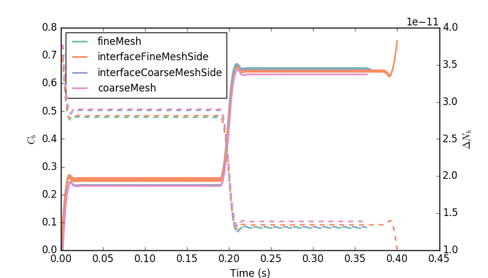{width=75%}

Caption: Testing of particle dissolution model.


# Future work over the next two weeks

* Write up
	* How are cases of wall interference handled during spatial and temporal interpolation

* Particle tracking and dissolution
	* Reintroduction of drug dissolution model
	    * How to calculate bulk concentration when the particle is in the mesh interface?
		* How to calculate drug release distribution when the particle is in the mesh interface?
		* How to introduce the new models for both into this code?
		* Parallelization			
 


[^1]: In a related discussion, Farhad noted that the order of adding the `delphi` is important and doing so before the moment propagation method could potentially reduce the negative scalar problems.
			


