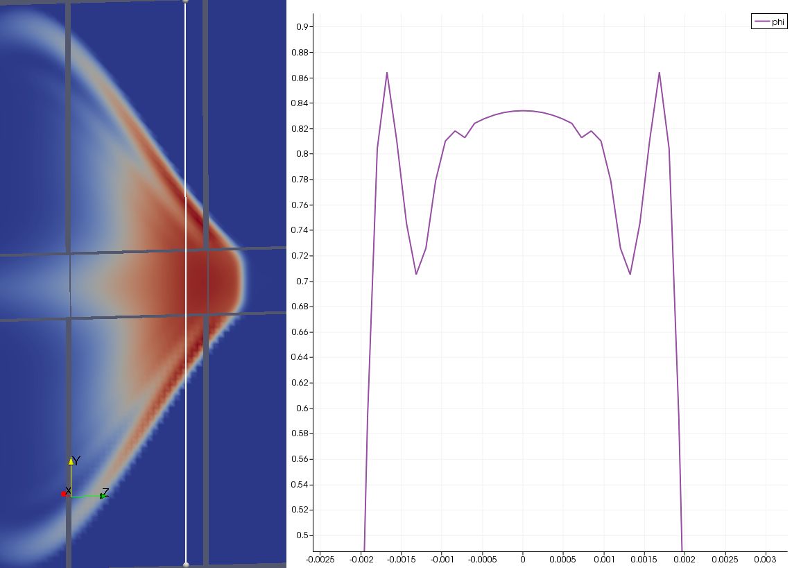

I'll document my attempts at implementing a multi-block method in the intestine code.

The main reason for implemeting a multi-block method in the intestine code is to be able to simulate fasting states, where the occlusion ratio for intestinal motility can go really small. The occlusion ratio is not quite the ratio of the occluded diameter to the total diameter of the domain. 

```math
a &= \frac{0.5 \; D}{ 2 - (\epsilon/a)} \\
\rightarrow \frac{a}{0.5 D} &= \frac{1}{ 2 - (\epsilon/a)} \\
\rightarrow \frac{\epsilon}{0.5 D} &= \frac{\epsilon}{a} \frac{a}{0.5 D} =  \frac{\epsilon}{a} \frac{1}{ 2 - (\epsilon/a)}
```
When $\epsilon/a \ll 2$, $\epsilon/(0.5D)$ will become half of $(\epsilon/a)$.

A rule of thumb is that the the occluded region should be resolved with about $\sim 10$ cells. The estimate of the maximum gut diameter we've been using so far is $D = 0.005m$. Lets say this is resolved with a 100 cells in the $x$ and $y$ directions. The resolution will be $\Delta x = 0.005/100 = 5 \times 10^{-5}m$. Table (#table:resolutionRequirements) shows that the resolution requirements increase severely as the occlusion ratio is dropped. It may not be feasible to acheive a reduction of the grid spacing of $\sim O(20-200)$ times with just two grids. I suspect that we will need atleast 3 grids with a reduction ratio of $m-5$ to simulate the occlusion ratio of 0.01 and may be 4 grids with a similar reduction ratio to simulate the occlusion ratio of 0.001.

#### Table:  {#table:resolutionRequirements}

| $\epsilon/a$ |  $\epsilon/R$ | $\Delta x_f$ | Ratio $\Delta x_c / \Delta x_f$ | $nx_f,  $ny_f = 0.1 D / \Delta x_f$ | $nz_f = L/\Delta x_f$ | $nx_f \times ny_f \times nz_f$ |
|--------------|---------------|--------------|-------------------------------|-------------------------------------|-----------------------|--------------------------------|
|   0.5        |     0.32      | $1.667 \times 10^{-4}$m |  0.3  |    -  |   -    |   -     |
|   0.1        |     0.0527    | $2.631 \times 10^{-5}$m |  1.9  |  19   |   380  |  137k   |
|   0.01       |     0.005     | $2.512 \times 10^{-6}$m |  20   |  200  |  4000  |  157M   |
|   0.001      |     0.0005    | $2.501 \times 10^{-7}$m |  200  |  2000 | 40000  |  159B   |

Caption: Demonstration of resolution requirement in the occluded region as the occlusion ratio $\epsilon/a$ is reduced.


## How to design the extent of the fine mesh

Let's say that we require only two grids. Figure (#multiblockDomainDecomposition) shows the proposed design of a slice of ($x=0$ plane) a cylindrical computational domain and the fine mesh within.


#### Figure: {#multiblockDomainDecomposition}


Caption: Proposed design of the computational domain and the fine mesh and it's domain decomposition.

The rule of thumb reg. 10 grid points in the occluded region need to be applied uniformly across the entire gut. Thus, if the max diameter of the gut is resolved with 100 points, the inner 10% of the domain needs to be refined at all times as it would have less than 10 cells by definition. If the fine mesh has been designed according to the rule of thumb, the resolution requirements would start to become astronomical very quickly as shown in the last column in Table (#table:resolutionRequirements).

# Actual design of the multi-block/grid algorithm

All these issues , not withstanding, I'm still going ahead with designing the multi-grid algorithm. I had to print out and study the Intestine code in detail. I'll branch off the Intestine code and not the COuette code as I'm not sure of the readiness of this code to simulate intestinal motility. When Farhad makes the merge between the two codes, my mods to the Intestine code should transfer straight away to the merged code.

## Diagrams that help understanding the basics of the intestine 3D code

This will probably belong in it's own section. But I'll just make a brief description of the Intestine 3D code here.

Most of the LBM algorithm is fairly straight forward. The complicated parts involve the communication between processors to exchange information. This is first done by creating local arrays that are padded on the boundaries in each direction like so in `Setup.f90`

```fortran
! Distribution Functions
ALLOCATE(f(0:NumDistDirs,0:nxSub+1,0:nySub+1,0:nzSub+1),                        &
fplus(0:NumDistDirs,0:nxSub+1,0:nySub+1,0:nzSub+1))
! Velocity, Density
ALLOCATE(u(0:nxSub+1,0:nySub+1,0:nzSub+1),                                                      &
v(0:nxSub+1,0:nySub+1,0:nzSub+1),                                                      &
w(0:nxSub+1,0:nySub+1,0:nzSub+1))
ALLOCATE(rho(0:nxSub+1,0:nySub+1,0:nzSub+1))
```

The numbering scheme for the density distribution function and the lattice velocity vectors are shown in Figure (#densityDistribution).

#### Figure: {#densityDistribution}


Caption: Numbering scheme of the density distribution directions and lattice velocity vectors in the Intestine 3D code.


Now for the complicated second part. The nodes on the boundaries of each processor could potentially interact with another processor in a variety of directions. To understand this, simply think of the information that a node on the faces, edges and corners of the processor boundaries. This is controlled by the temporary arrays `CDx, CDy and CDz` in the subroutine `SubDomainSetup` inside `Setup.f90`. Figure (#commDirs) shows the communication direction vector numbering scheme. 


#### Figure: {#commDirs}


Caption: Numbering scheme of the communication direction vectors in the Intestine 3D code.

This is then used to setup the array `SubID` that contains the neighboring processor in each communication direction through the subroutine `SetSubID`.

All of this information is then used to carefully setup the main arrays `msgSend` and `msgRecv` that is transferred across processors. There are a whole host of supporting arrays and variables that describe the structure of the the two main arrays and how to pack it before sending and unpack it after receiving. The optimization of this array is done pretty well and only information that is absolutely required is transferred. For instance, only certain components of the density distribution function is transferred depending upon the communication direction.

* `OppCommDir`
* `f_Comps`
* `fSize`
* `dsSize`
* `uvwSize`
* `YZ_FaceSize`
* `ZX_FaceSize`
* `XY_FaceSize`
* `msgSize`
* `f_SendSize`
* `ds_SendSize`
* `uvw_SendSize`
* `total_SendSize`
* `XY_SendIndex`
* `YZ_SendIndex`
* `XZ_SendIndex`
* `X_SendIndex`
* `Y_SendIndex`
* `Z_SendIndex`
* `Corner_SendIndex`
* `XY_RecvIndex`
* `YZ_RecvIndex`
* `XZ_RecvIndex`
* `X_RecvIndex`
* `Y_RecvIndex`
* `Z_RecvIndex`
* `Corner_RecvIndex`
* `CommDataStart_f`
* `CommDataStart_rho`
* `CommDataStart_phi`
* `CommDataStart_u`
* `CommDataStart_v`
* `CommDataStart_w`


## Current plan to modify the Intestine code

This is the current list of steps to modify the Intestine code to a multigrid code.


1. Copy `Setup, LBM, Geometry, ICBC, Parallel.f90` files into corresponding `_fine` files.
2. Change the variable names in these files to `_fine`
3. In the mani `Geometry.f90` file, introduce a new type of node called `REFINEMESH`. Identify/Flag the required nodes as `REFINEMESH`.
4. Set the geometry parameters for the fine mesh in `Geometry_fine.f90` and the identify the outer nodes as `COARSEMESH`.
5. In the `Main.f90`, change the algorithm to include the sub-iterations for the fine mesh.
6. Introduce interpolation subroutines to transfer density distribution and other stuff between coarse and fine meshes.

The progress on this can be tracked on the [attemptedMultiGrid](https://github.com/BioGI/Codes/commits/attemptedMultigrid) branch of the Github repository.

##Psuedo-code for multigrid implementation in the Main algorithm

The current outline of the time-stepping in Main.f90 looks like this

```fortran
DO iter = iter0-0_lng,nt

      CALL AdvanceGeometry            ! advance the geometry to the next time step [MODULE: Geometry]
      CALL Collision                  ! collision step [MODULE: Algorithm]
      CALL MPI_Transfer               ! transfer the data (distribution functions, density, scalar) [MODULE: Parallel]

      CALL Stream                     ! perform the streaming operation (with Lallemand 2nd order BB) [MODULE: Algorithm]

      CALL Macro                      ! calcuate the macroscopic quantities [MODULE: Algorithm]

      IF(iter .GE. phiStart) THEN
          CALL Scalar             ! calcuate the evolution of scalar in the domain [MODULE: Algorithm]
      END IF

      CALL PrintFields                   ! output the velocity, density, and scalar fields [MODULE: Output]
      CALL PrintScalar                   ! print the total absorbed/entering/leaving scalar as a function of time [MODULE: Output]
      CALL PrintMass                     ! print the total mass in the system (TEST)
      CALL PrintVolume                   ! print the volume in the system (TEST)

      !   CALL PrintPeriodicRestart     ! print periodic restart files (SAFE GUARD) [MODULE: Output]

      CALL PrintStatus              ! print current status [MODULE: Output]

      CALL MPI_BARRIER(MPI_COMM_WORLD,mpierr)       ! synchronize all processing units before next loop [Intrinsic]

END DO
```

Figure (#multiGridAlgorithm) shows the schematic of the multiblock algorithm for `gridRatio = 4`, i.e., the fine mesh has a resolution that is four times finer than the coarse mesh. 

#### Figure: {#multiGridAlgorithm}

{width=65%}

Caption: Schematic of the multiblock time-stepping algorithm. The resolution of the fine block is 4 times that of the coarse block.

Thus, the new time stepping psuedo-code should become

```fortran90
DO iter = iter0-0_lng,nt

      CALL AdvanceGeometry		! advance the geometry to the next time step [MODULE: Geometry]
      CALL Stream			! perform the streaming operation (with Lallemand 2nd order BB) [MODULE: Algorithm]
      CALL Macro			! calcuate the macroscopic quantities [MODULE: Algorithm]
      CALL Scalar             ! calcuate the evolution of scalar in the domain [MODULE: Algorithm]
      CALL Collision                  ! collision step [MODULE: Algorithm]
      CALL MPI_Transfer               ! transfer the data (distribution functions, density, scalar) [MODULE: Parallel]

      CALL SpatialInterpolateToFineGrid      ! Interpolate required variables to fine grid
      DO subIter=1,ratio
          CALL AdvanceGeometry_Fine   ! Advance the geometry on the fine grid
		  CALL TemporalInterpolateToFineGrid
          CALL Stream_Fine            ! Stream fine grid
	      CALL Macro_Fine             ! Calculate Macro properties on fine grid
		  CALL Scalar_Fine       ! Calculate Scalar stuff on fine grid
          CALL Collision_Fine     ! Collision step on the fine grid
	      CALL MPI_Transfer_Fine  ! Transfer the data across processor boundaries on the fine grid
      END DO
	  CALL InterpolateToCoarseGrid    ! Interpolate required variable to coarse grid

END DO
```

## Design of Interpolation from coarse mesh to fine mesh

In this section, I will describe the interface between a coarse and a fine mesh using an example. The coarse mesh has a 101 points in the x and y directions. Points 46-56 in both x and y directions are to be resolved by the fine mesh. The fraction of the total diameter resolved by the fine mesh will be $0.1D$. Figure (#designFineCoarseInterface) shows the interface between the coarse and the fine meshes.


####Figure: {#designFineCoarseInterface}

{width=75%} \
{width=49%}
{width=49%}

Caption: Design of the interface between the fine and coarse meshes for the multigrid algorithm.


### Symmetric cubic spline interpolation in space
A symmetric cubic spline interpolation procedure is used in all directions when interpolating from the coarse to fine mesh. For each fine mesh node, the nearest `lower` coarse mesh node $f_2$ is identified such that the fine mesh node is always between $f_2$ and $f_3$ with $0 \le s < 1$ as shown in Fig. (#symmetricCubicSplineInterpolation).

####Figure: {#symmetricCubicSplineInterpolation}

{width=75%}

Caption: Design of cubic spline spatial interpolation scheme to transfer data from the coarse to the fine mesh. 

### Second order interpolation in time
A second order interpolation procedure is used interpolating from the coarse to fine mesh in time. The data at the fine mesh is always wanted between time $t_n$ and $t_{n+1}$ as shown in Fig. (#multiGridAlgorithm). 

####Figure: {#secondOrderTimeInterpolation}

{width=75%}

Caption: Design of second order temporal interpolation scheme to transfer data from the coarse to the fine mesh. 


### Special cases - interference of wall with interpolation from coarse to fine mesh

When the intestine wall goes through the interface between the coarse to the fine mesh, the 

```fortran90
FUNCTION spatialInterpolate(f1,f2,f3,f4,n1,n2,n3,n4,s)

!!!Symmetric Cubic spline temporal interpolation 

  REAL(dbl) :: f1, f2, f3, f4, s
  INTEGER   :: n1,n2,n3,n4
  REAL(dbl) :: spatialInterpolate
  REAL(dbl) :: aHat, bHat, cHat, dHat

  if (n3 .eq. SOLID) then
     if (n2 .ne. SOLID) then
        spatialInterpolate = spatialExtrapolate_n1n2(f1,f2,s)
     else
        spatialInterpolate = 0.0
     end if
     
  else if (n2 .eq. SOLID) then
     spatialInterpolate = spatialExtrapolate_n3n4(f3,f4,s)
     
  else if ( (n1 .ne. SOLID) .and. (n4 .eq. SOLID) ) then
     spatialInterpolate = spatialInterpolate_n1n2n3(f1,f2,f3,s)

  else if ( (n1 .eq. SOLID) .and. (n4 .ne. SOLID) ) then
     spatialInterpolate = spatialInterpolate_n2n3n4(f2,f3,f4,s)
     
  else if ( (n1 .eq. SOLID) .and. (n4 .eq. SOLID) ) then
     spatialInterpolate = spatialInterpolate_n2n3(f2,f3,s)

  else if ( (n1 .ne. SOLID) .and. (n2 .ne. SOLID) .and. (n3 .ne. SOLID) .and. (n4 .ne. SOLID) ) then
     spatialInterpolate = spatialInterpolateAllFour(f1,f2,f3,f4,s)
  end if
   
  RETURN
  
END FUNCTION spatialInterpolate
```

# Design of mesh and conversion factors

It turns out that the relaxation parameter $\tau$ cannot be 1.0 for both coarse and fine meshes. This has to do with the conversion/interpolation between the coarse and the fine meshes as descirbed in [lbmBasics.html](./lbmBasics.html#multi-grid-scheme). Hence the design of the mesh requires some thought. Lets say $\tau_c = 1.5$, with a grid ratio of $m = 4$. Then,

~~~math
\tau_f &= \frac{1}{2} + m \left ( \tau_c - \frac{1}{2} \right \\
&= \frac{1}{2} + 4.0 \left ( 0.75 - \frac{1}{2} \right
&= 4.5
~~~

The conversion factors for each mesh will be

#### Table:  {#table:meshDesign}

|                     Coarse mesh                     |                       Fine mesh                        |
|-----------------------------------------------------|--------------------------------------------------------|
| $\nu_L = \frac{2 \times 1.5 - 1}{6} = 0.08333$     | $\nu_L = \frac{2 \times 4.5 - 1}{6} = 0.333333$        |
| $x_{cf} = y_{cf} = z_{cf} = 1.2 \times 10^{-4}m$    | $x_{cf} = y_{cf} = z_{cf} = 0.3 \times 10^{-4}m$       |
| $t_{cf} = \nu_L \frac{x_{cf} x_{cf}}{\nu} = 5e-4s$  | $t_{cf} = \nu_L \frac{x_{cf} x_{cf}}{\nu} = 1.25e-4s$  |
| $v_{cf} = \frac{x_{cf}}{t_{cf}} = 0.24 m/s$         | $v_{cf} = \frac{x_{cf}}{t_{cf}} = 0.24 m/s$            |
| Wave speed = $\frac{0.004}{0.24}$ = 0.016667        | Wave speed = $\frac{0.004}{0.24}$ = 0.016667           |
| Reynolds number lattice = $\frac{0.016667 \times 50 \times 50}{0.08333 \times 200} = 2.5$ | Reynolds number lattice = $\frac{0.016667 \times 200 \times 200}{0.333333 \times 800} = 2.5$ |

Caption: Design of mesh and conversion factors for the coarse and fine mesh

# Preliminary validation results

Comparing single lattice to dual lattice in a pure peristalsis case with occlusion ratio $= 0.1$. Single lattice has same resolution as coarse mesh on dual lattice. The grid ratio between coarse and fine meshes on the dual lattice is 4. The scalar initial condition is $\phi = 1$ on a line running through the center of the domain.

#### Figure: {#singleLattice1XgridRatio4Pressure}

{width=33%}
{width=33%}
{width=33%} \
{width=33%}
{width=33%}
{width=33%}

Caption: Comparison of evolution of flow field between single and dual lattice algorithm for a pure peristalsis case (occlusion ratio = 0.1) through pressure contours. (a)-(c) Single lattice algorithm; (d)-(f) Dual lattice algorithm. 

#### Figure: {#singleLattice1XgridRatio4Phi}

{width=33%}
{width=33%}
{width=33%} \
{width=33%}
{width=33%}
{width=33%}

Caption: Comparison of evolution of flow field between single and dual lattice algorithm for a pure peristalsis case (occlusion ratio = 0.1) through contours of $\phi$. (a)-(c) Single lattice algorithm; (d)-(f) Dual lattice algorithm. 


#### Figure: {#singleLattice1XgridRatio4PressureA}

{width=49%}
{width=49%} \
{width=49%}
{width=49%} \
{width=49%}
{width=49%} \
{width=49%}
{width=49%} \
{width=49%}
{width=49%} \

Caption: Comparison of evolution of flow field between single and dual lattice algorithm for a pure peristalsis case (occlusion ratio = 0.1) through pressure contours. (a),(c),(e),(g),(i) Single lattice algorithm; (d)-(j) Dual lattice algorithm. 

#### Figure: {#singleLattice1XgridRatio4ScalarA}

{width=49%}
{width=49%} \
{width=49%}
{width=49%} \
{width=49%}
{width=49%} \
{width=49%}
{width=49%} \
{width=49%}
{width=49%} \

Caption: Comparison of evolution of flow field between single and dual lattice algorithm for a pure peristalsis case (occlusion ratio = 0.1) through contoursof scalar. (a),(c),(e),(g),(i) Single lattice algorithm; (d)-(j) Dual lattice algorithm. 

It's hard to distinguish between the two algorithms using the pressure contours in Fig. (#singleLattice1XgridRatio4Pressure); however the contours of $\phi$ look quite different between the two algorithms in Fig. (#singleLattice1XgridRatio4Phi). The initial condition seems to persist in the single lattice case much longer leading to higher concentration of the scalar near the walls. This explains the increased absorption rate in the single lattice algorithm as shown below in Fig. (#singleLattice1XgridRatio4ScalarAbsorbed). I need to quantify the differences between the two flow fields better. 


#### Figure: {#singleLattice1XgridRatio4ScalarAbsorbed}

{width=75%}

Caption: Comparison of scalar absorbed over time between single and dual lattice algorithm for a pure peristalsis case (occlusion ratio = 0.1).

In the dual lattice mesh itself, the pressure and scalar are continuous across the mesh interface as shown in Figs. (#dualLatticePressureLine) and (#dualLatticePhiLine)

#### Figure: {#dualLatticePressureLine}

{width=75%} \
{width=75%} \
{width=75%} 

Caption: Profiles of pressure on a line through the mesh interface in the dual lattice algorithm simulation at 3 different time steps.

#### Figure: {#dualLatticePhiLine}

{width=75%} \
{width=75%} 

Caption: Profiles of pressure on a line through the mesh interface in the dual lattice algorithm simulation at 2 different time steps.


# Future work over the next two weeks

* Write up
    * Interpolation schemes
	* How are cases of wall interference handled during spatial and temporal interpolation

* Correct scalar flux computation across intestine wall - Avoid double counting

* Make code run on clusters, setup 2 spare machines in the lab to run cases.

* Validation
    * Compare dual lattice to single lattice 
	* Single lattice should have two resolutions
	    * Same as coarse mesh resolution in dual lattice
		* 2X refined compared to coarse mesh resolution in dual lattice
	* Occlusion ratio of 0.1, 0.5, 0.9 - Peristalsis and Segmentation 
	* Compare profiles of pressure and scalar 
	    * On lines that cross the interface
		    * One in the middle of a processor
			* At the interface between processors
			* At the place where the intestine wall crosses the mesh interface
		* On an axial line through the middle of the domain
	* Show pressure contours through the interface
	* Compare scalar absorption profiles over time

* Particle tracking and dissolution
    * Reintroduction of particle tracking - Adding complexity to track particles through the interface
	* Reintroduction of drug dissolution model
	    * How to calculate bulk concentration when the particle is in the mesh interface?
		* How to calculate drug release distribution when the particle is in the mesh interface?
		* How to introduce the new models for both into this code?
		* Parallelization			
 

	
			


